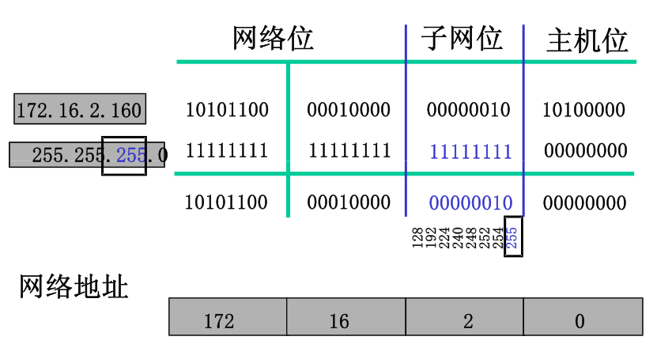

## **环境说明**

#### 准备工作

- CentOS 7

## **数据链路层目的**

- 为 IP 模块发送和接收 IP 数据报
- 为 ARP 模块发送 ARP 请求和接收 ARP 应答（ARP：地址解析协议，是用 IP 地址换 MAC 地址的一种协议）
- 为 RARP 发送 RARP 请求和接收 RARP 应答（RARP：逆地址解析协议）

**1. IP 协议**

- IP 协议是 TCP/IP 协议的核心，所有的 TCP，UDP，IMCP，IGCP 的数据都以 IP 数据格式传输。要注意的是，IP 不是可靠的协议，这是说，IP 协议没有提供一种数据未传达以后的处理机制--这被认为是上层协议--TCP 或 UDP 要做的事情。所以这也就出现了 TCP 是一个可靠的协议，而 UDP 就没有那么可靠的区别。

**2. IP 协议头**


- TTL(Time to live)这个字段规定该数据包在穿过多少个路由之后才会被抛弃(这里就体现出来 IP 协议包的不可靠性，它不保证数据被送达)，某个 ip 数据包每穿过一个路由器，该数据包的 TTL 数值就会减少 1，当该数据包的 TTL 成为零，它就会被自动抛弃。这个字段的最大值也就是 255，也就是说一个协议包也就在路由器里面穿行 255 次就会被抛弃了，根据系统的不同，这个数字也不一样，一般是 32 或者是 64，Tracerouter 这个工具就是用这个原理工作的，tranceroute 的-m 选项要求最大值是 255，也就是因为这个 TTL 在 IP 协议里面只有 8bit。

**3. IP 路由选择**

- 搜索路由表，优先搜索匹配主机，如果能找到和 IP 地址完全一致的目标主机，则将该包发向目标主机
- 搜索路由表，如果匹配主机失败，则匹配同子网的路由器，这需要“子网掩码(1.3.)”的协助。如果找到路由器，则将该包发向路由器。
- 搜索路由表，如果匹配同子网路由器失败，则匹配同网号(第一章有讲解)路由器，如果找到路由器，则将该包发向路由器。
- 搜索路由表，如果以上都失败了，就搜索默认路由，如果默认路由存在，则发包。
  如果都失败了，就丢掉这个包。
  这再一次证明了，ip 包是不可靠的。因为它不保证送达。

**4. 子网寻址**



- IP 地址的定义是网络号+主机号。但是现在所有的主机都要求子网编址，也就是说，把主机号在细分成子网号+主机号。最终一个 IP 地址就成为 网络号码+子网号+主机号。例如一个 B 类地址：210.30.109.134。有多少位代表子网号这个问题上，这没有一个硬性的规定，取而代之的则是子网掩码，校园网相信大多数人都用过，在校园网的设定里面有一个 255.255.255.0 的东西，这就是子网掩码。子网掩码是由 32bit 的二进制数字序列,形式为是一连串的 1 和一连串的 0.

**5. ARP 协议**

- ARP(地址解析)协议是一种解析协议，本来主机是完全不知道这个 IP 对应的是哪个主机的哪个接口，当主机要发送一个 IP 包的时候，会首先查一下自己的 ARP 高速缓存(就是一个 IP-MAC 地址对应表缓存)，如果查询的 IP-MAC 值对不存在，那么主机就向网络发送一个 ARP 协议广播包，这个广播包里面就有待查询的 IP 地址，而直接收到这份广播的包的所有主机都会查询自己的 IP 地址，如果收到广播包的某一个主机发现自己符合条件，那么就准备好一个包含自己的 MAC 地址的 ARP 包传送给发送 ARP 广播的主机，而广播主机拿到 ARP 包后会更新自己的 ARP 缓存(就是存放 IP-MAC 对应表的地方)。发送广播的主机就会用新的 ARP 缓存数据准备好数据链路层的的数据包发送工作。

- 一个典型的 arp 缓存信息如下，在任意一个系统里面用“arp -a”命令:

```
Interface: 192.168.11.3 --- 0x2
Internet Address     Physical Address     Type
192.168.11.1         00-0d-0b-43-a0-2e    dynamic
192.168.11.2         00-01-4a-03-5b-ed    dynamic
```

- 这样的高速缓存是有时限的，一般是 20 分钟(伯克利系统的衍生系统)。

**6. RARP 协议**

- 网络上的每个系统都具有唯一的硬件地址，他是由网络接口生产厂家配置的。无盘系统的 RARP 实现过程是从接口卡上读取唯一的硬件地址，然后发送一份 RARP 请求（一帧在网络上的数据），请求某个主机在无盘系统的 IP 地址。
- RARP 服务器的复杂性在于。服务器一般要为多个主机提供硬件地址到 IP 地址的映射。更为复杂的是，RARP 请求作为一个特殊类型的以太网数据帧来传送。这说明 RARP 服务器必须能够发送和接收这种类型的以太网数据帧。
- RARP 是许多无盘系统在引导时用来获取 IP 地址的。RARP 实现起来要比 ARP 复杂，因为 RARP 请求是在硬件层上广播的。这意味着他们不经过路由器进行转发。为了能让无盘系统在 RARP 关机的情况下也能引导，通常要在一个网络上（一根电缆）提供多个 RARP 服务器。

## **注意事项**
