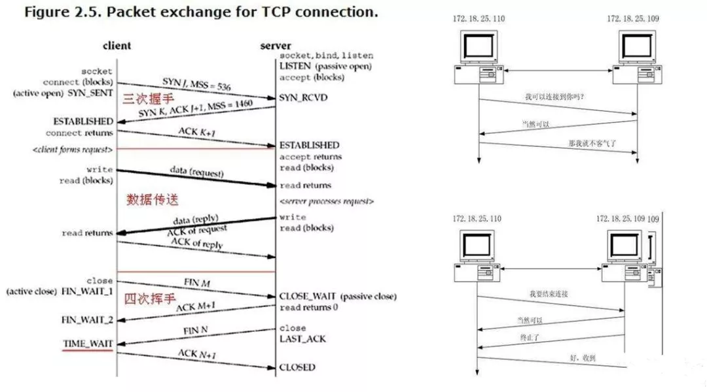

## **环境说明**

#### 准备工作

**1. 建立连接**

- 客户端首先向服务器申请打开某一个端口(用 SYN 段等于 1 的 TCP 报文)，然后服务器端发回一个 ACK 报文通知客户端请求报文收到，客户端收到确认报文以后再次发出确认报文确认刚才服务器端发出的确认报文（绕口么），至此，连接的建立完成。

**2. 结束连接**

- TCP 有一个特别的概念叫做 half-close，这个概念是说，TCP 的连接是全双工（可以同时发送和接收）连接，因此在关闭连接的时候，必须关闭传和送两个方向上的连接。客户机给服务器一个 FIN 为 1 的 TCP 报文，然后服务器返回给客户端一个确认 ACK 报文，并且发送一个 FIN 报文，当客户机回复 ACK 报文后（四次握手），连接就结束了。

**3. MSS（最大报文长度）**

- 一般这个 SYN 长度是 MTU 减去固定 IP 首部和 TCP 首部长度。对于一个以太网，一般可以达到 1460 字节。当然如果对于非本地的 IP，这个 MSS 可能就只有 536 字节，而且，如果中间的传输网络的 MSS 更佳的小的话，这个值还会变得更小。

**4. TCP 的状态迁移图**

4.1 客户端应用程序的状态迁移图

- 客户端的状态:CLOSED->SYN_SENT->ESTABLISHED->FIN_WAIT_1->FIN_WAIT_2->TIME_WAIT->CLOSED
- 以上流程是在程序正常的情况下应该有的流程，从书中的图中可以看到，在建立连接时，当客户端收到 SYN 报文的 ACK 以后，客户端就打开了数据交互地连接。而结束连接则通常是客户端主动结束的，客户端结束应用程序以后，需要经历 FIN_WAIT_1，FIN_WAIT_2 等状态，这些状态的迁移就是前面提到的结束连接的四次握手。

  4.2 服务器的状态迁移图

- 服务器的状态:CLOSED->LISTEN->SYN 收到->ESTABLISHED->CLOSE_WAIT->LAST_ACK->CLOSED
- 在建立连接的时候，服务器端是在第三次握手之后才进入数据交互状态，而关闭连接则是在关闭连接的第二次握手以后（注意不是第四次）。而关闭以后还要等待客户端给出最后的 ACK 包才能进入初始的状态。

  4.3 其他状态迁移

- LISTEN->SYN_SENT，对于这个解释就很简单了，服务器有时候也要打开连接的嘛。
- SYN_SENT->SYN 收到，服务器和客户端在 SYN_SENT 状态下如果收到 SYN 数据报，则都需要发送 SYN 的 ACK 数据报并把自己的状态调整到 SYN 收到状态，准备进入 ESTABLISHED
- SYN_SENT->CLOSED，在发送超时的情况下，会返回到 CLOSED 状态。
- SYN\_收到->LISTEN，如果受到 RST 包，会返回到 LISTEN 状态。
- SYN\_收到->FIN_WAIT_1，这个迁移是说，可以不用到 ESTABLISHED 状态，而可以直接跳转到 FIN_WAIT_1 状态并等待关闭。

  4.4 2MSL 等待状态

- 这个状态又叫做 2MSL 状态，说的是在 TIME_WAIT2 发送了最后一个 ACK 数据报以后，要进入 TIME_WAIT 状态，这个状态是防止最后一次握手的数据报没有传送到对方那里而准备的（注意这不是四次握手，这是第四次握手的保险状态）。这个状态在很大程度上保证了双方都可以正常结束，但是，问题也来了。
- 由于插口的 2MSL 状态（插口是 IP 和端口对的意思，socket），使得应用程序在 2MSL 时间内是无法再次使用同一个插口的，对于客户程序还好一些，但是对于服务程序，例如 httpd，它总是要使用同一个端口来进行服务，而在 2MSL 时间内，启动 httpd 就会出现错误（插口被使用）。为了避免这个错误，服务器给出了一个平静时间的概念，这是说在 2MSL 时间内，虽然可以重新启动服务器，但是这个服务器还是要平静的等待 2MSL 时间的过去才能进行下一次连接。

  4.5 FIN_WAIT_2 状态

- 这就是著名的半关闭的状态了，这是在关闭连接时，客户端和服务器两次握手之后的状态。在这个状态下，应用程序还有接受数据的能力，但是已经无法发送数据，但是也有一种可能是，客户端一直处于 FIN_WAIT_2 状态，而服务器则一直处于 WAIT_CLOSE 状态，而直到应用层来决定关闭这个状态。

  4.6 RST，同时打开和同时关闭

- RST 是另一种关闭连接的方式，应用程序应该可以判断 RST 包的真实性，即是否为异常中止。而同时打开和同时关闭则是两种特殊的 TCP 状态，发生的概率很小。

**5. TCP 服务器设计**

- TCP 服务器对于每一个连接都需要建立一个独立的进程（或者是轻量级的，线程），来保证对话的独立性。所以 TCP 服务器是并发的。而且 TCP 还需要配备一个呼入连接请求队列（UDP 服务器也同样不需要），来为每一个连接请求建立对话进程，这也就是为什么各种 TCP 服务器都有一个最大连接数的原因。而根据源主机的 IP 和端口号码，服务器可以很轻松的区别出不同的会话，来进行数据的分发。

## **注意事项**
