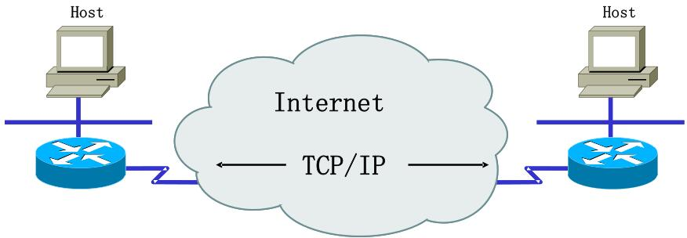
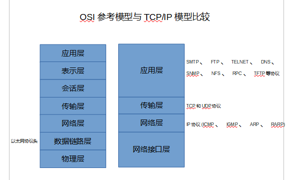
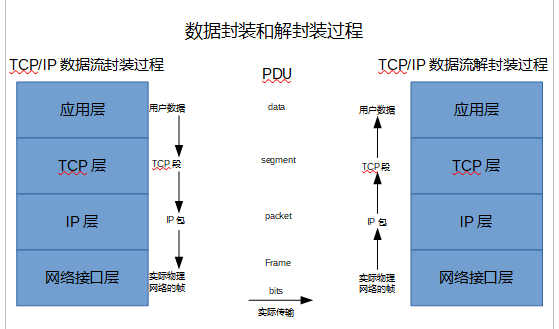

#### 基础概念

**1. TCP/IP**

- 最早使用的协议栈
- 全球实际上的通讯标准

**2. 由来**

- TCP/IP 不是一个协议，而是一个协议族的统称。里面包括了 IP 协议，ICMP 协议，TCP 协议，以及我们更加熟悉的 http、ftp、pop3 协议等等。电脑有了这些，就好像学会了外语一样，就可以和其他的计算机终端做自由的交流了。

**3. TCP/IP 协议分层**

**4. ip 地址**

- 网络上每一个节点都必须有一个独立的 Internet 地址（也叫做 IP 地址）。现在，通常使用的 IP 地址是一个 32bit 的数字，也就是我们常说的 IPv4 标准，这 32bit 的数字分成四组，也就是常见的 255.255.255.255 的样式。IPv4 标准上，地址被分为五类，我们常用的是 B 类地址。具体的分类请参考其他文档。需要注意的是 IP 地址是网络号+主机号的组合，这非常重要。

**5. 域名系统**

- 域名系统是一个分布的数据库，它提供将主机名（就是网址啦）转换成 IP 地址的服务。

**6. RFC**

- RFC 是什么？RFC 就是 tcp/ip 协议的标准文档，在这里我们可以看到 RFC 那长长的定义列表，现在它一共有 4000 多个协议的定义，当然，我们所要学习的，也就是那么十几个协议而已。

**7. 端口号**

- 注意，这个号码是用在 TCP，UDP 上的一个逻辑号码，并不是一个硬件端口，我们平时说把某某端口封掉了，也只是在 IP 层次把带有这个号码的 IP 包给过滤掉了而已。

**8. 应用编程接口**

- 现在常用的编程接口有 socket 和 TLI。而前面的有时候也叫做“Berkeley socket”，可见 Berkeley 对于网络的发展有多大的贡献。

#### 总结
