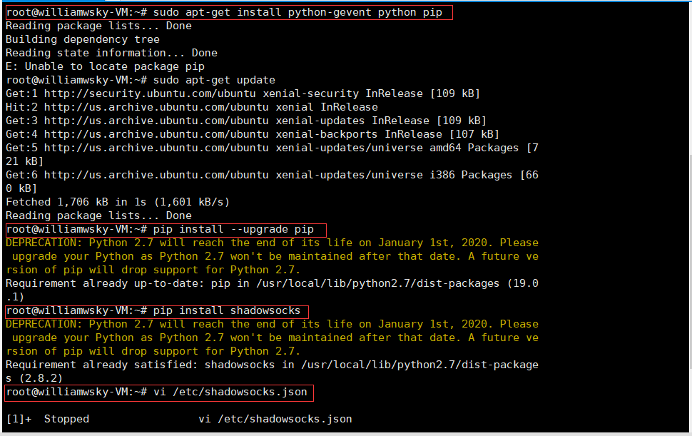
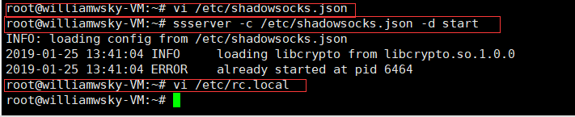
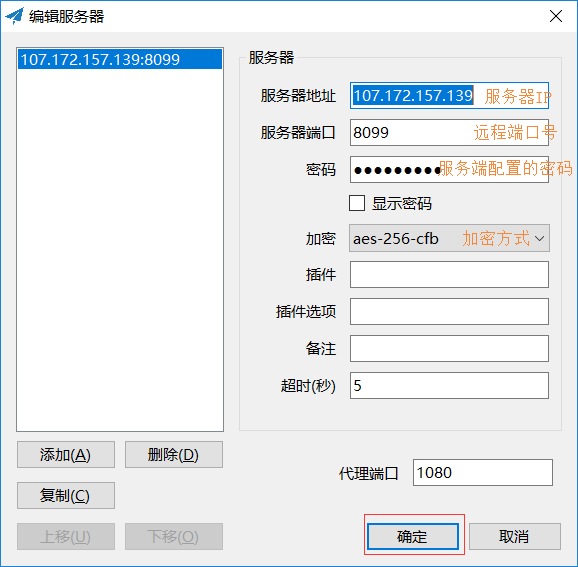

## **环境说明**

#### 准备工作

- Ubuntu 16.04.5 LTS
- python 3.8
- [shadowsocks](https://github.com/shadowsocks/shadowsocks-windows/releases)
- [.NET Framework 4.6.2](https://www.microsoft.com/zh-CN/download/details.aspx?id=53344) 和 [Microsoft Visual C++ 2015 Redistributable](https://www.microsoft.com/en-us/download/details.aspx?id=53840)

## **步骤说明**

**1. 安装必要组件**

```@Terminal
sudo apt-get update
sudo apt-get install python-gevent python pip
```

**2. 更新一下 PIP（非必要），然后通过 pip 安装 shadowsocks 包**

```@Terminal
pip install --upgrade pip
pip install shadowsocks
```

**3. 在/etc 下新建名为 shadowsocks.json 的文件**

```@Terminal
vi /etc/shadowsocks.json
```

- 3.1 在 VI 的界面按 I，进入编辑模式，然后输入如下内容

```@shadowsocks.json
{
 "server":"192.3.45.215"，
 "server_port":8090,
 "local_address": "127.0.0.1",
 "local_port":1080,
  "password": "Will@.123",
 "timeout":300,
 "method":"aes-256-cfb",
 "fast_open": false
}

##############
以下是说明文字，请忽略
your_vps_ip是你的服务器登录地址
127.0.0.1请保持默认
1080请保持默认
8381，foobar1请自行修改，是vps的端口号和密码
300请保持默认
aes-256-cfb请保持默认
false请保持默认
注意：最后一个false，和foobar1后面是没有逗号的。
```

- 3.2 按 ESC，然后按 shift+; 在按 wq 回车就保存了

**4. 启动/停止服务**

```@Terminal
ssserver -c /etc/shadowsocks.json -d start  #启动服务
ssserver -c /etc/shadowsocks.json -d stop   #停止服务
```

**5. 设置开机启动**

```@Terminal
vi /etc/rc.local
##然后在exit 0上面一行加入
ssserver -c /etc/shadowsocks.json -d start
```




## **客户端配置**

**1. 下载完成默认安装即可**

**2. 启动 Shadowsocks 程序，在任务栏中右键程序图标，添加服务器，配置如图：**



**3. 选择 启用系统代理 来启用系统代理。请禁用浏览器里的代理插件，或把它们设置为使用系统代理。**

- 除了设为系统代理，你也可以直接自己配置浏览器代理。在 SwitchyOmega 中把代理设置为 SOCKS5 或 HTTP 的 127.0.0.1:1080。这个 1080 端口可以在服务器设置中设置。

## **注意事项**

**其他命令参考**

```@Terminal
ufw status # 查看ufw防火墙是否在工作，查看使用中的规则
ufw enable # 启动ufw防火墙
ufw default deny # 启动默认防御（阻止外部联接，放行对外联接）
ufw allow 53 # 允许其它主机访问本机53端口，协议包含tcp和udp
ufw allow 25/tcp # 允许其它主机使用tcp协议访问本机25端口
ufw allow smtp # UFW也可以检查 /etc/services文件，明白服务的名字及对应的端口和协议

# UFW同时支持出入口过滤。用户可以使用in或out来指定向内还是向外。如果未指定，默认是inufw allow in http # 许可访问本机http端口
ufw reject out smtp # 禁止访问外部smtp端口，不告知“被防火墙阻止”
ufw deny out to 192.168.1.1 # 禁止本机192.168.1.1对外访问，告知“被防火墙阻止”
ufw delete deny 80/tcp # 要删除规则，只要在命令中加入delete就行了
```
