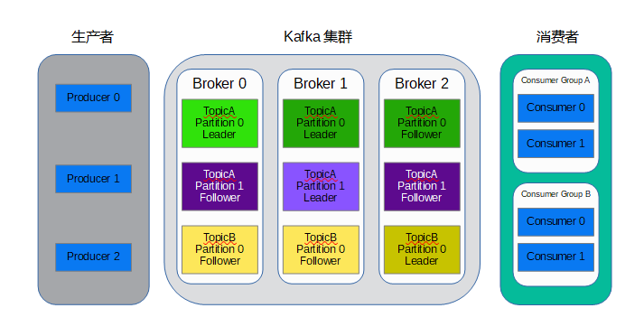
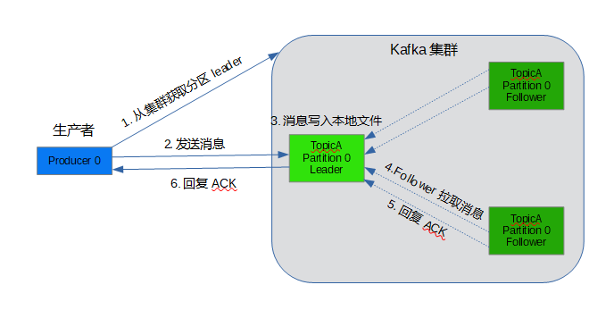
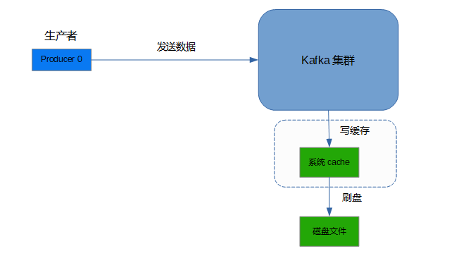
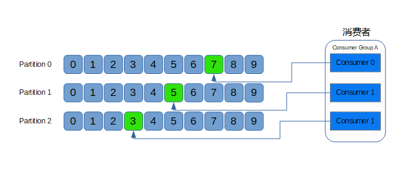

## **环境说明**

#### 准备工作

- Kafka消息处理

## **步骤说明**

**1.什么是Kafka**

> Kafka是分布式发布-订阅消息系统。它最初由LinkedIn公司开发，之后成为Apache项目的一部分。
Kafka是一个分布式的，可划分的，冗余备份的持久性的日志服务。它主要用于处理活跃的流式数据。

**2.Kafka架构**
- Kafka为显式分布式架构，主要由producer（生产者）、broker（kafka）和consumer（消费者）组成。

- Producer（生产者）可以将数据发布到所选择的topic（主题）中。生产者负责将记录分配到topic的哪一个 partition（分区）中。可以使用循环的方式来简单地实现负载均衡，也可以根据某些语义分区函数(如记录中的key)来完成。

- Consumer（消费者）使用一个consumer group（消费组）名称来进行标识，发布到topic中的每条记录被分配给订阅消费组中的一个消费者实例。消费者实例可以分布在多个进程中或者多个机器上。

**3.message delivery semantic（消息传递语义）**

- 消息传递语义，简单说就是消息传递过程中消息传递的保证性。主要分为三种：
  - at most once：最多一次。消息可能丢失也可能被处理，但最多只会被处理一次。
  - at least once：至少一次。消息不会丢失，但可能被处理多次。可能重复，不会丢失。
  - exactly once：精确传递一次。消息被处理且只会被处理一次。不丢失不重复就一次。

- 理想情况下肯定是希望系统的消息传递是严格exactly once，也就是保证不丢失、只会被处理一次，但是很难做到。

**4. Kafka消息传递的过程**

- 1.生产者发消息给Kafka Broker。
- 2.Kafka Broker 消息同步和持久化
- 3.Kafka Broker 将消息传递给消费者。

- 在这三步中每一步都有可能会丢失消息，下面详细分析为什么会丢消息，如何最大限度避免丢失消息.

**5. 生产者丢失消息**

- 生产者发送消息的一般流程如下：
  - 1.生产者是与leader直接交互，所以先从集群获取topic对应分区的leader元数据；
  - 2.获取到leader分区元数据后直接将消息发给过去；
  - 3.Kafka Broker对应的leader分区收到消息后写入文件持久化；
  - 4.Follower拉取Leader消息与Leader的数据保持一致；
  - 5.Follower消息拉取完毕需要给Leader回复ACK确认消息；
  - 6.Kafka Leader和Follower分区同步完，Leader分区会给生产者回复ACK确认消息。

- 生产者采用push模式将数据发布到broker，每条消息追加到分区中，顺序写入磁盘。消息写入Leader后，Follower是主动与Leader进行同步。

- Kafka消息发送有两种方式：同步（sync）和异步（async），默认是同步方式，可通过producer.type属性进行配置。

- Kafka通过配置request.required.acks属性来确认消息的生产：
  - 0表示不进行消息接收是否成功的确认；不能保证消息是否发送成功，生成环境基本不会用。
  - 1表示当Leader接收成功时确认；只要Leader存活就可以保证不丢失，保证了吞吐量。
  - -1或者all表示Leader和Follower都接收成功时确认；可以最大限度保证消息不丢失，但是吞吐量低。

- kafka producer 的参数acks 的默认值为1，所以默认的producer级别是at least once，并不能exactly once。

- 这里可能会丢消息：
  - 如果acks配置为0，发生网络抖动消息丢了，生产者不校验ACK自然就不知道丢了。
  - 如果acks配置为1保证leader不丢，但是如果leader挂了，恰好选了一个没有ACK的follower，那也丢了。
  - all：保证leader和follower不丢，但是如果网络拥塞，没有收到ACK，会有重复发的问题。

**6. Kafka Broker丢失消息**

- Kafka Broker 接收到数据后会将数据进行持久化存储

- 操作系统本身有一层缓存，叫做 Page Cache，当往磁盘文件写入的时候，系统会先将数据流写入缓存中，至于什么时候将缓存的数据写入文件中是由操作系统自行决定。

- Kafka提供了一个参数 producer.type 来控制是不是主动flush，如果Kafka写入到mmap之后就立即 flush 然后再返回 Producer 叫同步 (sync)；写入mmap之后立即返回 Producer 不调用 flush 叫异步 (async)。

- 可能会丢消息：
  - Kafka通过多分区多副本机制中已经能最大限度保证数据不会丢失，如果数据已经写入系统 cache 中但是还没来得及刷入磁盘，此时突然机器宕机或者掉电那就丢了，当然这种情况很极端。

**7. 消费者丢失消息**

- 消费者通过pull模式主动的去 kafka 集群拉取消息，与producer相同的是，消费者在拉取消息的时候也是找leader分区去拉取。

- 多个消费者可以组成一个消费者组（consumer group），每个消费者组都有一个组id。同一个消费组者的消费者可以消费同一topic下不同分区的数据，但是不会出现多个消费者消费同一分区的数据。

- 消费者消费的进度通过offset保存在kafka集群的__consumer_offsets这个topic中。

- 消费消息的时候主要分为两个阶段：
  1、标识消息已被消费，commit offset坐标；
  2、处理消息。

- 可能会丢消息：
  - 场景一：先commit再处理消息。如果在处理消息的时候异常了，但是offset 已经提交了，这条消息对于该消费者来说就是丢失了，再也不会消费到了。
  - 场景二：先处理消息再commit。如果在commit之前发生异常，下次还会消费到该消息，重复消费的问题可以通过业务保证消息幂等性来解决。

#### 总结

- Kafka可能会在三个阶段丢失消息：
  - （1）生产者发送数据；
  - （2）Kafka Broker 存储数据；
  - （3）消费者消费数据；

- 在生产环境中严格做到exactly once其实是难的，同时也会牺牲效率和吞吐量，最佳实践是业务侧做好补偿机制，万一出现消息丢失可以兜底。