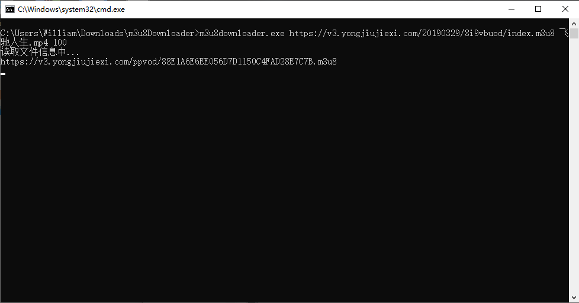
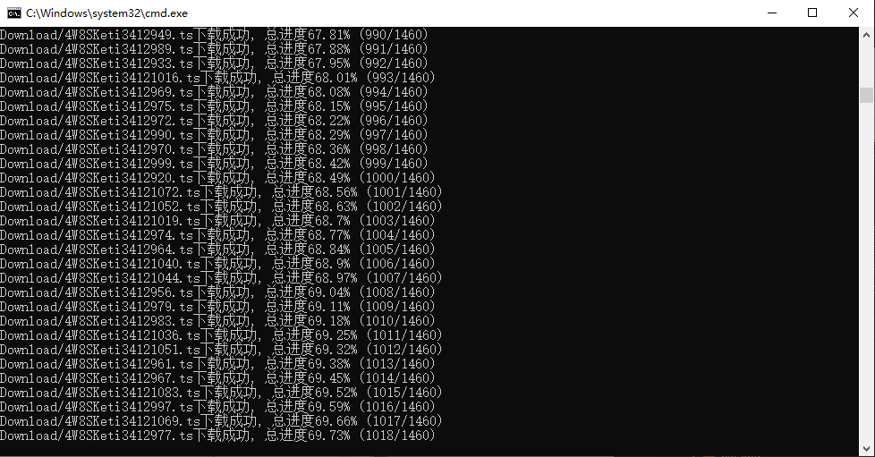

## **环境说明**

#### 准备工作

- Windows 10 1909 版本（Windows 64 位系统）
- python 3.8

#### 背景简介

- M3U 是一种播放多媒体列表的文件格式，它的设计初衷是为了播放音频文件，比如 MP3，但是越来越多的软件现在用来播放视频文件列表，M3U 也可以指定在线流媒体音频源。很多播放器和软件都支持 M3U 文件格式。
- m3u8 文件是 HTTP Live Streaming（缩写为 HLS） 协议的部分内容，而 HLS 是一个由苹果公司提出的基于 HTTP 的流媒体网络传输协议。
  > HLS 是新一代流媒体传输协议，其基本实现原理为将一个大的媒体文件进行分片，将该分片文件资源路径记录于 m3u8 文件（即 playlist）内，其中附带一些额外描述（比如该资源的多带宽信息···）用于提供给客户端。客户端依据该 m3u8 文件即可获取对应的媒体资源，进行播放。
- 扩展 M3U 指令：

| 指令                     | 含义                                 |
| ------------------------ | ------------------------------------ |
| #EXTM3U                  | 必需，表示一个扩展的 m3u 文件        |
| #EXT-X-VERSION:3         | hls 的协议版本号，暗示媒体流的兼容性 |
| #EXT-X-MEDIA-SEQUENCE:xx | 首个分段的 sequence number           |
| #EXT-X-ALLOW-CACHE:NO    | 是否缓存                             |
| #EXT-X-TARGETDURATION:5  | 每个视频分段最大的时长（单位秒）     |
| #EXT-X-DISCONTINUITY     | 表示换编码                           |
| #EXTINF:<duration>       | 每个切片的时长                       |

## **步骤说明**

**1. 源码解释**

```@main.py

import requests
import os
from concurrent.futures import ThreadPoolExecutor, wait
import sys

finishedNum = 0
allNum = 0
fileList = []
headers = {'User-Agent': 'Mozilla/5.0 (Windows NT 10.0; Win64; x64; rv:62.0) Gecko/20100101 Firefox/62.0'}

# 使用多线程下载视频
def download(downloadLink, name):
    global finishedNum
    global allNum
    for _ in range(10):
        try:
            req = requests.get(downloadLink, headers=headers, timeout=15).content
            with open(f"{name}", "wb") as f:
                f.write(req)
                f.flush()
            finishedNum += 1
            print(f"{name}下载成功, 总进度{round(finishedNum / allNum * 100, 2)}% ({finishedNum}/{allNum})")
            break
        except:
            if _ == 9:
                print(f"{name}下载失败")
            else:
                print(f"{name}正在进行第{_}次重试")

# 合并视频
def merge_file(path, name):
    global fileList
    cmd = "copy /b "
    for i in fileList:
        if i != fileList[-1]:
            cmd += f"{i} + "
        else:
            cmd += f"{i} {name}"
    os.chdir(path)
    with open('combine.cmd', 'w') as f:
        f.write(cmd)
    os.system("combine.cmd")
    os.system('del /Q *.ts')
    os.system('del /Q *.cmd')


def downloader(url, name, threadNum):
    global allNum
    global fileList
    print("读取文件信息中...")
    downloadPath = 'Download'
    if not os.path.exists(downloadPath):
        os.mkdir(downloadPath)
    # 查看是否存在
    if os.path.exists(f"{downloadPath}/{name}"):
        print(f"视频文件已经存在，如需重新下载请先删除之前的视频文件")
        return
    # .m3u8文件储存了视频所在的位置信息，可以通过发送一个Get请求来获取链接中的内容
    content = requests.get(url, headers=headers).text.split('\n')
    if "#EXTM3U" not in content[0]:
        raise BaseException(f"非M3U8链接")
    # .m3u8 跳转
    for video in content:
        if ".m3u8" in video:
            if video[0] == '/':
                url = url.split('//')[0] + "//" + url.split('//')[1].split('/')[0] + video
            elif video[:4] == 'http':
                url = video
            else:
                url = url.replace(url.split('/')[-1], video)
            print(url)
            content = requests.get(url, headers=headers).text.split('\n')
    # 拼接视频下载链接
    urls = []
    for index, video in enumerate(content):
        if '#EXTINF' in video:
            if content[index + 1][0] == '/':
                downloadLink = url.split('//')[0] + "//" + url.split('//')[1].split('/')[0] + content[index + 1]
            elif content[index + 1][:4] == 'http':
                downloadLink = content[index + 1]
            else:
                downloadLink = url.replace(url.split('/')[-1], content[index + 1])
            urls.append(downloadLink)
    allNum = len(urls)
    # 使用多线程下载视频
    pool = ThreadPoolExecutor(max_workers=threadNum)
    futures = []
    for index, downloadLink in enumerate(urls):
        fileList.append(os.path.basename(downloadLink))
        futures.append(pool.submit(download, downloadLink, f"{downloadPath}/{os.path.basename(downloadLink)}"))
    wait(futures)
    print(f"运行完成")
    merge_file(downloadPath, name)
    print(f"合并完成")
    print(f"文件下载成功")


if __name__ == '__main__':
    videoUrl = str(sys.argv[1])
    name = str(sys.argv[2])
    threadNum = int(sys.argv[3])
    downloader(videoUrl, name, threadNum)
```

**2. 使用步骤**

- 2.1 下载编译好的程序会得到两个文件，先右键 run.bat 文件->编辑，可以看见文件内容如下：

```@run.bat
m3u8downloader.exe https://v3.yongjiujiexi.com/20190329/8i9vbuod/index.m3u8 飞驰人生.mp4 100
```

\*文件解释：

| 组成                                                     | 含义                 |
| -------------------------------------------------------- | -------------------- |
| m3u8downloader.exe                                       | 软件名称             |
| https://v3.yongjiujiexi.com/20190329/8i9vbuod/index.m3u8 | .m3u8 结尾的视频链接 |
| 飞驰人生.mp4                                             | 视频名称             |
| 100                                                      | 下载时的线程数       |

- 2.2 修改好你需要下载的视频链接和视频名称等参数后，保存并关闭此文件，再双击运行 run.bat 文件，此时会弹出一个类似 cmd 的窗口
  
  

- 2.3 若出现下载失败，则可能是服务器限制了线程数，此时修改 run.bat 中的第四个参数，将线程数改小再试

- 2.4 下载好的视频文件默认会保存再出现文件夹下的 Download 文件夹内
