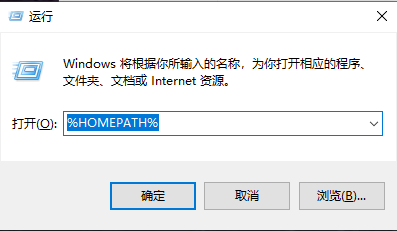
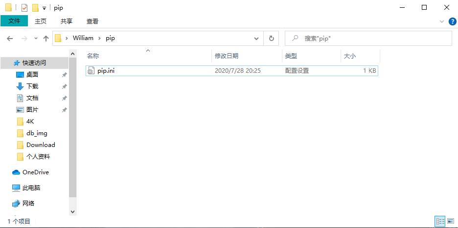

## **环境说明**

#### 准备工作

- Windows 10 2004 版本（Windows 系统）
- python 3.8 版本

## **步骤说明**

**1. Win+R 打开 cmd 输入%HOMEPATH%打开自己的 HOMEPATH 路径文件夹**



**2. 在此路径下建立一个名为 pip 的文件夹，并在其内新建一个 pip.ini 的文件，文件内容如下：**

```@pip.ini
[global]
timeout = 6000
index-url = https://pypi.tuna.tsinghua.edu.cn/simple
trusted-host = pypi.tuna.tsinghua.edu.cn
```



**3. 保存文件后,再执行安装依赖包命令时下载速度快**
