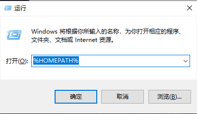
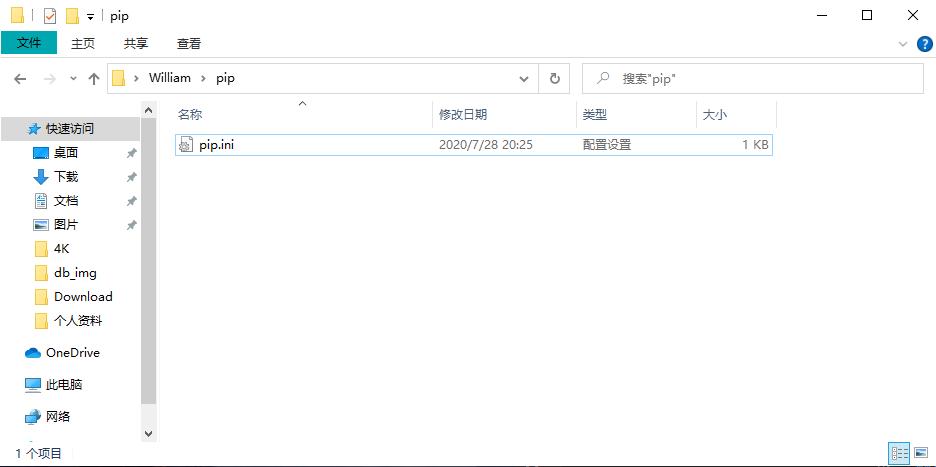

## **环境说明**

#### 准备工作

- Windows 10 1909 版本（Windows 系统）
- Python
- VS Code
- pyinstaller

## **步骤说明**

## **前言**

- 如果打包为 exe 的话，版本尽量选择 python3.6+32 位版本，因为 win64 位系统向下兼容 32 位程序，但是如果不考虑 32 位系统的话无所谓，直接 python64 位版本直接打包就可以，只是只能在 win64 位系统上跑。

**1. 安装 pyinstaller**

首先安装 pyinstaller，使用安装命令：pip3 install pyinstaller，如下图所示。


**2. pyinstaller 打包机制**

我们写的 python 脚本是不能脱离 python 解释器单独运行的，所以在打包的时候，至少会将 python 解释器和脚本一起打包，同样，为了打包的 exe 能正常运行，会把我们所有安装的第三方包一并打包到 exe。

即使我们的项目只使用的一个 requests 包，但是可能我们还安装了其他 n 个包，但是他不管，因为包和包只有依赖关系的。比如我们只装了一个 requests 包，但是 requests 包会顺带装了一些其他依赖的小包，所以为了安全，只能将所有第三方包+python 解释器一起打包。如下图所示。



蓝色表示是安装 requests 依赖的包，看到了吧！

**3. Pyinstaller 打包 exe**

这里呢，我就拿刚给同事写办公自动化脚本示例一下。源码示例效果，如下图所示。



1、我们来将这个.py 的文件打包成一个 exe，我们直接 cmd 切换到这个脚本的目录，执行命令：pyinstaller-F setup.py，如下图所示。


ps: -F 参数表示覆盖打包，这样在打包时，不管我们打包几次，都是最新的，这个记住就行，固定命令。

2、执行完毕之后，会生成几个文件夹，如下图所示。


3、在 dist 里面呢，就有了一个 exe 程序，这个就是可执行的 exe 程序，如下图所示。


4、我们把这个 setup.exe 拖到和 setup.py 平级的目录，我们来运行一下这个，效果图如下图所示。

![测试]](../img/p_img/pi7.png)

5、这样，我们就完成了一个打包工作，如果别人需要，即使没有 python 环境，他依然可以运行。

6、接下来我们再来打包一个带界面的，这里我用 pyqt5 写了一个最简单的框架，看一下打包成 exe 是否能运行成功，效果图如下图所示。


我们可以看到，后面有一个黑洞洞的窗口，这就有点尴尬了，所以，我们的打包命令也要变一下。

7、执行 pyinstaller -F -wsetup.py 多加-w 以后，就不会显示黑洞洞的控制台了，这里就不做演示啦！

8、但是我们打包的 exe，我们的图标呀，实在是有点丑陋，默认的，没有一点自己的风格，那么，我们应该怎么改一下呢？

执行命令:pyinstaller -F -w-i wind.ico setup.py，如下图所示。


9、默认打包图片，如下图所示。


10、加上 -i 参数之后，如下图所示，会形成一个类似风力发电机的 logo 图案。


ps:程序路径最好全部都是英文，否则肯能会出现莫名其妙的问题

11、到此，我们能用到的 pyton 打包成 exe 命令都总结完了

## **总结命令**

```@python
Pyinstaller -F setup.py 打包exe
Pyinstaller -F -w setup.py 不带控制台的打包
Pyinstaller -F -i xx.ico setup.py 打包指定exe图标打包
```
