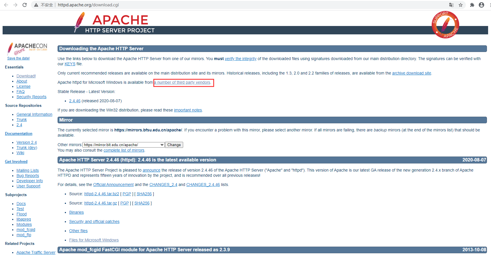
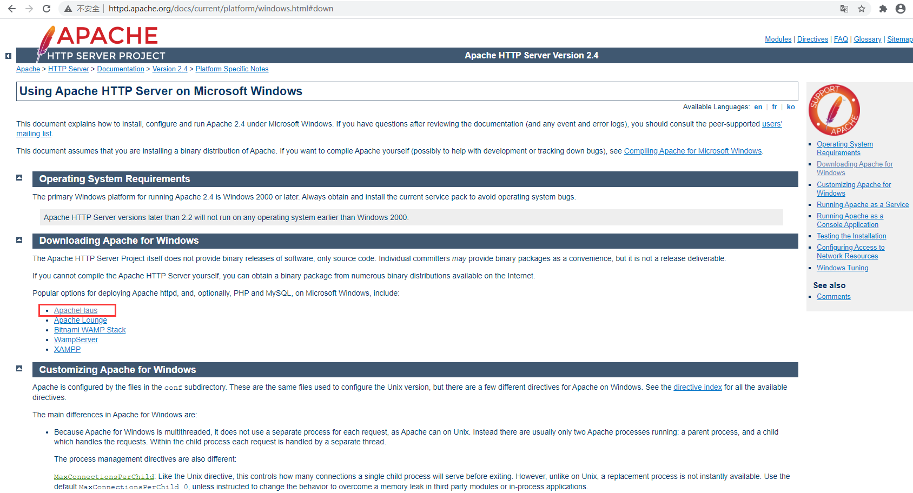
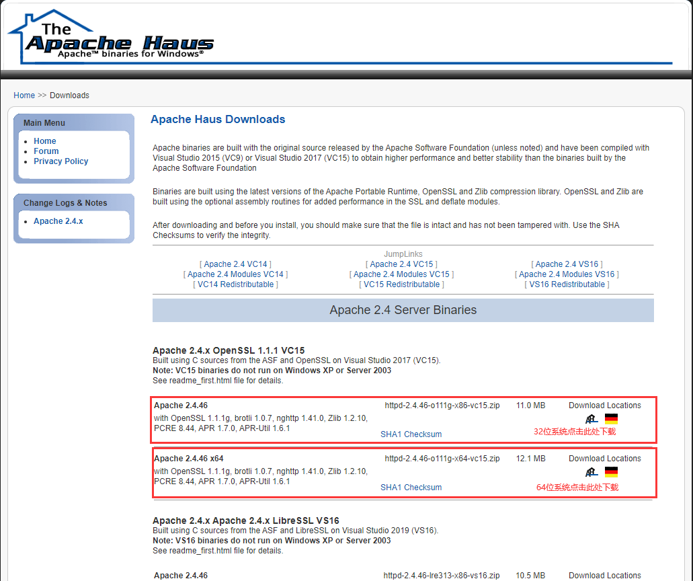
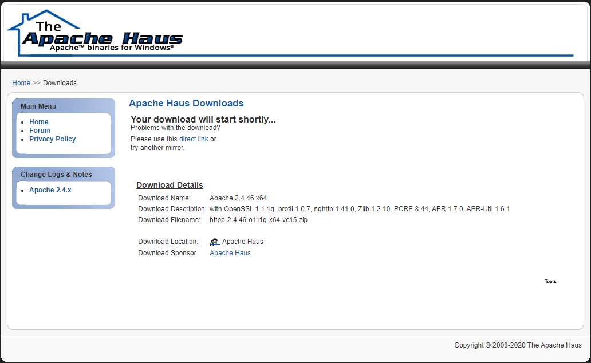
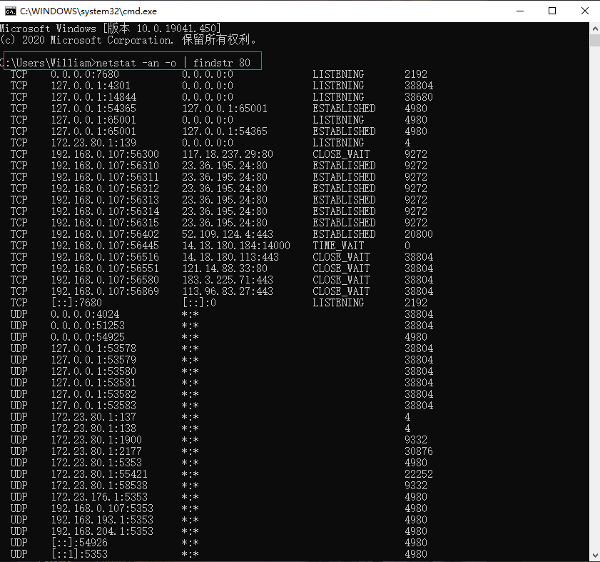
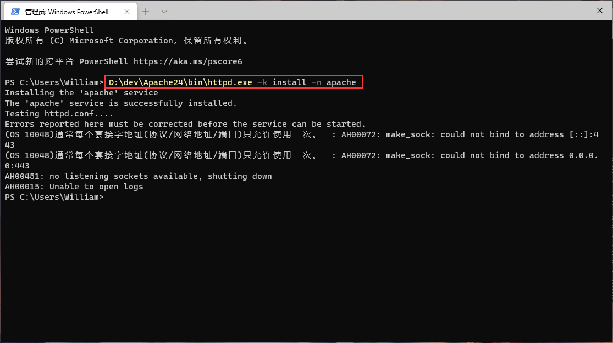
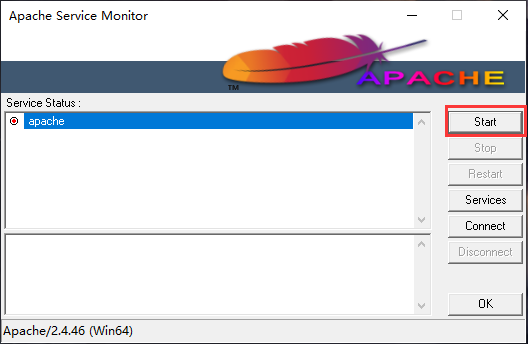
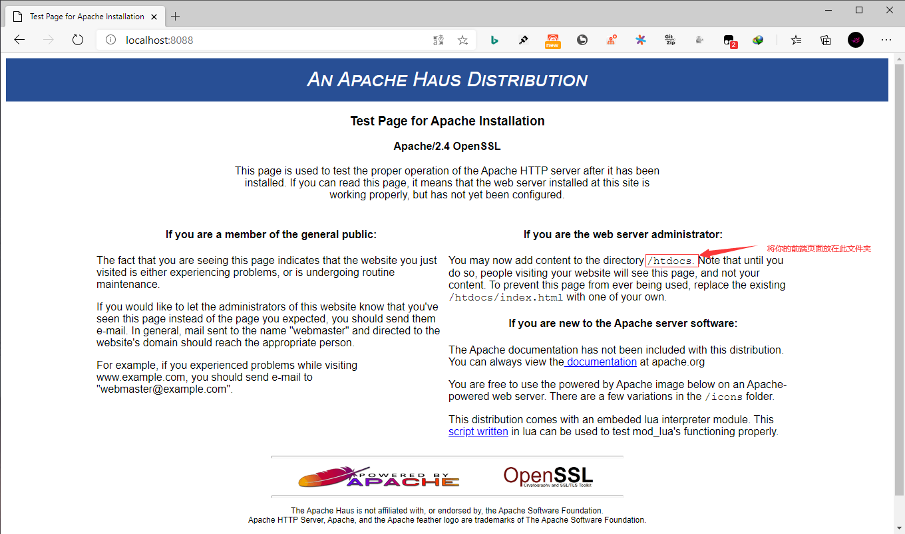
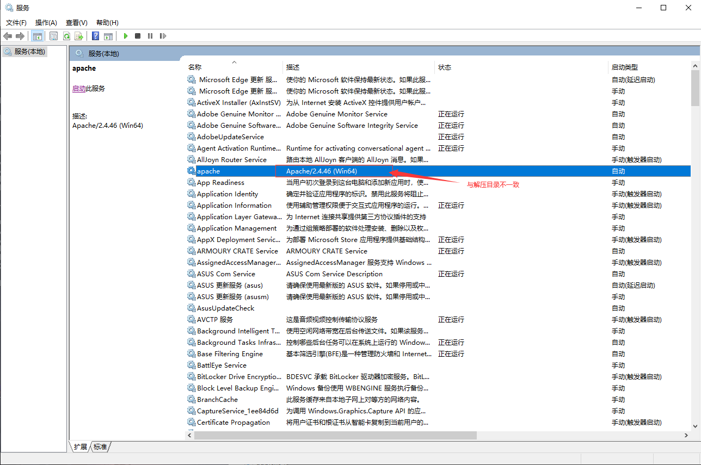
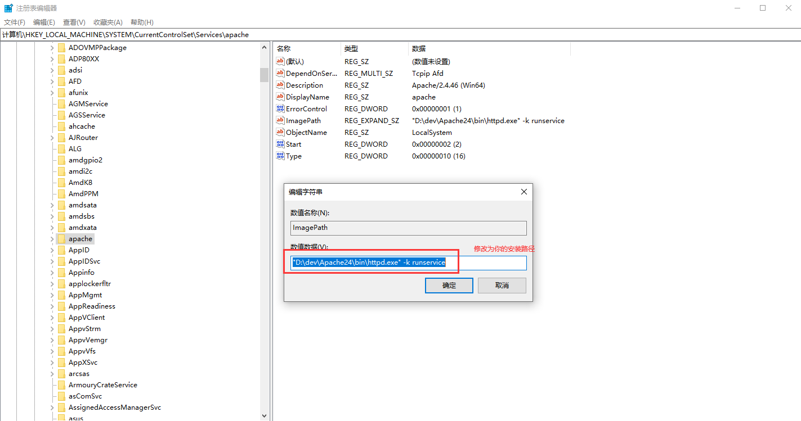

## **环境说明**

#### 准备工作

- Windows 10 1909 版本（Windows 系统）
- [下载 Apache](http://httpd.apache.org/download.cgi)

## **步骤说明**

**1. 下载 Apache 服务器，步骤如下:**






**2. 解压下载好的安装包，并配置 Apache24/conf 目录下的 httpd.conf 文件内容如下:**

```httpd.conf
Define SRVROOT "D:/dev/Apache24"  #此处改成你的安装目录路径
ServerRoot "${SRVROOT}"

#Listen 12.34.56.78:80  若80端口被占用，则修改如下内容
Listen 8088
```

**3. 检测 80 端口是否被占用和安装 Apache 服务，并将其命名为 apache**

```
netstat -an -o | findstr 80
D:\dev\Apache24\bin\httpd.exe -k install -n apache
```




**4. 测试服务，安装服务后，或在 Apache24/bin 目录下运行 ApacheMonitor.exe 应用程序一样可以启动服务，在系统右下角双击 Apache 图标，点击 start 进行测试**




#### 注意事项

**1. 启动服务报错：Apache 提示 the requested operation has failed 无法启动问题**

- 查看服务的描述信息是否与安装路径一致
- 查看注册表中的信息是否与安装路径一致



