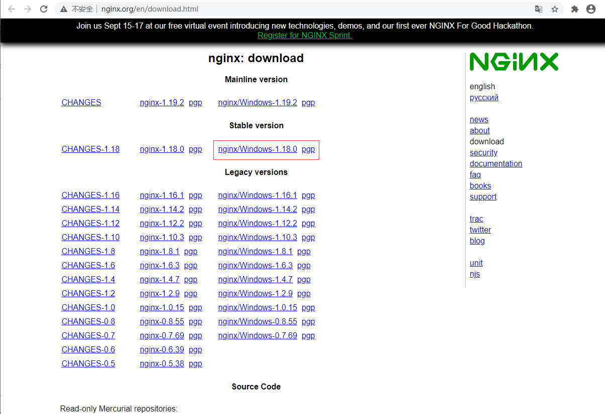

## **环境说明**

#### 准备工作

- Windows 10 1909 版本（Windows 系统）
- [下载 Nginx](http://nginx.org/en/download.html)

## **步骤说明**

**1. 下载 Nginx 服务器，步骤如下:**



**2. 解压下载好的安装包，直接双击该目录下的 nginx.exe，即可启动 nginx 服务器**

```cmd
cd D:/dev/nginx
nginx  #启动nginx
# 停止nginx
nginx -s stop  #强制停止nginx服务器，如果有未处理的数据，丢弃
nginx -s quit  #优雅的停止nginx服务器，如果有未处理的数据，等待处理完成之后停止
```

**3. 测试**

- 打开浏览器，输入地址：http://localhost，访问页面，出现如下页面表示访问成功


**4. 启动一个本地服务器**

- 通过配置 server_name 和 root 目录等来访问目标文件，配置文件在 nginx/conf/nginx.conf,文件内容如下：

```nginx.conf
http {
    gzip  on;

    #静态文件
    server {
        listen       80;
        server_name  static.cnblog.com;

        location / {
            root   E:/work/static;
        }
    }

    #html文件
    server {
        listen       80;
        server_name  127.0.0.1 localhost;

        location / {
            root   G:/work/www/unic/dist;
            index  index.html index.htm;
        }
    }
}
```

**5. 在 nginx.exe 目录，打开命令行工具，执行如下命令**

```cmd
start nginx : 启动nginx
nginx -s reload  ：修改配置后重新加载生效
nginx -s reopen  ：重新打开日志文件
nginx -t -c /path/to/nginx.conf 测试nginx配置文件是否正确
```
