## **设计模式**
#### 业务流程
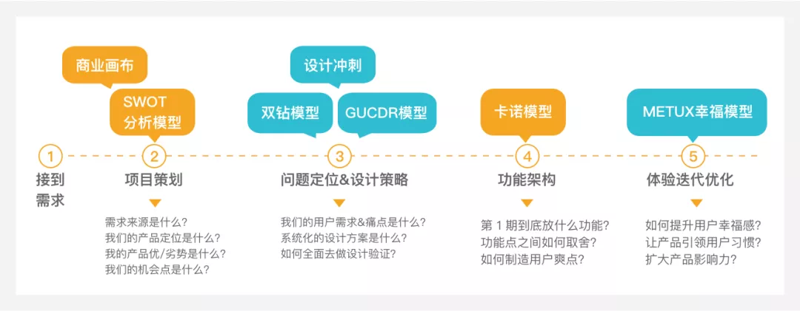

#### 设计模型介绍
**1. SWOT模型**

1.1 概念介绍
* SWOT分析法（也称 TOWS 分析法、道斯矩阵）即态势分析法，20世纪80年代初由美国旧金山大学的管理学教授韦里克提出，经常被用于企业战略制定、竞争对手分析等场合。
在现在的战略规划报告里，SWOT分析应该算是一个众所周知的工具。来自于麦肯锡咨询公司的SWOT分析，包括分析企业的优势（Strengths）、劣势（Weaknesses）、机会（Opportunities）和威胁（Threats）。
1.2 使用场景
* 主要用在产品前期的战略规划中；用于项目成员知己知彼，同时也能知道在行业领域自己的产品所处的位置和核心竞争力是什么；对于产品方向的定位和全方位分析有复用价值。

1.3 设计价值
* SWOT分析实际上是将对企业内外部条件各方面内容进行综合和概括，进而分析组织的优劣势、面临的机会和威胁的一种方法。
* 优劣势分析主要是着眼于企业自身的实力及其与竞争对手的比较，而机会和威胁分析将注意力放在外部环境的变化及对企业的可能影响上 。在分析时，应把所有的内部因素（即优劣势）集中在一起，然后用外部的力量来对这些因素进行评估。

1.4 具体实践案例说明
* SWOT 分析模型其实还可以与商业画布相结合，便于更全面对项目/业务进行快速分析和深入了解；深入懂业务的设计师才能真正在团队中进行发声，提出超越 UI 层的建设性意见。
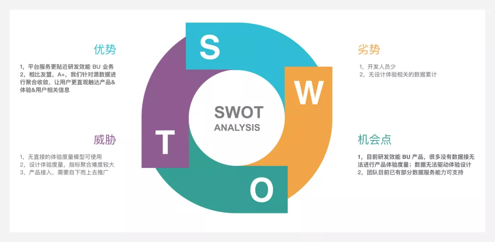

**2. Google Design Sprint**

1.1 概念介绍
* Design Sprint, 设计冲刺，顾名思义就是要在短时间内做出好设计；是由 Google 提出的设计方法。

1.2 使用场景
* 适用于短时间就需要产出设计方案；例如一些 Workshop 的构建, 产品迭代周期很快的新需求/任务，需要系统化分析与输出设计方案。

1.3 设计价值
* 可以在很短的时间内输出一套系统化的设计策略及方案；
* 通过与不同背景的参与者进行沟通协作，能获取更多看事物的角度和差异化知识；创造更多可能；
* 作为一种理想的设计教育工具，让非科班的设计人员完整又快速了解产品&设计。

1.4 具体实践案例说明

设计冲刺的主要内容包括 6 个阶段：
* 理解（Understand）：理解要为用户解决的问题 
* 定义（Define）：明确产品策略（数据分析，用户调研，设计原则制定等） 
* 发散（Diverge）：探索实现方案 
* 决定（Decide）：确定设计方案 
* 原型（Prototype）：构建产品原型 
* 验证（Validate）：验证产品原型
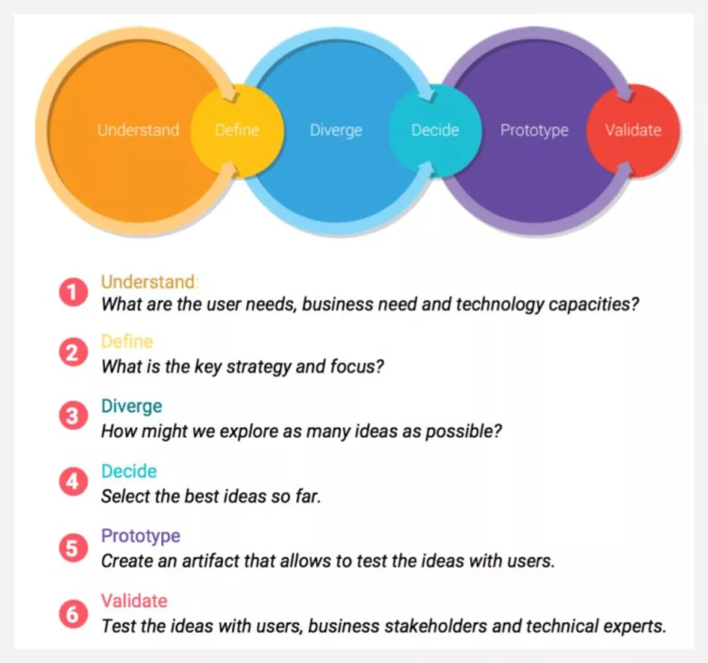

**3. GUCDR 模型**

1.1 概念介绍
* G（Goal）U（User）C（Condition）D（Design）R（Realize） 模型在设计过程中的实用性更强，能让你快速用起来，帮你系统性梳理信息；在实际工作中，只要能够回答画布中的每个点，即可形成完整的设计推演过程，让设计思路逐渐清晰起来。
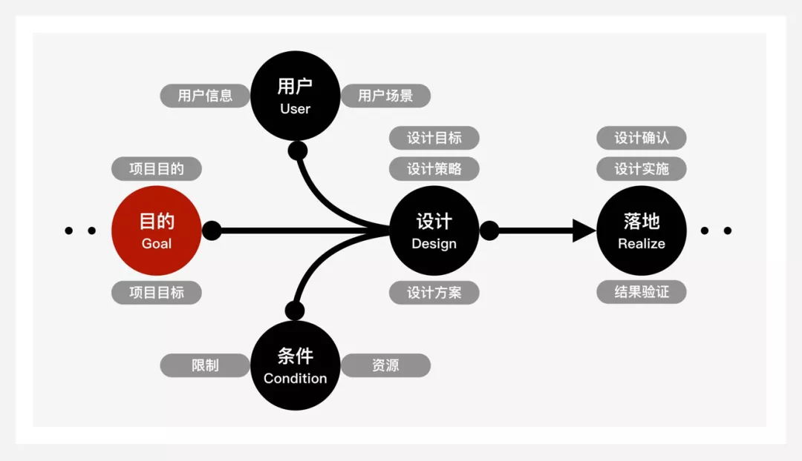

1.2 使用场景
* GUCDR 模型很适合用于前期需求调研和整理阶段；特别是在自己不是很熟悉的领域中，把信息按照模型和画布中的点进行归类汇总；最大限度的让自己的设计思维和信息逻辑得到诠释。

1.3 设计价值
* 对设计的需求来源及设计目标的聚焦定位，非常有价值，能快入深入了解业务背景；
* 对设计阶段的目标拆解，从设计目标 > 设计策略 > 设计方案，层层递进，设计方案输出的逻辑性和针对性很强。

1.4 具体实践案例说明
* GUCDR 模型在具体的使用过程中，可以和 GUCDR 画布结合起来一起使用。信息下钻的更深入具体，从项目目标到设计落地，每个阶段都有具体的节点支撑，在使用过程中只需要把信息直接输入到对应的位置即可。下图为 GUCDR 画布模板，可直接把业务相关信息输入进来。
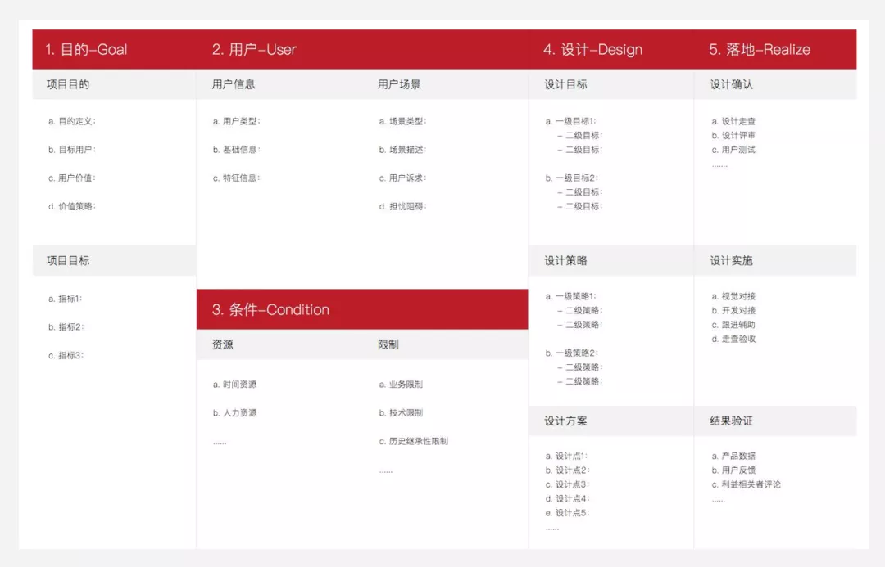

**4. 双钻模型**

1.1 概念介绍
* 双钻设计模型由英国设计协会提出，该设计模型的核心是：发现正确的问题、发现正确的解决方案。
双钻模型是一个结构化的设计方法，被很多设计师喜爱和使用。
* 探索/调研——透析问题（发散）
* 定义/合成——聚焦领域（集中）
* 发展/构思——潜在问题（发散）
* 传达/实现——实施方案（集中）
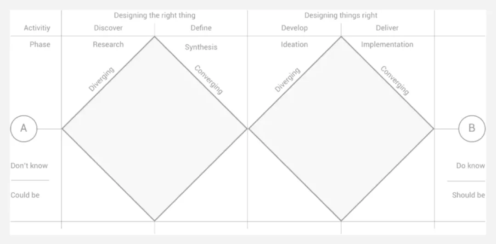

1.2 使用场景
* 一般应用在产品开发过程中的需求定义和交互设计阶段；教我们如何对未知的可能的事物进行探索；一步步到达已知的理应的层面。

1.3 操作使用说明
* 第一阶段——做对的事（菱形1——探索和定义）
* 第二阶段——把事情做对（菱形2——开发和履行）
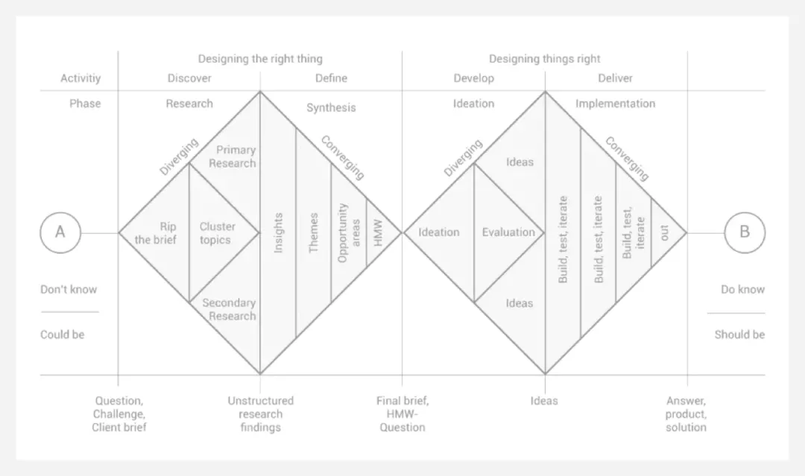
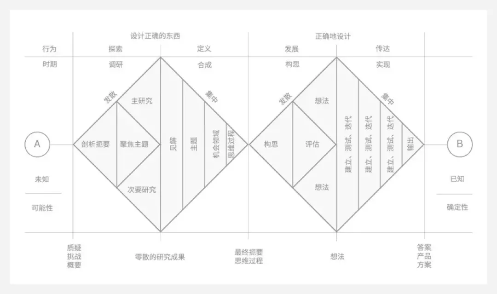

1.4 具体实践案例说明
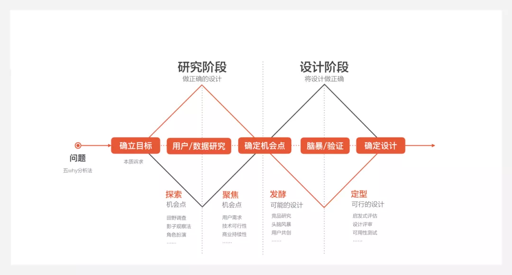

**5. 卡诺模型**

1.1 概念介绍
* kano模型是狩野纪昭教授发明的一种工具，以分析用户需求对用户满意的影响为基础，体现了产品性能和用户满意之间的非线性关系。
* 魅力属性：用户意想不到的，如果不提供此需求，用户满意度不会降低，但当提供此需求，用户满意度会有很大提升；
* 期望属性：当提供此需求，用户满意度会提升，当不提供此需求，用户满意度会降低；
* 必备属性：当优化此需求，用户满意度不会提升，当不提供此需求，用户满意度会大幅降低；
* 无差异因素：无论提供或不提供此需求，用户满意度都不会有改变，用户根本不在意；
* 反向属性：用户根本都没有此需求，提供后用户满意度反而会下降。
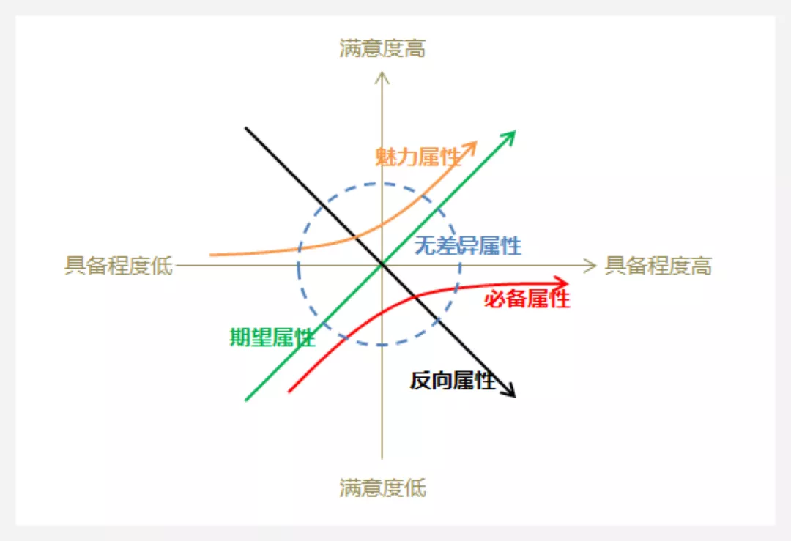

1.2 使用场景
* 主要使用场景是对用户需求分类；
* 另一种是对多个功能点进行优先级排序。

1.3 操作使用说明

1.3.1 步骤一：设计问卷调查表，实施有效的问卷调查
KANO 模型的问卷问法，是对每个质量特性都由正向和负向两个问题构成，分别测量用户在面对存在或不存在某项质量特性时的反应。问卷中的问题答案采用五级选项分别是：
* 我很喜欢：让你感到满意、开心、惊喜。
* 理应如此：你觉得是应该且必备的功能。
* 无所谓：你不会特别在意，但还可以接受。
* 勉强接受：你不喜欢，但可以接受。
* 我很不喜欢：让你感到不满意。

1.3.2 步骤二：问卷结果整理，进行数据分析

根据问卷结果进行 KANO 模型二维属性归属分析，可得出魅力属性、期望属性、必备属性、无差异属性、反向属性与可疑结果的功能属性归类百分比。除了对属性的归属探讨外，并通过百分比计算出 Better-Worse 系数，表示某功能可以增加满意或者消除很不喜欢的影响程度。
* 增加后的满意系数 Better/SI=(A+O)/(A+O+M+I)
* 消除后的不满意系数 Worse/DSI=-1*(O+M)/(A+O+M+I)
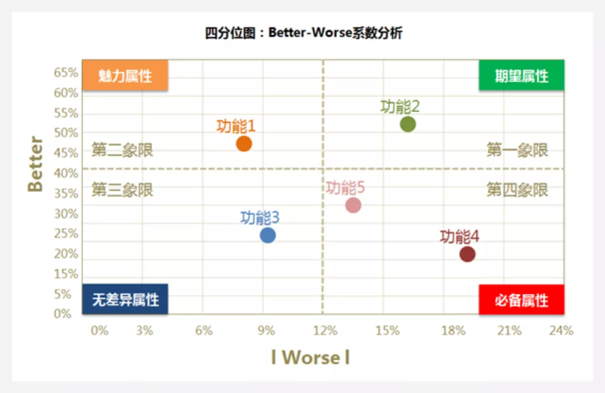

根据 better-worse 系数值，将散点图划分为四个象限。
* 第一象限/期望属性：better 与 worse系数成正比；表示产品提供此功能，用户满意度会提升，不提供此功能，用户满意度会降低，这是质量的竞争性属性，应尽力去满足用户的期望型需求。
* 第二象限/魅力属性：better系数值高，worse 系数绝对值低的情况。表示不提供此功能，用户满意度不会降低，提供此功能，用户满意度和忠诚度会有很大提升；
* 第三象限/无差异属性：better系数值低，worse系数绝对值也低的情况。即无论提供或不提供这些功能，用户满意度都不会有改变，这些功能点是用户并不在意的功能。
* 第四象限/必备属性：better系数值低，worse系数绝对值高的情况。当产品提供此功能，用户满意度不会提升，当不提供此功能，用户满意度会大幅降低；此象限的功能是最基本的功能，这些需求是用户认为产品有义务做到的事情。

1.3.3 步骤三：数据解读，将结果落地实施
* KANO 模型是对功能需求的优先级进行探索，具体情况还需要和业务方进行讨论，结合实际情况后制定可行的产品功能开发优先级顺序，以将调研结果落地实施。

1.4 具体实践案例说明
* 步骤一：设计问卷问题，发放问卷
* 步骤二：问卷统计，进行 KANO 模型二维属性归属分析
* 步骤三：根据问卷统计的用户数据；计算出每个区域的百分比；
* 步骤四：根据 Better-Worse 计算公式，得出 Better-Worse 系数，明确功能落点象限。
* 步骤五：多个功能需求结果对比进行优先级排序。

**6. METUX 幸福模型**

1.1 概念介绍
* 为了帮助大家更好地进行“幸福设计”，卡里罗教授分享了他的一个模型——Motivation, Engagement and Thriving in theUser Experience (METUX)。

1.2 使用场景
* 产品成熟稳定期，需对产品&用户体验进行提升时；或需综合对产品体验进行评估分析时；提升用户幸福感，希望产品能对用户行为方式及生活质量有所影响时。

1.3 操作使用说明

在考虑用户体验时，从4个层次进行考虑：
* 第一层是“界面”体验：用户与产品交互时的体验如何。
* 第二层是“任务”体验：界面之上是用户完成的任务。如利用智能手环计步，用户在完成任务时体验如何。
* 第三层是“行为”体验：任务之上是用户的行为。如用户购买智能手环的目的是运动，此时行为可能是跑步、骑自行车。因此产品在任务之上应该深入关注用户行为上的体验。
* 第四层是“生活”体验：行为会对生活产生影响。如运动过量可能导致身体受损。
在设计过程中，应该关注“胜任力”、“自主性”和“关系”三个关键因素，这些基本心理诉求是动机、投入感和幸福感的根本。
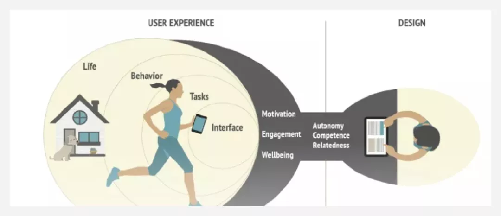