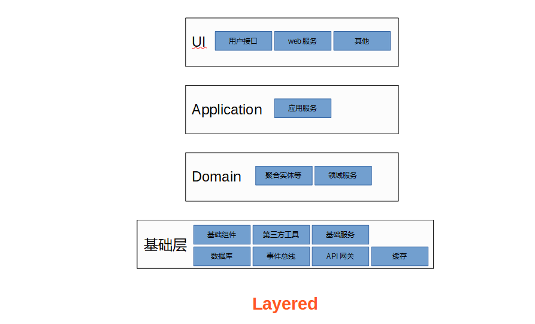

### 软件系统特性

**1. Complexity（复杂性）**

- 软件可以说是人类创造的最复杂的系统类型。软件的各个模块之间有各种显性或隐性的依赖关系，随着系统的成长和模块的增多，这些关系的数量往往以几何级数的速度增长。而理解运用这些复杂性的人并没有太多的变化。

**2. Invisibility（不可见性）**

- 软件工程师能直接看见源代码，但是源代码不是软件本身。并且静态的源代码和运行的系统也不一样，软件运行环境的复杂性也增加了软件系统的不可预测性。软件系统不能以简单的方式描述出来，设计文档，描述说明，流程图，架构图这些也不过是让复杂的软件系统以更易于理解和易于交流的方式展示，却依旧不能完全描述系统的全貌。

**3. Changeability（易变性）**

- 修改软件看似很容易，修改软件比修改硬件容易多了，修改软件系统也比修改一座巍立建筑物容易的多。所以人们自然地期待软件系统能够适应未来的变化。但变化却是复杂的，环境也是复杂的，这些复杂的情况往往让一个易于修改的事情却变成一件越来越困难的事情。

**4. Conformity（服从性）**

- 软件系统不能独立存在，它总是运行在硬件上面，也总是要服从系统中其他组成部分的要求，也要服从用户的要求、行业的要求。

### 系统架构设计方式

**1. 抽象**

- 抽象是系统架构设计的重要一步。抽象是将复杂的概念简单化。在最高层次上，将软件系统抽象为对象和过程两个高层次概念。对象可以是系统、组件、接口、类、方法等等不同层次的概念，过程是系统运行的方式和流程。抽象使具象的事物概念化，从而确定边界，易于理解，易于交流。

**2. 分解**

- 分解与组合相互作用。分解就是将高层次的抽象概念分解成低层次的抽象概念，就是将实体分成小的部件或组成部分，在应对复杂度的诸多方式中，”分而治之“是一项基本策略，它把大问题持续分解成小问题，直到每一个小问题都能够解决为止。

**3. 语言**

- 语言的边界就是世界的边界。领域语言、设计语言确定系统的what、how和why。语言使系统显见于文档，设计图等等易于理解的层次，也使得系统的易变性被规范在可预见和可控制的范围之中。

### 架构模式

**1. Client-Server**

- client-server 模式以请求-响应方式工作，客户端发送请求信息，服务端接受请求，作出相应处理，然后发回响应信息。所有我们访问的互联网网站都是这种架构。在桌面程序流行的时代，互联网还没有当前这么发达的时代。Client-Server 还只代表 Desktop Client-Server 模式，使用浏览器的方式称之为 B-S 模式，即 Browser-Server 模式。如今 Browser、Desktop Application、Mobile Application、Mobile Web 等统称为 Client。

**2. P2P**

- 端对端服务模式（Peer to Peer，简称 P2P），亦称为“点对点模式”，是指通过互联网将个人与个人连接起来，绕开中心平台而直接提供服务、完成交易的模式。P2P 的早期含意是计算机通信领域中的“对等网络协议”，它打破了传统的 Client/Server(C/S)模式，使得成千上万台彼此连接的计算机都处于对等地位，网络的参与者直接共享他们所拥有的一部分硬件资源（包括处理能力、存储能力、网络连接能力、打印机等），这些共享资源通过互联网，能被其它对等节点(Peer)直接访问而无需经过统一的中间体。在该网络中的参与者既是资源（服务或内容）提供者（Server），又是资源获取者（Client）。

- P2P 模式流行于文件分享与下载、计算与存储、即时通信和协同共享等领域。

**3. MVC**

- Model-View-Controller，MVC 架构是面向对象编程的一大进步。服务将逻辑划分为三个不同的组建：Model——模型，即数据，通常存储在数据库中，在内存中进行逻辑操作。View——用户可见的组建，用于用户交互和数据展示，如 Web GUI。Controller——逻辑操作，连接 Model 和 View 的组件，操作 Model 逻辑和 View 交互展示逻辑。

- MVC 模式在客户端和 H5 前端都比较流行。也一直是 Web 后端流行的架构模式，在 Java Web 领域催生的 Struts、Spring MVC 等 Web 后台框架，让曾经复杂的 Web 开发变成一种异常简单的开发。

- 随着前后端渐渐分离，之前的后台 MVC 已经将 View 完全交于前端，前后端通过相关协议通信，完成 View 数据的传输。

**4. Layered**

- 分层架构是运用最为广泛的架构模式，几乎每个软件系统都需要通过层（Layer）来隔离不同的关注点（Concern Point），以此应对不同需求的变化，使得这种变化可以独立进行。

- 单一职责原则，是系统设计开发重要的原则。分层架构就时时遵循单一职责原则。不同的层次相互隔离，承担不同的职责。

- 说起分层架构，最让人熟知的就是经典的三层架构。经典三层架构自顶向下由用户界面层（User Interface Layer）、业务逻辑层（Business Logic Layer）与数据访问层（Data Access Layer）组成。三层架构是简单 Client-Server 架构的升级。

- 三层架构的经典和流行，以及大量 Web 后台框架对三层架构的靠近，使得 Web 后台开发简单到一个刚刚入门的开发人员就可以进行 web 开发。也正因为此，使得大部分 web 开发人员的思维受限于此，从而成为人人调侃的 CRUD-Boy。随着 MIS 系统时代的渐远，三层架构也开始在一些领域无法成为“银弹“。

- 除去经典的三层架构。在领域驱动设计中，Eric Evans 设计了一种经典的四层架构，其在用户界面层与业务逻辑层之间引入了新的一层，即应用层（Application Layer）。其余几层也相应的有所调整。

**5. Distribute-Cluster**

- 单体架构有如下优势：
易于开发：借助于开发框架，单体应用的开发及其简单，开发人员也很少需要考虑系统、部署、网络等层次的问题。
易于测试：单体应用部署在一个进程中，环境简单。只要服务启动就可以测试所有的功能。
易于部署：往往只需要将应用打包成一个简单的包就可。
易于水平扩展：只需要将程序包部署多个服务即可。

- 单体应用的劣势：
维护成本增加：随着需求的增多，单体系统将越来越臃肿，维护的复杂性也将越来越大。
持续交互周期长：一方面维护困难，另一方面单体应用在并行开发，并行测试上将十分困难，单体应用十分不适合快速迭代的敏捷开发。
扩展性差：由于臃肿的系统，将导致系统扩展性变难。系统的升级也需要十分谨慎。
对新人不友好。

**6. Micro-Service**

- 微服务通常具有以下特性：
单一职责：业务独立，团队自主。职责单一的服务应该具有核心的领域，高内聚、低耦合，与其他系统和领域确定明确的边界。
轻量级通信：通信应该简单，轻量。与语言无关，与平台无关。
独立性：独立开发，独立测试和独立部署。
一切选择都是权衡的过程。微服务解决了单体应用的许多问题，自然也会带来相应的问题。分布式和集群的环境是复杂的，基于此的微服务架构也将具有相应的复杂度。

- 随着微服务的流行，微服务的很多问题也被越来越多的框架和服务解决掉了。我们以 Spring Cloud 技术栈为例：
SpringBoot：单体服务，快速创建项目，快速集成各种框架，易于测试，易于部署。
Feign：微服务独立部署，通过相关协议通信。Feign 就是一个简单的申明式通信框架，基于 HTTP restful。
Eureka：独立服务越来越多，服务实例也越来越多。服务治理便是必须的，Eureka 提供高可用的服务注册和服务发现功能。
Ribbon：Feign 只负责通信，Ribbon 提供客户端负载均衡，是系统优化的部分。
Hystrix：微服务将带来服务间复杂的依赖关系，分布式和集群的复杂度也将带来许多难以预料的问题。为防止复杂网络和复杂系统某一点的问题导致整个系统的雪崩状态，便有了 Hystrix，Hystrix 是 Spring Cloud 体系中优秀的断路器，可以在系统发生问题时进行服务降级，防止整体系统崩溃。
Zuul：统一网关，统一网关是以 Facade 模式，对外提供友好的接口，微服务化之后，服务将越来越多，越来越复杂，为了降低外部系统调用的复杂度，统一网关就是常用解决方案。
Config：服务划分越多，配置将越多，Spring cloud config 提供统一的配置管理。
Sleuth：服务监控和治理。监控是复杂系统必需的基础设施。系统感知、问题发现、性能定位都需要监控的加持。

**7. Even-Source**

- 事件溯源是最新流行一种应用程序体系结构模式。事件源将应用程序进行的状态更改建模为事件的不可变序列或“日志”。事件源不是在现场修改应用程序的状态，而是将触发状态更改的事件存储在不可变的日志中，并将状态更改建模为对日志中事件的响应。

- CQRS 模式通常基事件溯源模式。在传统的体系结构中，使用同一数据模型查询和更新数据库。这十分简单，非常适用于基本的 CRUD 操作。但是，在更复杂的应用程序中，此方法会变得难以操作。例如，在读取方面，应用程序可能执行大量不同的查询，返回具有不同形状的数据传输对象 (DTO)。对象映射可能会变得复杂。在写入方面，模型可能实施复杂验证和业务逻辑。结果，模型执行太多操作，过度复杂。

- CQRS（命令查询的责任分离 Command Query Responsibility Segregation ）将读取和写入操作分成不同的模型，使用 命令 更新数据，并使用 查询 来读取数据。

**8. Hexagonal**

- 六边形架构又称“端口和适配器模式”，是 Alistair Cockburn 提出的一种具有对称性特征的架构风格。在这种架构中，系统通过适配器的方式与外部交互，将应用服务与领域服务封装在系统内部。

- 六边形架构由以下三个组件组成：
Ports：又可以分为输入端和输出端，是系统与其他系统交互的接口。
Adapters：与其他系统的适配层，一方面防止核心系统和领域被外部影响，即防腐;另一方面方便 api 使用。
Domain：应用和模型是程序的核心。

- 六边形架构的核心理念是：应用通过"端口"跟外部进行交互。在传统的分层架构中很容易跨越层间的边界，把业务逻辑渗透到其它层中去。六边形架构重要的就是“边界”和“领域”。六边形架构的初衷是为了解决技术与业务系统的解耦合问题，以及技术与技术间的解耦合问题，这一架构从设计模式中来，从业务的实体服务出发，将面向接口的设计具体化的端口协议和适配器实现，服务自身实现独立性和完备性。

