## **环境说明**

#### 准备工作

- [Web 端入门须知](https://tencentcloudbase.github.io/2020-02-14-init)
- [开发准备文档](https://tencentcloudbase.github.io/2020-02-14-prepare)
- [腾讯云账号](https://console.cloud.tencent.com/tcb)
- VS Code IDE

## **步骤说明**

#### **一、创建云开发环境**

**1. 注册好腾讯云账号后，按照如下步骤创建云开发环境**
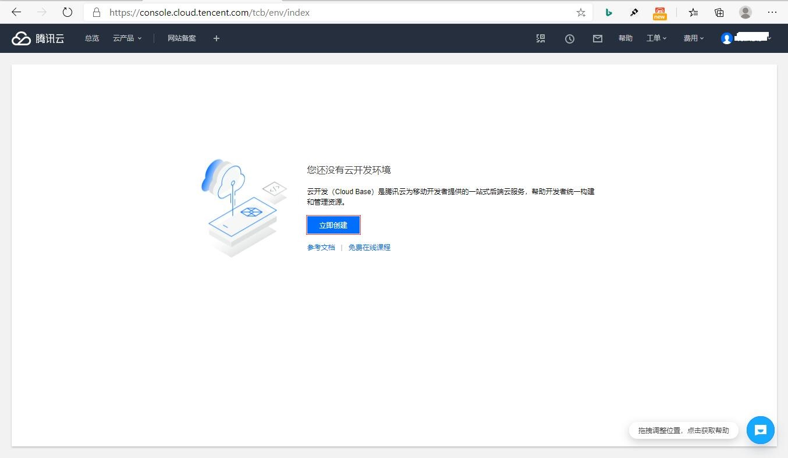
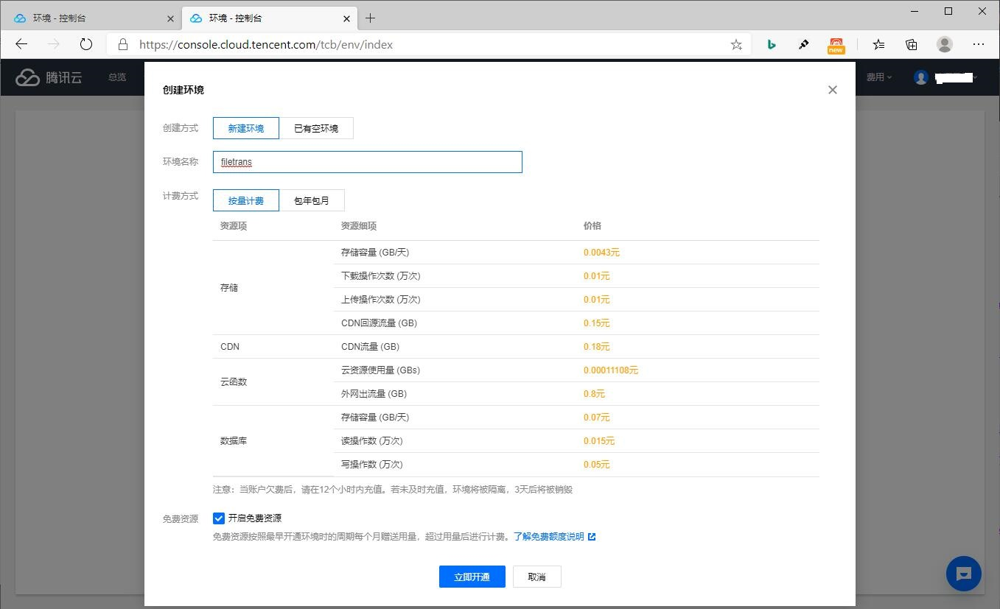
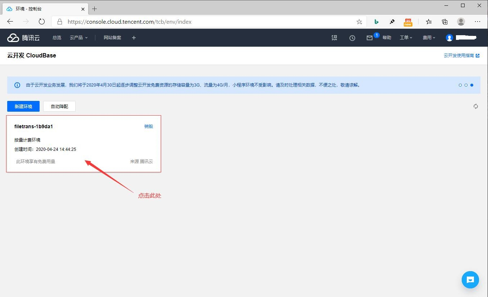

**2. 点击左侧静态网站托管菜单，再点击右侧的开始使用按钮**
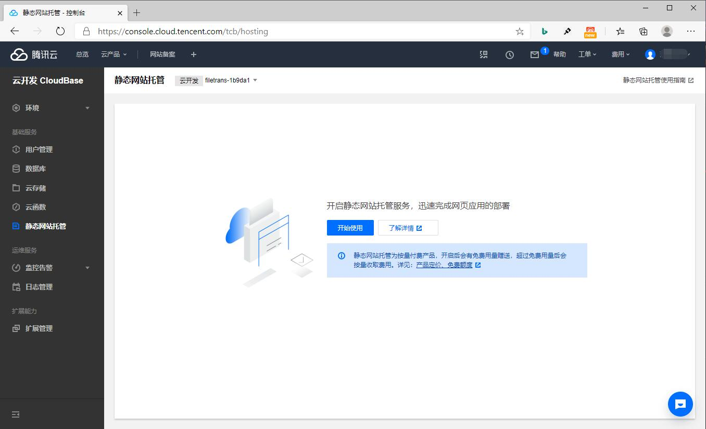

**3. 点击左侧数据库菜单，再点击右侧的添加集合按钮，添加如下 3 个集合**
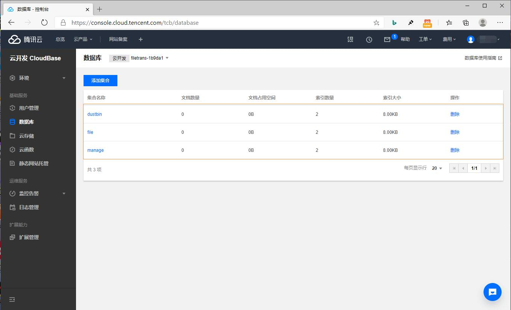

**4. 点击左侧环境->环境设置菜单，再点击右侧的登录方式菜单，将匿名登录开启**
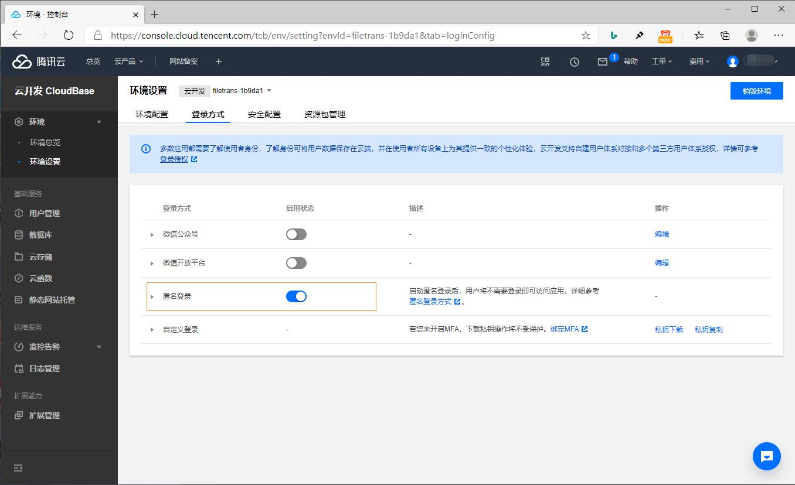

#### **二、导入初始数据**

**1. 点击左侧数据库菜单，点击创建好的 manage 集合，导入 json 文件**
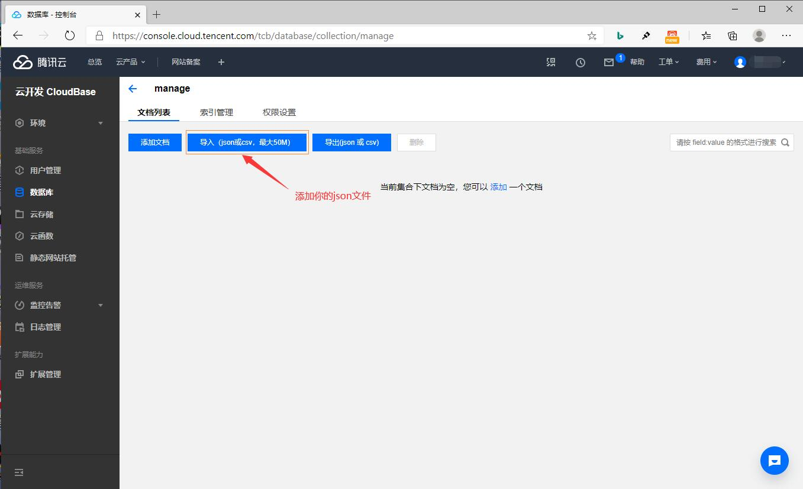
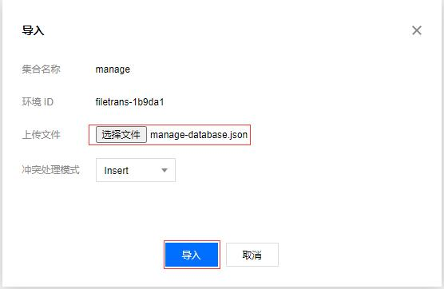
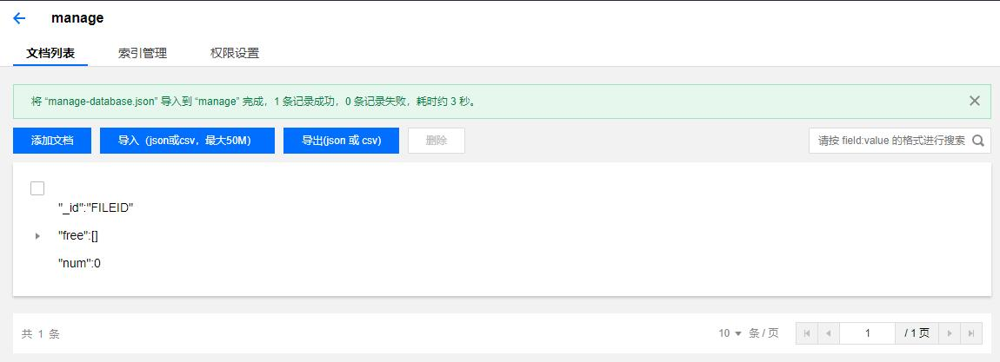

#### **三、配置项目**

**1. 用代码工具打开项目目录，修改以下文件的环境 ID；环境 ID 可以在环境设置->环境配置下查看**

```
cloudfunctions/cloudbaserc.js 第3行
webviews/js/index.js 第1行
```

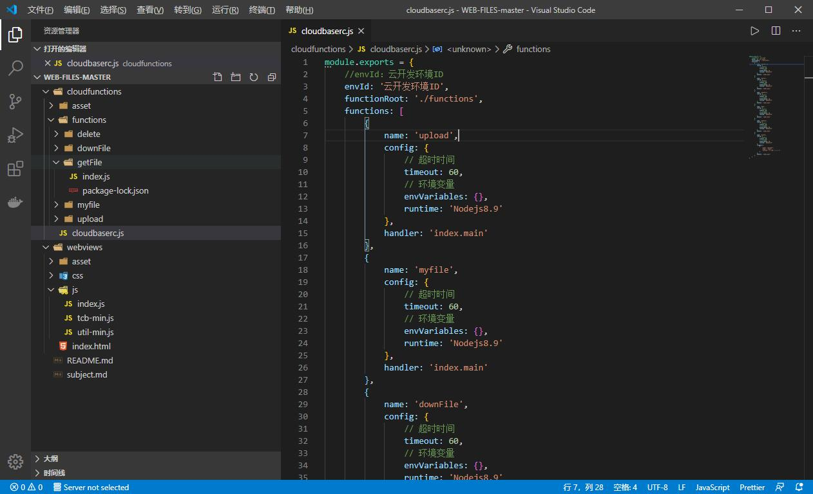
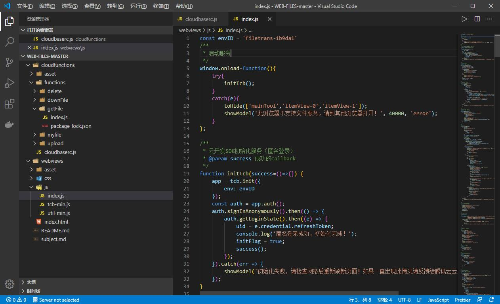

**2. [创建验证码应用](https://console.cloud.tencent.com/captcha)，获得 aid（APPID）和 AppSecretKey 并修改以下文件参数**

```
@ cloudfunctions/functions/getFile/index.js
const tcb = require("tcb-admin-node");
const request = require('request');
const TCaptchaID = {
    aid:'2011408467',//腾讯验证码项目aid
    AppSecretKey:'0VCR3zfoz7QtLQuW_xNxvXw**'//腾讯验证码项目Secretkey
};
@ webviews/index.html
<button class="button dark large-btn upload" disabled id="TencentCaptcha" data-appid="你的APPID" data-cbfn="downloadFile">
  <span class="btnText" id="downloadBtnText">下载文件</span>
  <span class="btnProgress" id="downProgress"></span>
</button>
```

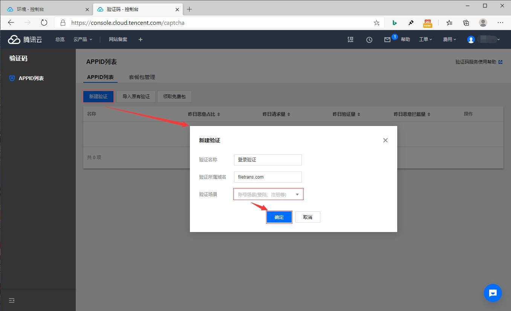

- 点击查看详情，再点击基础配置即可查看自己的 APPID 和 AppSecretKey
  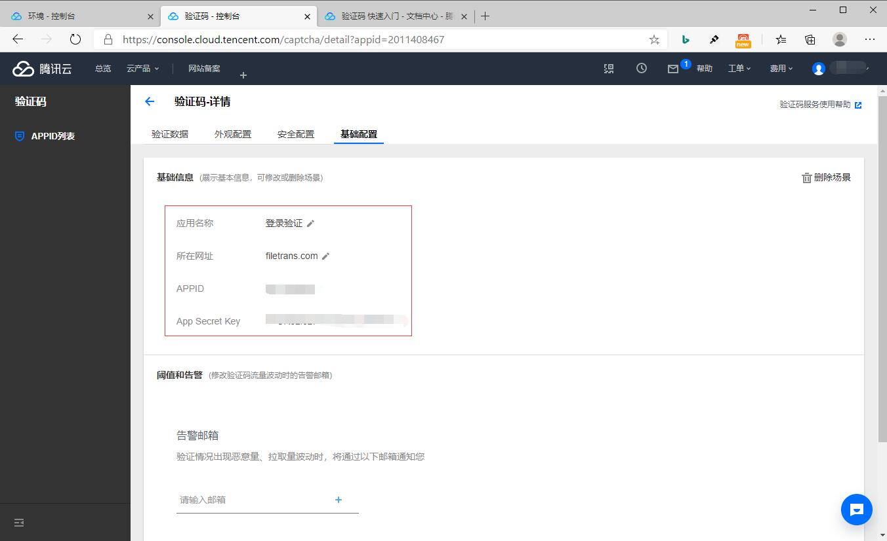

**3. 设置域名，复制域名信息下的默认域名，黏贴到 cloudfunctions/functions/getFile/index.js 第 9 行 AllowOriginList 数组中第 1 项**
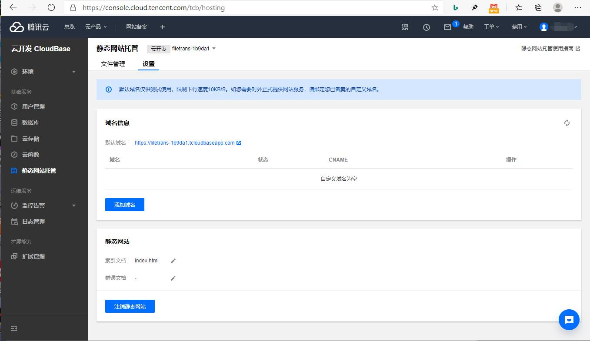
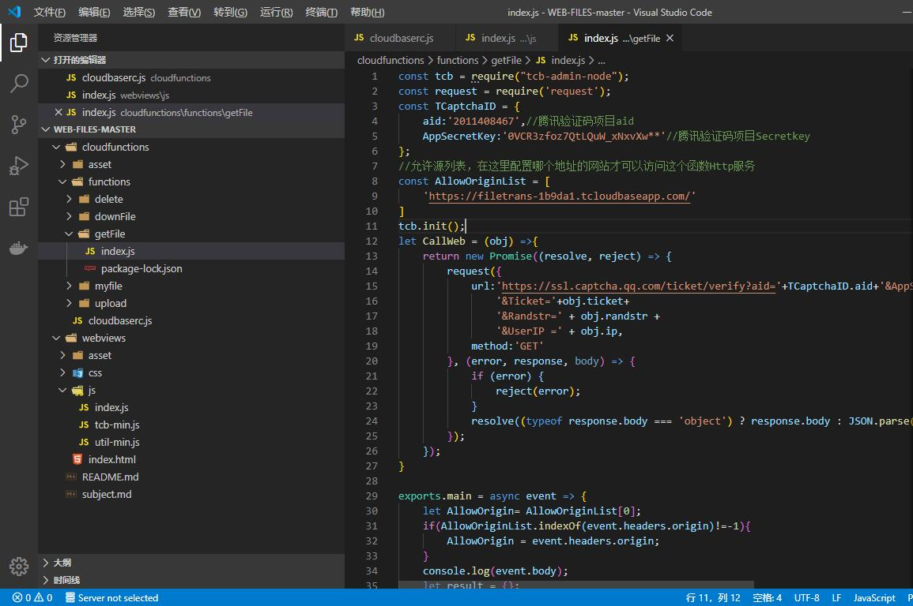

#### **四、安装依赖**

**1. 确定本机已经安装了 nodejs 和 npm 后，命令行进入 cloudfunctions/functions 下的每个文件目录，在每一个目录下均执行一遍以下代码：**

```
npm install tcb-admin-node
```

注意：getFile 文件夹下需要安装 request

#### **五、上传并部署云函数**

**1. 安装 cloudbase/cli，打开命令行终端，输入如下命令：**

```
$ sudo npm i -g @cloudbase/cli
```

**2. 测试安装是否成功**

- 如果安装过程没有错误提示，一般就是安装成功了。下面，我们可以继续输入命令：

```
$ cloudbase -v
```

- 如果看到输出版本号，说明已经安装成功。

**3. 使用 CloudBase CLI 工具登录后，进入 cloudfunctions/目录，依次执行以下代码：**

```@bush
cloudbase functions:deploy -e 你的云开发环境ID delete
cloudbase functions:deploy -e 你的云开发环境ID downFile
cloudbase functions:deploy -e 你的云开发环境ID getFile
cloudbase functions:deploy -e 你的云开发环境ID myfile
cloudbase functions:deploy -e 你的云开发环境ID upload
cloudbase service:create -e 你的云开发环境ID -p /getFile -f getFile
cloudbase functions:trigger:create -e 你的云开发环境ID delete
```

上面最后两行是为 getFile 云函数创建 HTTP 服务 和 为 delete 创建触发器

#### **六、部署静态网站服务**

- 使用 CloudBase CLI 工具登录后，进入根目录，依次执行以下代码：
  **注意：中文替换成自己的云开发环境 ID**

```@bash
$ cloudbase hosting:deploy -e 你的云开发环境ID webviews
```

#### 注意事项

1. 如果云函数访问提示找不到 tcb-admin-node,则使用代码更新命令重新更新即可

```@bash
$ cloudbase functions:code:update -e envID fun
```

2. 如果上传文件提示同源限制，则在环境设置中重新配置一下静态托管域名（删掉重新安装）
