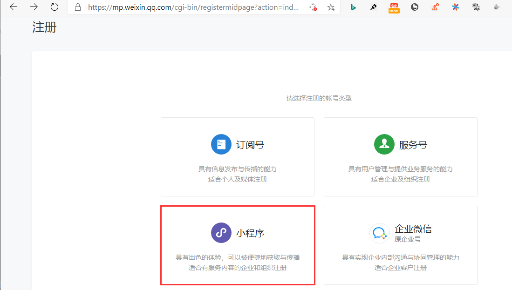
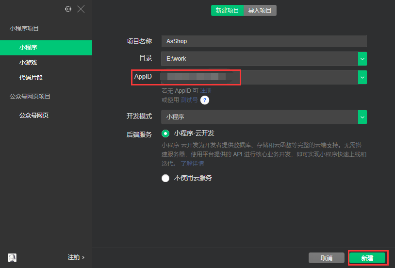
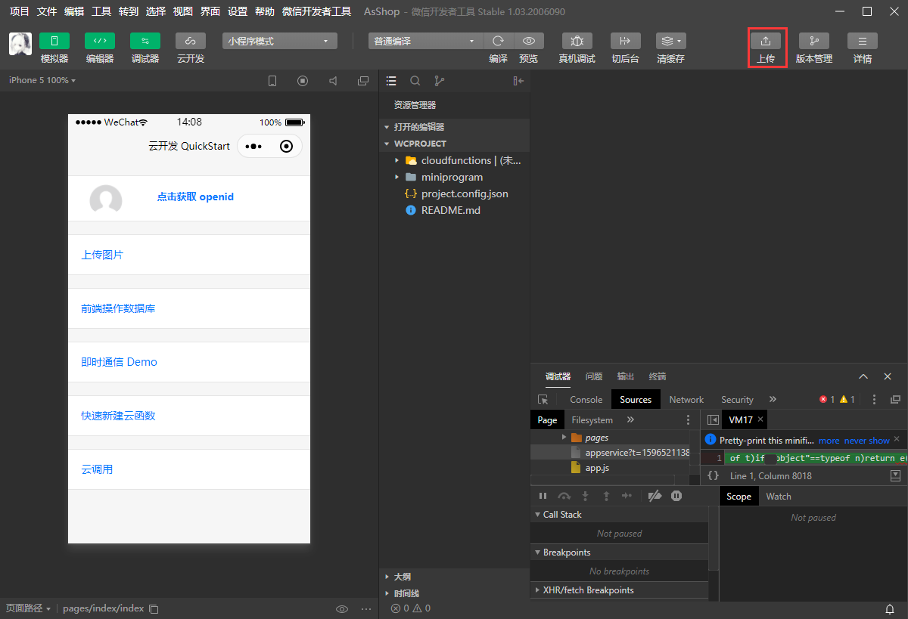
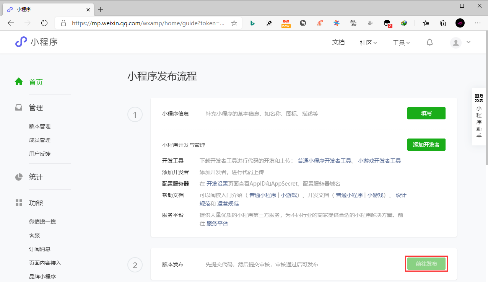
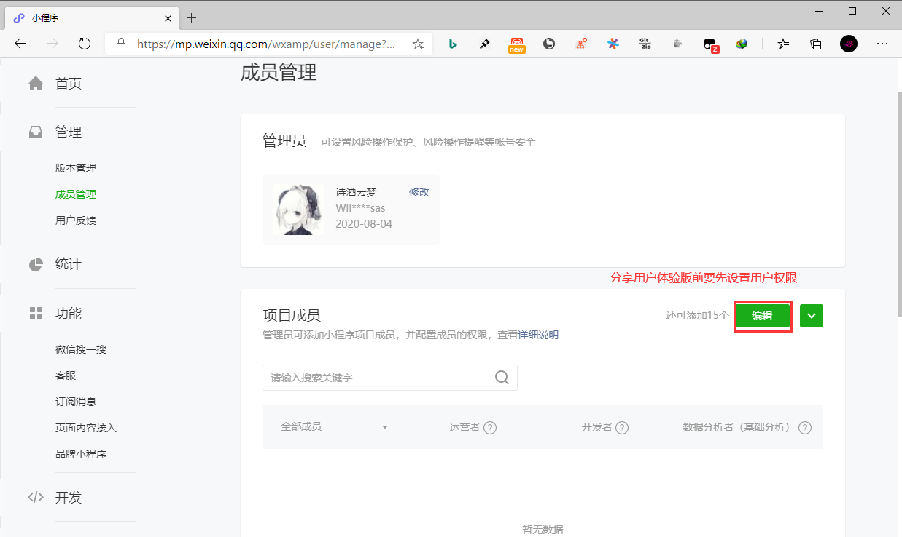
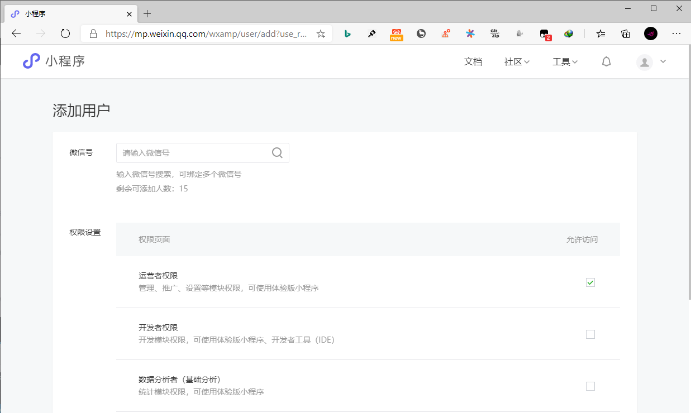

## **环境说明**

#### 准备工作

- Windows 10 2004 版本（Windows 系统）
- [小程序开发工具](https://developers.weixin.qq.com/miniprogram/dev/devtools/download.html)
- [注册](https://mp.weixin.qq.com/cgi-bin/registermidpage?action=index&lang=zh_CN&token=)

## **步骤说明**

**1. 申请成为微信小程序开发者**

**2. 安装开发者工具并登录**

**3. 项目开发**

**4. 项目上传**

- 上传完成后，在网页的微信小程序开发者后台，点击首页-》前往发布-》开发者版本-》选为体验版本-》提交-》分享二维码

- 添加用户权限（用于体验测试小程序）

**5. 发布正式版**

- 在网页的微信小程序开发者后台，点击首页-》前往发布-》开发者版本-》提交审核-》同意条款服务-》配置小程序功能页面-》等待审核结果
