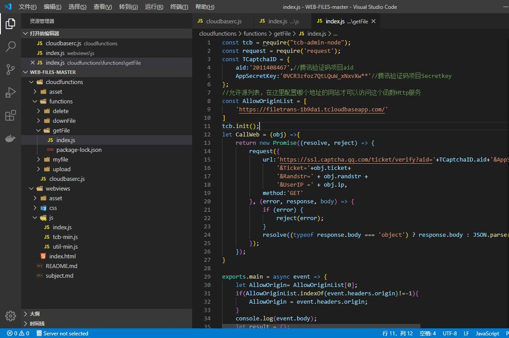

## **环境说明**
#### 准备工作
* [Web端入门须知](https://tencentcloudbase.github.io/2020-02-14-init)
* [开发准备文档](https://tencentcloudbase.github.io/2020-02-14-prepare)
* [腾讯云账号](https://console.cloud.tencent.com/tcb)
* VS Code IDE

## **步骤说明**
#### **一、创建云开发环境**
**1. 注册好腾讯云账号后，按照如下步骤创建云开发环境**


**2. 点击左侧静态网站托管菜单，再点击右侧的开始使用按钮**


**3. 点击左侧数据库菜单，再点击右侧的添加集合按钮，添加如下3个集合**


**4. 点击左侧环境->环境设置菜单，再点击右侧的登录方式菜单，将匿名登录开启**


#### **二、导入初始数据**
**1. 点击左侧数据库菜单，点击创建好的manage集合，导入json文件**


#### **三、配置项目**
**1. 用代码工具打开项目目录，修改以下文件的环境ID；环境ID可以在环境设置->环境配置下查看**
```
cloudfunctions/cloudbaserc.js 第3行
webviews/js/index.js 第1行
```


**2. [创建验证码应用](https://console.cloud.tencent.com/captcha)，获得aid（APPID）和AppSecretKey并修改以下文件参数**
```
@ cloudfunctions/functions/getFile/index.js
const tcb = require("tcb-admin-node");
const request = require('request');
const TCaptchaID = {
    aid:'2011408467',//腾讯验证码项目aid
    AppSecretKey:'0VCR3zfoz7QtLQuW_xNxvXw**'//腾讯验证码项目Secretkey
};
@ webviews/index.html
<button class="button dark large-btn upload" disabled id="TencentCaptcha" data-appid="你的APPID" data-cbfn="downloadFile">
  <span class="btnText" id="downloadBtnText">下载文件</span>
  <span class="btnProgress" id="downProgress"></span>
</button>
```

* 点击查看详情，再点击基础配置即可查看自己的APPID和AppSecretKey


**3. 设置域名，复制域名信息下的默认域名，黏贴到cloudfunctions/functions/getFile/index.js第9行AllowOriginList数组中第1项**



#### **四、安装依赖**
**1. 确定本机已经安装了nodejs和npm后，命令行进入cloudfunctions/functions下的每个文件目录，在每一个目录下均执行一遍以下代码：**
```
npm install tcb-admin-node
```
注意：getFile文件夹下需要安装request

#### **五、上传并部署云函数**
**1. 安装 cloudbase/cli，打开命令行终端，输入如下命令：**
```
$ sudo npm i -g @cloudbase/cli        
```

**2. 测试安装是否成功**
* 如果安装过程没有错误提示，一般就是安装成功了。下面，我们可以继续输入命令：
```
$ cloudbase -v
```
* 如果看到输出版本号，说明已经安装成功。

**3. 使用CloudBase CLI工具登录后，进入cloudfunctions/目录，依次执行以下代码：**
``` @bush
cloudbase functions:deploy -e 你的云开发环境ID delete
cloudbase functions:deploy -e 你的云开发环境ID downFile
cloudbase functions:deploy -e 你的云开发环境ID getFile
cloudbase functions:deploy -e 你的云开发环境ID myfile
cloudbase functions:deploy -e 你的云开发环境ID upload
cloudbase service:create -e 你的云开发环境ID -p /getFile -f getFile
cloudbase functions:trigger:create -e 你的云开发环境ID delete
```
上面最后两行是为 getFile云函数创建HTTP服务 和 为delete创建触发器

#### **六、部署静态网站服务**
* 使用CloudBase CLI工具登录后，进入根目录，依次执行以下代码：
**注意：中文替换成自己的云开发环境ID**
``` @bash
$ cloudbase hosting:deploy -e 你的云开发环境ID webviews
```

#### 注意事项
1. 如果云函数访问提示找不到tcb-admin-node,则使用代码更新命令重新更新即可
``` @bash
$ cloudbase functions:code:update -e envID fun
```
2. 如果上传文件提示同源限制，则在环境设置中重新配置一下静态托管域名（删掉重新安装）