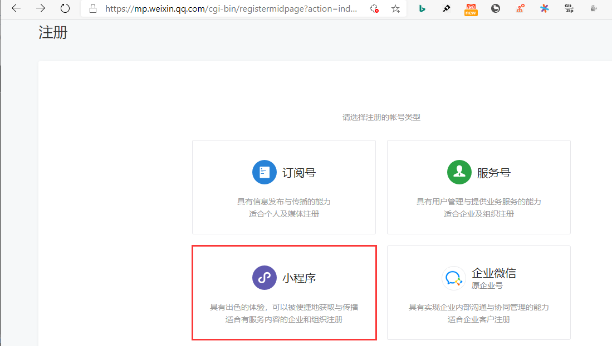
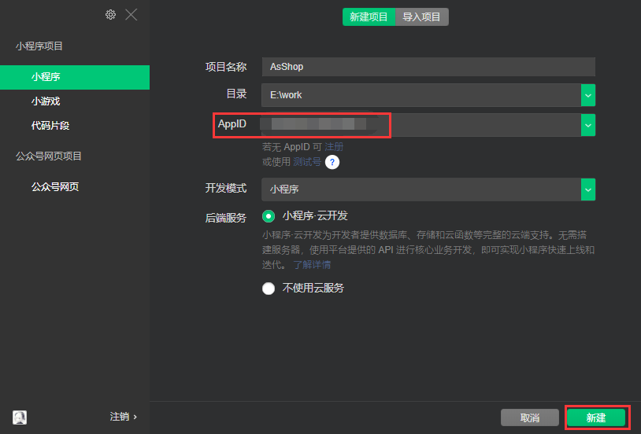
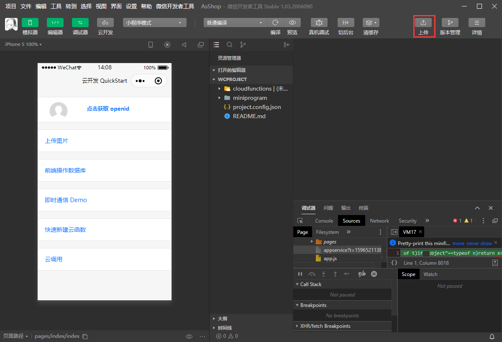
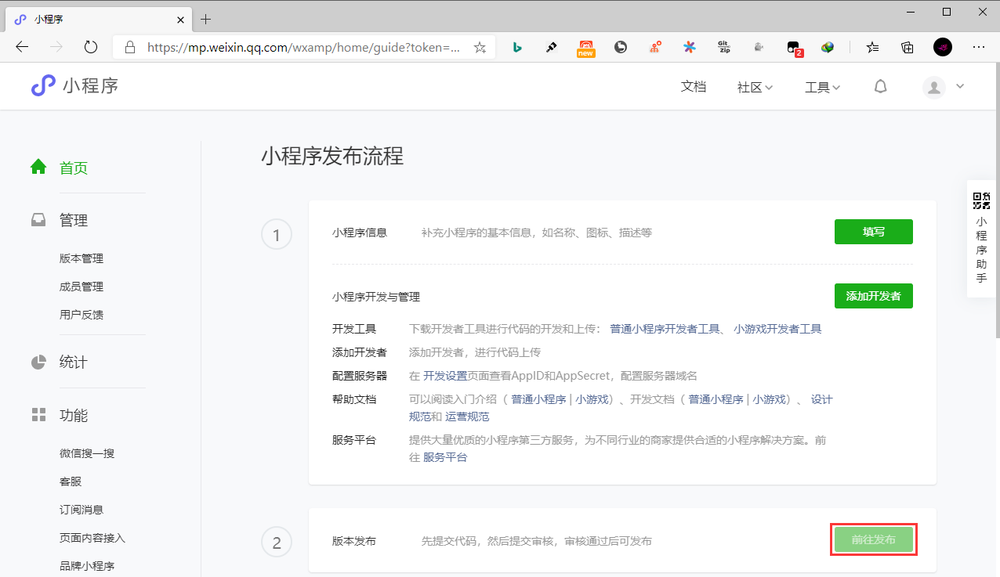
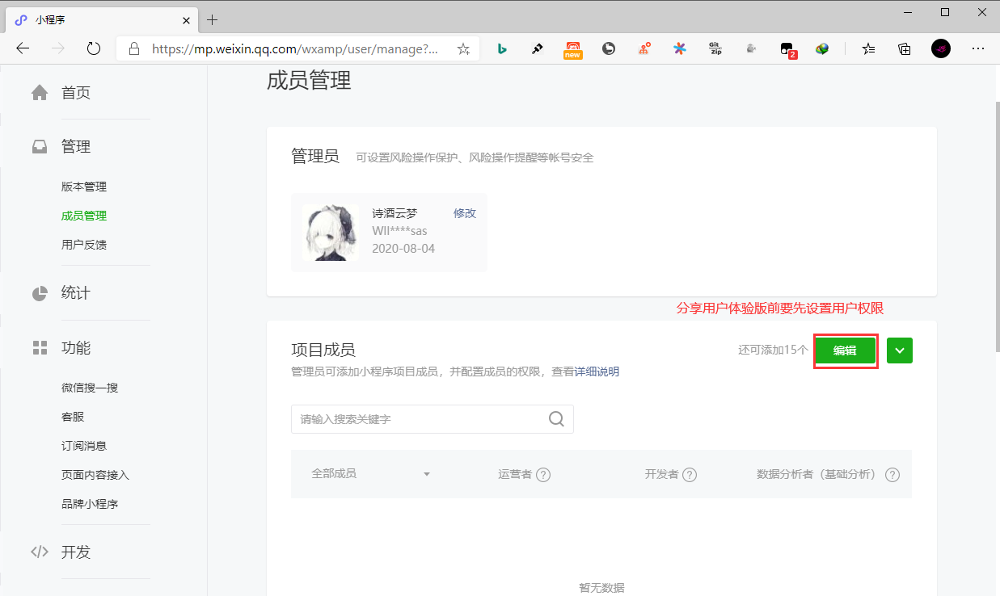
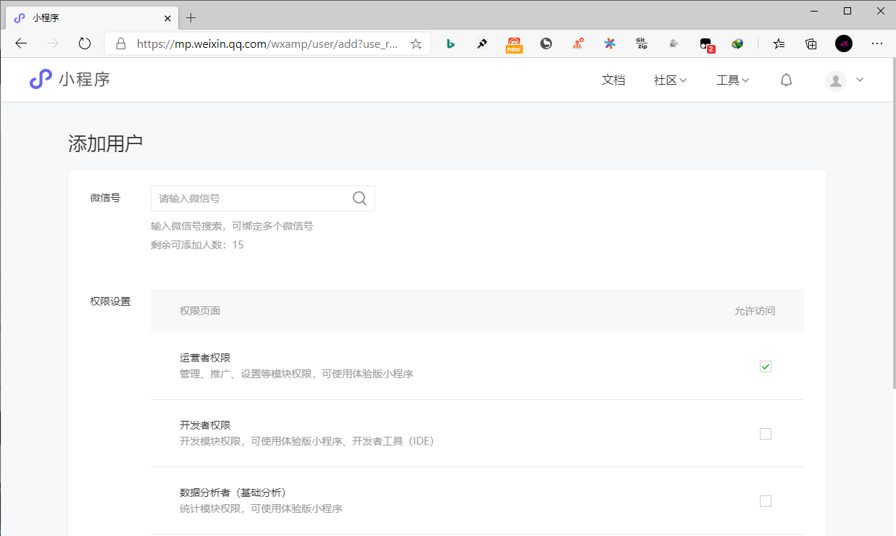

## **环境说明**

#### 准备工作

- Windows 10 2004 版本（Windows 系统）
- [小程序开发文档](https://developers.weixin.qq.com/miniprogram/dev/framework/)
- [react-visual-editor 可视化拖拽工具](https://github.com/tomato-cc/wxmap)

## **步骤说明**

**1. 11**

**2. 222**

**3. 333**

**4. 444**

- 上传完成后，在网页的微信小程序开发者后台，点击首页-》前往发布-》开发者版本-》选为体验版本-》提交-》分享二维码

- 添加用户权限（用于体验测试小程序）

**5. 555**

- 在网页的微信小程序开发者后台，点击首页-》前往发布-》开发者版本-》提交审核-》同意条款服务-》配置小程序功能页面-》等待审核结果
