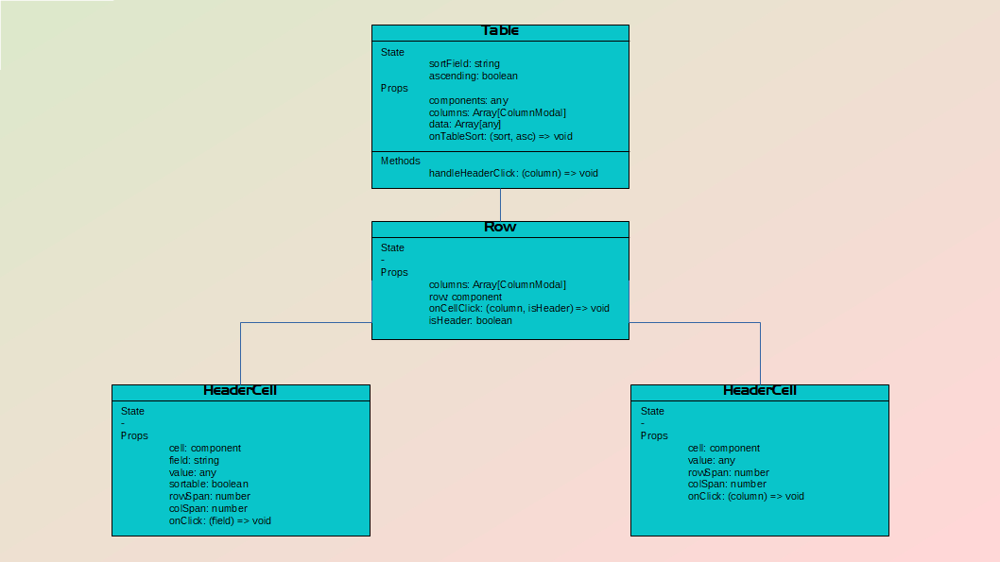
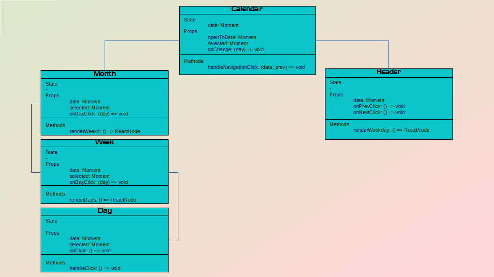
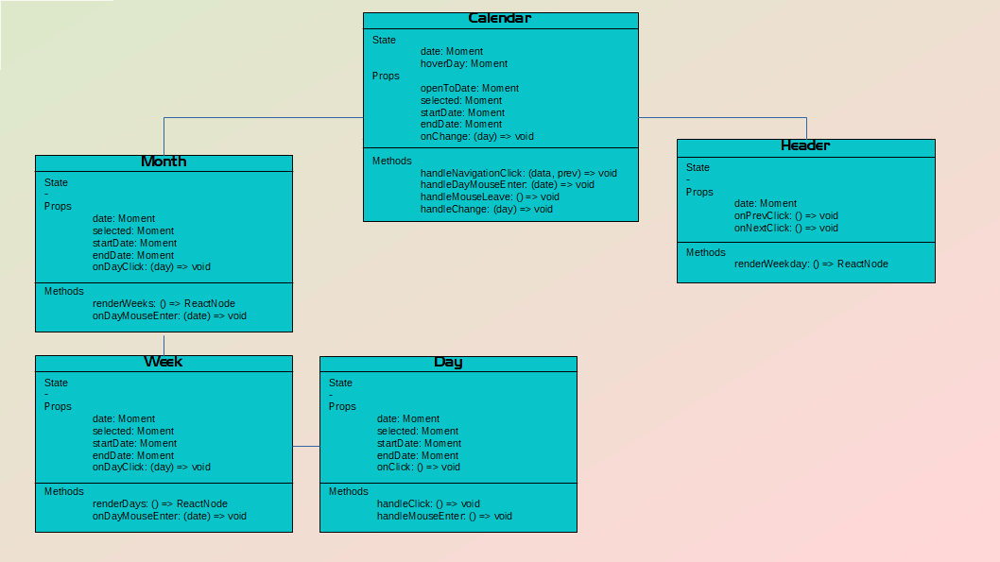

## **环境说明**

#### 组件预览站点

- Docz：React 技术栈，MDX（Markdown + jsx）语法，基于 Gatsby.js。
- Storybook：支持 Vue/React/Angular 等，提供功能丰富的 addons 插件增强文档交互体验。Storybook继承了很多插件的平台, 官方提供了很多的插件。
- React Styleguidist：React 技术栈，支持在 md 文件中解析 js/jsx 代码块。
- [Docs](https://www.npmjs.com/package/@storybook/addon-docs)
- [MDX](https://www.npmjs.com/package/storybook-addon-mdx-embed)
- [Action](https://www.npmjs.com/package/@storybook/addon-actions)
- [Knobs](https://www.npmjs.com/package/@storybook/addon-knobs)
- [Storysource](https://www.npmjs.com/package/@storybook/addon-storysource)
- [Storybook](https://storybook.js.org/)

## **步骤说明**

#### **一、分析**

**1. 目的**

- 提高团队的开发效率
- 提高系统的复用性，可维护性
- 统一页面基础元素的交互方式
- 统一页面的风格，让输出的产品更专业
- 满足一些定制的需求

**2. 具备要素**

- 对业务的良好抽象，能够支撑大多数业务场景
- 规范的Api设计，减少使用者的学习成本
- 设计灵活，可扩展性强，方便维护
- 预览站点，详细的文档，方便查阅api和用法
- 没有渲染和性能问题

#### **二、设计方法**

**1. 设计原则**

- 单一职责， 职责越单一组件越通用
- 独立性，尽可能的减少业务耦合
- api设计和命名需要遵循规范，降低学习成本
- 灵活的api，满足大多数场景
- 无环形依赖

**2. 层次结构和关联性**

- 组件开发前，先对组件做解构，了解这个组件中需要有哪些零件，以及这些零件之间的层级结构和关联关系。以确保我们可以通过api实现他们之前的逻辑关系，将所有零件拼装成一个完整的组件。我们可以通过组件图的方式来展示这些结构和关系，这样我们再下手时，有依据可以参考，更容易让程序符合我们的预期。

- 如何通过图的方式去展示组件，我们可以通过这些属性来表示一个完整组件或者一个零件：
  - State
  - Props
  - Methods
  - 组件/零件的关系

- 下图为Table组件的拆解



- 这样table组件自上而下具备了展示、排序、合并单元格、自定义行元素、自定义列元素的功能。我们只需根据定义好的组件图去实现每一个属性。同样我们也可以通过先对每一个结构定义interface接口的方式来表示出组件内部的层级关系和关联性。

**3. 扁平化的State和Props**

- 如果将State定义为一个复杂的对象时，那么很可能会出现修改state导致不必要的渲染，性能可能会有影响。对于Props而言，如果将一个prop结构定义的太复杂，我们很难了解到内部细节，导致组件的功能不够清晰。

```js
------ not good ------
interface AlertProps {     
 config: AlertConfig;         
    prefixCls: string;
}
interface AlertConfig {
 id: string;
    className: string;
    type: AlertType;
    visible: boolean;
    fixed: boolean;
    delay: number;
    content: any;
}

----- is good ------
interface AlertProps {
 id: string;
    className: string;
    type: AlertType;
    visible: boolean;
    fixed: boolean;
    delay: number;
    content: any;
    prefixCls: string;
}
```

- 对于一些场景，我们需要将某一些prop组合在一起，以减少组件的props数量，例如一个组件A里需要包含一个button组件，外部需要能对这个button组件进行控制，这个时候我们应该定义一个buttonProps的属性提供给外部传值

```js
interface DropdownProps {
 menu: any[];
    align: 'left' | 'right';
    disabled: boolean;
    buttonProps: ButtonProps;
}
or
interface DropdownProps {
 menu: any[];
    align: 'left' | 'right';
    disabled: boolean;
    
    ...buttonProps...
    disabled?: boolean;
    checked?: boolean;
    label?: React.ReactNode;
    ...buttonProps...
}
```

**4. 隐藏内部细节，通过props控制组件**

- 组件内部的状态、事件、dom都在隐藏在内部，父级是无法拿到的。而组件内部无法处理的事件、依赖外部控制的状态应该通过props的形式从父级接收。尽可能的不要通过ref或者dom操作的形式去控制组件内部细节。

**5. 与业务解耦，定义逻辑无关的抽象组件**

- 脱离业务对组件进行层次结构分析，我们可以的用UML图或者接口定义来体现层次结构关系，这里我们选用接口定义

```js
interface BadgeProps {
 type: string;
    icon: IconProps;
    text: string;
}
interface IconProps {
 content: string;
 independent: boolean;
}
```

- 那type的类型应该如何定义呢，如果是根据业务进行定义，type的可选值有 draft | approved | declined | submitted。当这个组件需要用来表示其他的状态标记， 我们又要增加type字段的可选值，以及相应的样式变化。这样会导致我们这个组件的复用性降低，同时api不够简洁清晰。

```js
interface BadgeProps {
    type: 'light' | 'dark' | 'success' | 'warning' | 'danger';
    background: 'fill' | 'transparent';
    icon: React.ReactNode;
    children: React.ReactNode;
}
```

- 所以我们脱离业务对单纯的ui视图做拆分，所有的状态标识的结构都是一致的，有一个图标，一个文字，以及一个背景。type用于控制组件的字体颜色和背景颜色，background用于控制组件背景填充的方式。我们将图标和文字从限定的Icon组件和文本改为从外部传入的任意node节点以增强组件的自由度和通用度。这样我们可以满足对所有状态标记的表示。例如:

```js
<Badge type="success" icon={<Icon content="check-line" />} background="fill">Approved</Badge>
<Badge type="warning" icon={<Icon content="error-warning-fill" />} background="transparent">Pending</Badge>
```

**6. 增强Api, 扩展组件默认值和行为**

- 增强API：将Api的可选值设置为多种可能，或者合并两个或多个Api，来满足多种场景，并且做到不增加组件api的复杂度。

- 例如开发下拉组件时，需要一个对选项可搜索的功能，这个时候在我们组件内部需要一个handleSearchChange的方法去响应搜索框值的改变，默认的情况下，我们应该需要这样一个方法对下拉框中的值根据搜索框的输入值进行模糊匹配。

```js
options.filter(option => option.label.includes(searchKey))
```

- 但是如果我们不需要或者需要其他的匹配方式呢？如果我们已选的值也要展示在筛选结果的列表中？如果我们的筛选结果是要用过计算或者调用后端接口获得？我们要怎样实现这个需求？这时候我们可以给增加一个filterOption属性，可接收值可以是属性或者方法，根据传入的参数来做具体的筛选操作

```js
interface SelectProps {
 filterOption: boolean | ((searchKey: string, option: OptionProps)) => boolean
}
const optionFilter = (searchKey: string, option: OptionProps) => {
 if (typeof filterOption === 'boolean') {
     return filterOption || option.label.includes(searchKey);
    }
    return filterOption;
}
options.filter(option => optionFilter(searchText, option))
```

- 这样我们通过一个api实现了多种对选项筛选的需要。我们在做组件内部细节的时候，遇到为组件设定默认值，默认行为的时候，可以多思考一下，是不是需要将它设置为可变参数。有没有潜在的业务场景是需要我们改变默认值和行为，如果有，我们可以提早的api设置的更灵活一些。

**7. 用扩展组件代替在原组件中加入大量适配代码**

- 基于原有的组件上再做一层封装作为该组件的扩展组件。比如Input组件和NumberInput组件，我们可以把基础的输入功能放在Input组件里，而把对数字输入的限制，格式化等封装在NumberInput中作为Input组件的扩展。

**8. 面向对象的组件设计**

- 我们在设计比较复杂的组件时，可以采用面向对象的思维方式，将复杂的组件拆分为对象和对象之间的关系。除此之外，我们应该保证最简对象设计，确保每个对象只需要完成最简单、核心的逻辑，暂时放弃灵活性和自由度。将各个对象拼装起来后再进行定制扩充。举个日期控件的例子：

- 对于一个日期控件来说，内部的事件和状态维护会比较多，交互也会比较复杂，所以我们要先对组件进行拆分，哪些状态需要依赖外部props传入，哪些状态放在组件内部自己管理。哪些事件要开放给组件外部处理，哪些事件是自己在内部处理交互逻辑。组件内的零件颗粒度要怎么划分？我们还是用UML图来进行层次结构的表示。

- 先只考虑选单个日期的情况



```js
interface DayProps {
    date: Moment;  // 要渲染的日期是哪一天
    selected：Moment;  // 选中的日期，为了方便做选中的样式区分
    onClick: () => void; // day选中的事件，暴露到上层进行事件处理
}
interface WeekProps {
    date: Moment;  // 要渲染的startOfWeek
    selected: Moment;  // 选中的日期，透传到Day
    onDayClick: () => void;  // Day的点击事件，透传到Day
    renderDays() 处理渲染Day的逻辑
}
interface MonthProps {
    date: Moment; // 要渲染月份的startOfMonth
    selected: Moment; 
    onDayClick: (day: Moment) => void;
    renderWeeks() 处理渲染Weeks的逻辑
}
interface HeaderProps {
    date: Moment;  // 用于显示当前月份
    onPrevClick: () => void;  // 上一月按钮的点击事件，暴露到上层处理
    onNextClick: () => void;  // 下一月按钮的点击事件
    renderWeeksday() 作为Month的表头，渲染星期数
}
interface CalendarProps {
    openToDate: Moment;  // 用于初始化显示的那个月份
    selected: Moment; // 选中的日期
    onChange: (day: Moment) => void; // 处理选中day的事件
}
interface CalendarStateMethod {
    date: Moment;  // 当前显示的月份
    handleNavigationClick() // 处理切换月份的事件
}
```

- 在此基础上加入一些功能，比如选择日期范围， 那么我们需要一个开始时间和结束时间的状态，一个鼠标hover的状态用来标识选中的范围。我们需要的状态和控制逻辑加到相应的对象中。



- 先将hoverDay状态提升到calendar对象，为了处理鼠标移出时清空hoverDay的事件逻辑。然后将startDate，endDate设置为props一直透传到Day对象。Day对象中根据startDate,endDate,hoverDay三个状态确定当前天处于已选/正在被选/未选状态。在Calendar handleChange中将选择的日期范围通过onChange返回出去

- 按照同样的方法，一项项的添加组件功能，从核心功能，到功能开关，再到开放dom给外部去定义。都可以通过这个方法来设计状态，分解到各个对象中。