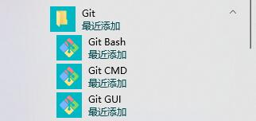
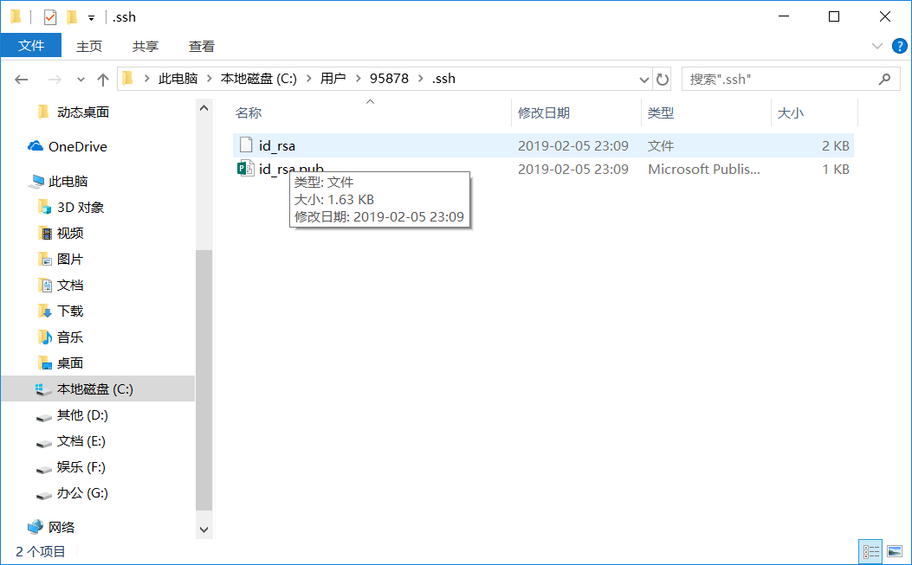

## **环境说明**

#### 准备工作
* Windows 10 1909版本（Windows系统）
* [Git下载](https://git-scm.com/downloads)
* [Github官网](https://github.com/)

## **步骤说明**
**1. 在Windows上安装Git**
* 1.1 从管网下载，然后进行默认安装即可。安装完成后，在开始菜单里面找到 "Git --> Git Bash",如下：


会弹出一个类似的命令窗口的东西，就说明Git安装成功。如下：


* 1.2 安装完成后，还需要最后一步设置，在命令行输入如下：
```
Admin@WILLIAM-MASTER MINGW64 / (master)
$ git config --global user.name "此处改成你的用户名"
Admin@WILLIAM-MASTER MINGW64 / (master)
$ git config --global user.email "你的邮箱地址，比如QQ邮箱"
```
因为Git是分布式版本控制系统，所以需要填写用户名和邮箱作为一个标识。
注意：git config --global 参数，有了这个参数，表示你这台机器上所有的Git仓库都会使用这个配置，当然你也可以对某个仓库指定的不同的用户名和邮箱。

* 1.3 测试安装是否成功，运行CMD，输入git --version查看git的版本号，代码如下
```
git --version
```

**2. 在LINUX上安装Git(CentOS 7)**
* 2.1 无论系统是否安装有git,先删除已有的git，在终端中输入如下命令：
```
yum remove git
```

* 2.2 切换到存放目录下（程序下载包存放目录）
```
cd /usr/src
```

* 2.3 下载git
```
wget https://github.com/git/git/archive/v2.14.1.zip
```

* 2.4 安装依赖项
```
yum -y install zlib-devel openssl-devel cpio expat-devel gettext-devel curl-devel perl-ExtUtils-CBuilder perl-ExtUtils-MakeMaker
```

* 2.5 解压git
```
unzip v2.14.1.zip
```

* 2.6 将git安装到/usr/local上（进入git文件夹-->编译-->安装）
```
cd git-2.14.1
make prefix=/usr/local all
make prefix=/usr/local install
```

* 2.7 验证是否安装成功
```
git --version
```
到此安装成功！！！

以下是可选项：
* 2.71 将指令添加到bash中去
```
vi /etc/profile
　　在最后一行加入：
export PATH=$PATH:/usr/local/git/bin
　　让该配置文件立即生效：
source /etc/profile
```

* 2.8 生成ssh秘钥
```
ssh-keygen -t rsa -C "你的邮箱地址，比如QQ邮箱"
```

* 2.9 将密码复制到码云/github上面

* 2.10 下载代码
```
git clone [此处改成你的仓库地址]
```

**3. 配置SSH(远程仓库)**

* 3.1 先注册一个GitHub账号

* 3.2 创建SSH Key。在用户主目录下，看看有没有.ssh目录，如果有，再看看这个目录下有没有id_rsa和id_rsa.pub这两个文件，如果有的话，直接跳过此命令，如果没有的话，打开命令行，输入如下命令：
```
ssh-keygen -t rsa –C “youremail@example.com”
```
注：youremail@example.com改成你之前绑定的邮箱地址，此过程会出现3次回车，结果如下图：


id_rsa是私钥，不能泄露出去，id_rsa.pub是公钥，可以放心地告诉任何人

* 3.3 登录github,打开” settings”中的SSH Keys页面，然后点击“Add SSH Key”,填上任意title，在Key文本框里黏贴id_rsa.pub文件的内容。


点击 Add Key，你就应该可以看到已经添加的key。

至此所有配置都已完成。


