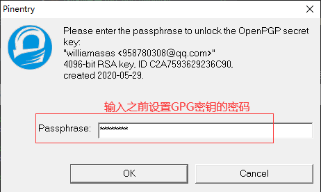
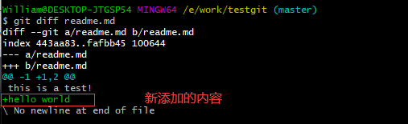
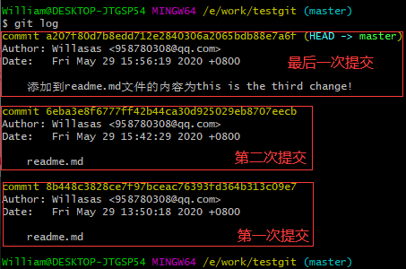
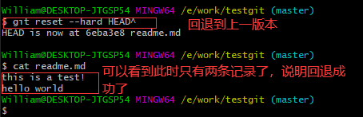
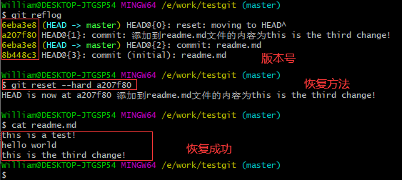

## **环境说明**

#### 准备工作
* Windows 10 1909版本（Windows系统）
* Git
* Github账号

## **步骤说明**
**1. 创建版本库（repository），代码如下：**
* 版本库又名仓库，英文名repository,你可以简单的理解一个目录，这个目录里面的所有文件都可以被Git管理起来，每个文件的修改，删除，Git都能跟踪，以便任何时刻都可以追踪历史，或者在将来某个时刻还可以将文件”还原”。
``` @Git Bash
cd E:           #进入E盘
cd work         #进入work文件夹
mkdir testgit   #创建testgit文件夹
cd testgit      #进入testgit文件夹
git init        #将该目录设置成git可管理的仓库
pwd             #显示当前目录，此时该目录下会多出一个.git文件夹
```

**2. 提交代码**
* 2.1 在版本库testgit目录下新建一个readme.md文件，文件内容如下：this is a test!
``` @git bash
vi readme.md  //按下键盘上的i键，然后编辑内容，然后按Esc键退出编辑
:wq           //保存并退出
git add readme.md   #添加到暂存区，若windows上提交报错，则执行git config --global core.autocrlf false命令
```

* 2.2 若提交出现错误，则执行如下代码中的一个：
``` @git bash
git config --global core.autocrlf true    #提交时转换为LF，检出时转换为CRLF
git config --global core.autocrlf input   #提交时转换为LF，检出时不转换
git config --global core.autocrlf false   #提交检出均不转换(window用户)
```

* 2.3 把文件提交到仓库,执行如下代码：
``` @git bash
git commit -m "readme.md"   #提交readme.md文件
git status                  #查看是否还有文件未提交
```


* 2.4 查看文件修改了什么内容,在readme.md文件中添加一句hello world,结果如下：
``` @git bash
git status                  #查看是否还有文件未提交
git diff readme.md          #如上可以看到，readme.txt文件内容从一行this is a test!改成 二行 添加了一行hello world内容。
git add readme.md           #添加到缓存区
git commit -m "readme.md"   #重新提交
```


**3. 版本回退**
* 3.1 在readme.md文件中添加this is the third change!内容，并回退到上面只有两条内容的时候，代码如下：
``` @git bash
git add readme.md
git commit -m "添加到readme.md文件的内容为this is the third change!"
git log                    #查看历史记录
git log --pretty=oneline   #查看历史记录（简版）
git log --graph --pretty=format:'%Cred%h%Creset -%C(yellow)%d%Creset %s %Cgreen(%cr) %C(bold blue)<%an>%Creset' --abbrev-commit --    #按指定格式输出提交历史
git reset --hard HEAD^      #回退到上个版本
git reset --hard HEAD^^     #回退到上上个版本
git reset --hard HEAD~100   #回退到指定的版本，如100版本
cat readme.md               #查看文件内容
```



* 3.2 若我们想要回退到最新的版本（即第三次提交的时候），则使用如下代码：
``` @git bash
git reflog                  #获取版本号
git reset --hard a207f80    #恢复
cat readme.md               #查看文件内容
```


**4. 工作区与暂存区**
> 工作区：就是你在电脑上看到的目录，比如目录下testgit里的文件(.git隐藏目录版本库除外)。或者以后需要再新建的目录文件等等都属于工作区范畴。
版本库(Repository)：工作区有一个隐藏目录.git,这个不属于工作区，这是版本库。其中版本库里面存了很多东西，其中最重要的就是stage(暂存区)，还有Git为我们自动创建了第一个分支master,以及指向master的一个指针HEAD。

**5. 撤销修改和删除文件操作**
* 5.1 撤销修改
``` @Git Bash
git status   #查看当前的状态
git checkout -- readme.md   #丢弃工作区的修改readme.md为文件名，可以改查你不想要修改的文件名
cat readme.md               #查看文件内容
```
* 上述撤销存在以下两种情况：

1.readme.txt自动修改后，还没有放到暂存区，使用撤销修改就回到和版本库一模一样的状态。

2.另外一种是readme.txt已经放入暂存区了，接着又作了修改，撤销修改就回到添加暂存区后的状态。

* 5.2 如果我知道要删掉那些内容的话，直接手动更改去掉那些需要的文件，然后add添加到暂存区，最后commit掉。
* 5.3 我可以按以前的方法直接恢复到上一个版本。使用 git reset --hard HEAD^

* 5.4 删除文件,假设要删除test.md文件，操作如下：
``` @Git Bash
git add test.md                    #把test.md文件添加到缓存区
git commit -m "添加test.md文件"     #提交test.md文件
rm test.md                         #删除test.md文件
git status                         #查看提交状态
```

## **注意事项**
* 命令git checkout -- readme.md中的 -- 很重要，如果没有 -- 的话，那么命令变成创建分支了。