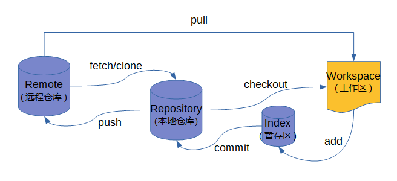

## **Git简史**
与生活中的许多伟大事物一样，Git开始时会有一些创造性的破坏和激烈的争议。
Linux内核是一个范围相当大的开源软件项目。在Linux内核维护（1991-2002）的大部分生命周期中，对软件的更改都作为补丁和归档文件传递。2002年，Linux内核项目开始使用名为BitKeeper的专有DVCS。
2005年，开发Linux内核的社区与开发BitKeeper的商业公司之间的关系破裂，该工具的免费状态被撤销。这促使Linux开发社区（尤其是Linus Torvalds，Linux的创建者）根据他们在使用BitKeeper时学到的一些经验来开发自己的工具。新系统的一些目标如下：
* 速度
* 设计简单
* 对非线性开发的强大支持（数千个并行分支）
* 完全分布
* 能够有效地处理Linux内核等大型项目（速度和数据大小）
自2005年诞生以来，Git已经发展成熟，易于使用，并保留了这些初始品质。它速度惊人，对于大型项目非常有效，并且它具有非常线性开发的令人难以置信的分支系统（参见Git Branching）。

## **什么是Git？**
那么，Git简而言之是什么？这是一个很重要的部分，因为如果你了解Git是什么以及它是如何工作的基础，那么有效地使用Git对你来说可能会容易得多。当您学习Git时，请尝试清楚您对其他VCS（例如CVS，Subversion或Perforce）所了解的内容 - 这样做可以帮助您避免在使用该工具时出现细微的混淆。尽管Git的用户界面与其他VCS非常相似，但Git以非常不同的方式存储和思考信息，理解这些差异将帮助您避免在使用它时感到困惑。

#### 快照，而不是差异
Git和任何其他VCS（包括Subversion和朋友）之间的主要区别在于Git对其数据的思考方式。从概念上讲，大多数其他系统将信息存储为基于文件的更改列表。这些其他系统（CVS，Subversion，Perforce，Bazaar等）将它们存储的信息视为一组文件以及随着时间的推移对每个文件所做的更改（这通常被描述为基于delta的版本控制）。


图1.将数据存储为每个文件的基本版本的更改。
Git没有想到或以这种方式存储数据。相反，Git认为其数据更像是一系列微型文件系统的快照。使用Git，每次提交或保存项目状态时，Git基本上都会记录当时所有文件的外观，并存储对该快照的引用。为了提高效率，如果文件没有改变，Git不会再次存储文件，只是指向它已存储的上一个相同文件的链接。Git认为其数据更像是一个**快照流**。


图2.将数据存储为项目的快照。
这是Git和几乎所有其他VCS之间的重要区别。它让Git几乎重新考虑了大多数其他系统从上一代复制的版本控制的每个方面。这使得Git更像是一个迷你文件系统，其上构建了一些非常强大的工具，而不仅仅是一个VCS。当我们在Git Branching中介绍Git分支时，我们将通过这种方式考虑您的数据来探索您获得的一些好处。

#### 几乎每一项行动都是本地的
Git中的大多数操作只需要本地文件和资源来运行 - 通常不需要从网络上的另一台计算机获取信息。如果你已经习惯了大多数操作都有网络延迟开销的CVCS，那么Git的这个方面会让你觉得速度之神已经赐予Git不可思议的力量。因为您在本地磁盘上拥有项目的完整历史记录，所以大多数操作几乎都是即时的。
例如，要浏览项目的历史记录，Git不需要去服务器获取历史记录并为您显示它 - 它只是直接从本地数据库中读取它。这意味着您几乎可以立即看到项目历史记录。如果你想看到当前版本的文件和一个月前的文件之间引入的变化，Git可以在一个月前查找文件并进行本地差异计算，而不必要求远程服务器执行此操作或从远程服务器中提取旧版本的文件以在本地执行此操作。
这也意味着如果你离线或离开VPN，你几乎无法做到。如果您乘坐飞机或火车并想做一些工作，您可以愉快地（对于您的本地副本，请记住吗？），直到您上网的网络连接。如果您回家并且无法使VPN客户端正常工作，您仍然可以工作。在许多其他系统中，这样做既不可能也不痛苦。例如，在Perforce中，当您未连接到服务器时，您无法做很多事情; 在Subversion和CVS中，您可以编辑文件，但不能提交对数据库的更改（因为您的数据库处于脱机状态）。这可能看起来不是什么大不了的事，但你可能会惊讶于它可以带来的巨大差异。

#### Git通常只添加数据
Git有诚信
Git中的所有内容在存储之前都经过校验和，然后由该校验和引用。这意味着如果没有Git知道它，就不可能改变任何文件或目录的内容。这个功能在最低级别内置于Git中，并且是其理念的组成部分。如果Git无法检测到信息，您不能丢失传输中的信息或导致文件损坏。
Git用于此校验和的机制称为SHA-1哈希。这是一个40个字符的字符串，由十六进制字符（0-9和a-f）组成，并根据Git中文件或目录结构的内容计算。SHA-1哈希看起来像这样：
```
24b9da6552252987aa493b52f8696cd6d3b00373
```

您将在Git中看到这些哈希值，因为它使用了这么多。实际上，Git不是通过文件名而是通过其内容的哈希值将所有内容存储在其数据库中。

当您在Git中执行操作时，几乎所有操作都只将数据添加到Git数据库。很难让系统做任何不可撤销的事情或者以任何方式擦除数据。与任何VCS一样，您可能会丢失或搞乱尚未提交的更改，但在将快照提交到Git之后，很难丢失，尤其是在您经常将数据库推送到另一个存储库时。
这使得使用Git成为一种快乐，因为我们知道我们可以在没有严重搞砸事情的危险的情况下进行实验。要更深入地了解Git如何存储其数据以及如何恢复看似丢失的数据，请参阅撤消事物。

#### 三态
现在要注意 - 如果你希望你的学习过程顺利进行，这是关于Git的主要事项。Git有三个主要状态，您的文件可以驻留在：
* 已提交，已修改和已暂存：
* 已提交意味着数据安全地存储在本地数据库中。
* 修改意味着您已更改文件但尚未将其提交到您的数据库。
分阶段意味着您已在其当前版本中标记了已修改的文件，以进入下一个提交快照。
这将我们引导到Git项目的三个主要部分：Git目录，工作树和临时区域。


图3.工作树，临时区域和Git目录。
Git目录是Git存储项目的元数据和对象数据库的地方。这是Git最重要的部分，它是从另一台计算机克隆存储库时复制的部分。
工作树是项目的一个版本的单个结帐。这些文件从Git目录中的压缩数据库中提取出来并放在磁盘上供您使用或修改。
暂存区域是一个文件，通常包含在您的Git目录中，用于存储有关下一次提交的内容的信息。它在Git用语中的技术名称是“索引”，但短语“staging area”也同样适用。
基本的Git工作流程如下：
您可以修改工作树中的文件。
您可以选择性地暂存您希望成为下一次提交一部分的更改，这只会将这些更改添加到暂存区域。
您执行提交，它将文件保存在暂存区域中，并将该快照永久存储到您的Git目录中。
如果文件的特定版本在Git目录中，则认为它已提交。如果它已被修改并添加到暂存区域，则会暂存。如果它被签出后已被更改但尚未上演，则会进行修改。在Git Basics中，您将了解有关这些状态的更多信息，以及如何利用它们或完全跳过分阶段部分。

## **命令行**
使用Git有很多种不同的方法。有原始的命令行工具，并且有许多不同功能的图形用户界面。对于本书，我们将在命令行中使用Git。首先，命令行是唯一可以运行所有 Git命令的地方 - 为简单起见，大多数GUI仅实现Git功能的部分子集。如果您知道如何运行命令行版本，您可能还可以找出如何运行GUI版本，而相反的情况不一定如此。此外，虽然您选择的图形客户端是个人品味的问题，但所有用户都将安装并提供命令行工具。
因此，我们希望您知道如何在MacOS中打开终端或在Windows中打开命令提示符或PowerShell。如果您不知道我们在这里谈论的是什么，您可能需要快速停下来进行研究，以便您可以按照本书中的其他示例和说明进行操作。

## **流程图**

