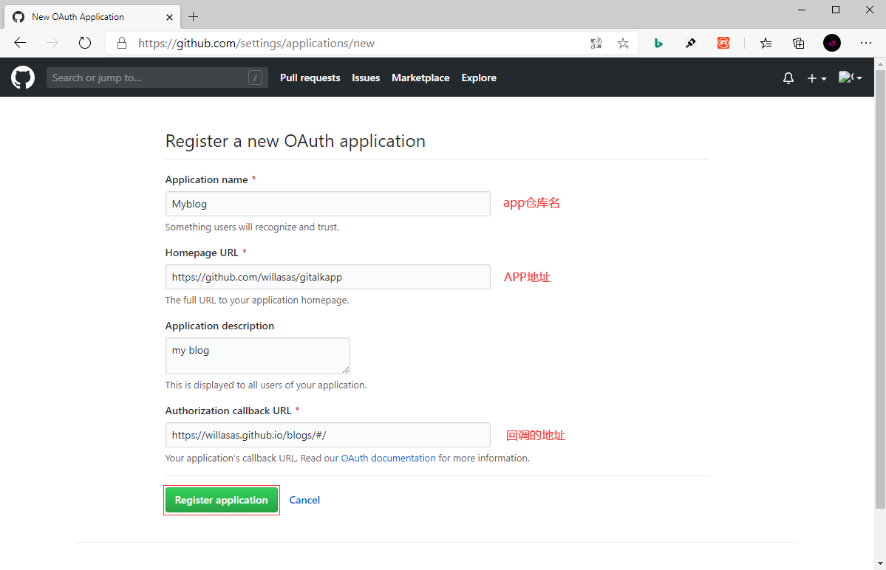
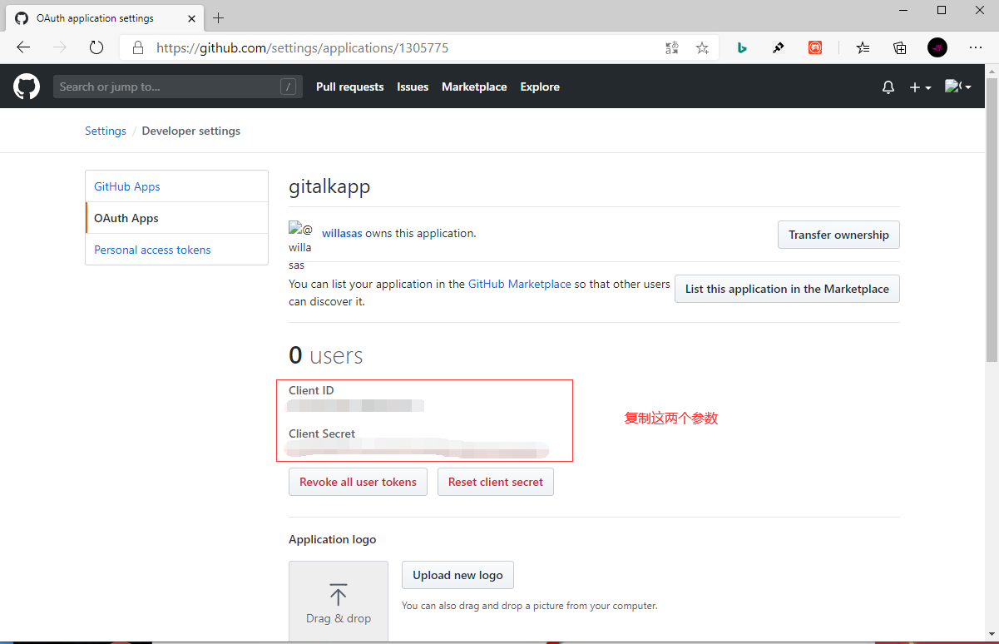
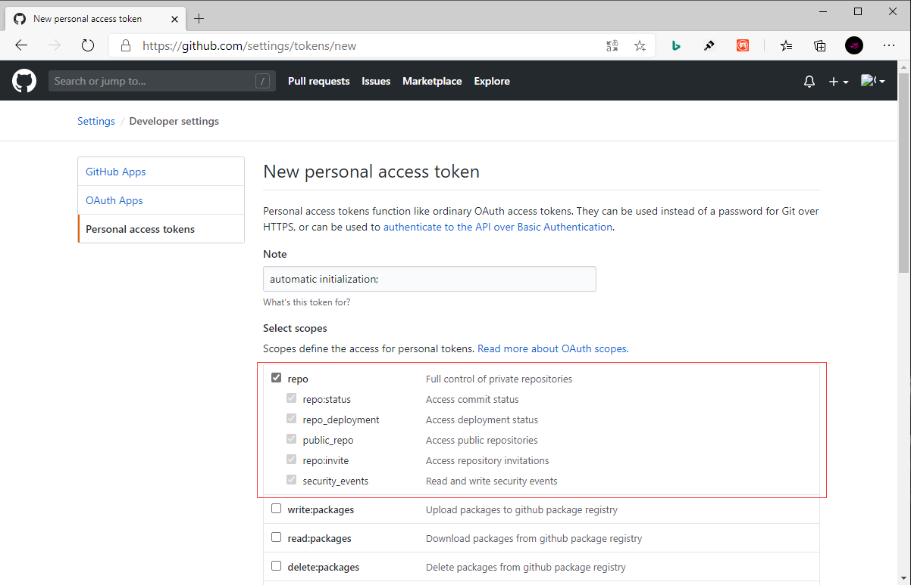
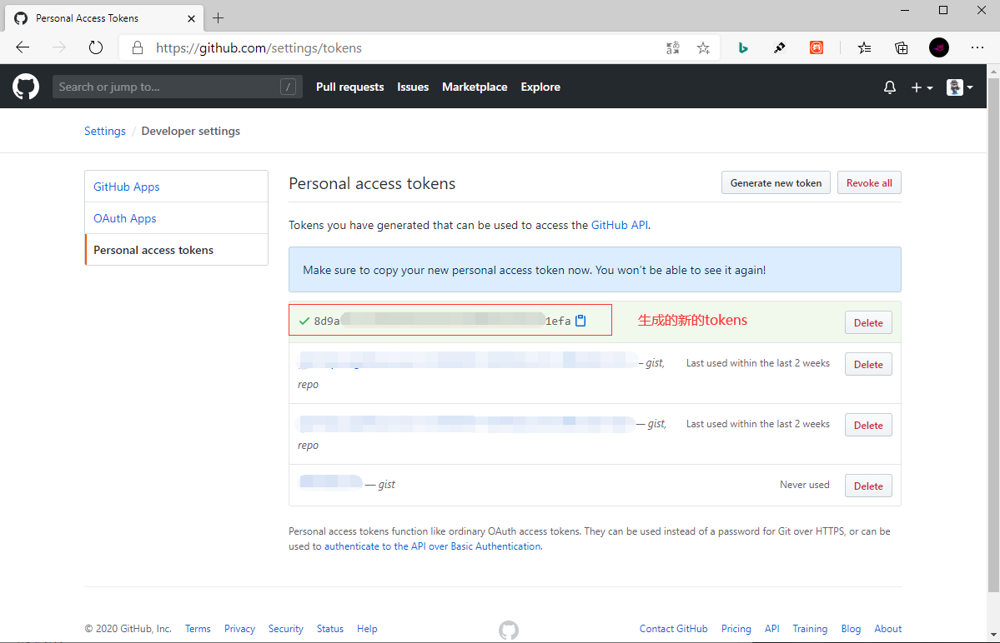

## **环境说明**

#### 准备工作

- Windows 10 1909 版本（Windows 系统）
- Github 账号
- [application 注册](https://github.com/settings/applications/new)
- [gitalk 官网](https://github.com/gitalk/gitalk)

## **步骤说明**

**1. 登录 github 账号后，依次点击用户->Settings->applications->Register a new OAuth application**



- 1.2 在 index.html 中引入对应的 js

```@index.js
<link rel="stylesheet" href="https://cdn.jsdelivr.net/npm/gitalk@1/dist/gitalk.css">
<script src="https://cdn.jsdelivr.net/npm/gitalk@1/dist/gitalk.min.js"></script>
<!-- or -->
<link rel="stylesheet" href="https://unpkg.com/gitalk/dist/gitalk.css">
<script src="https://unpkg.com/gitalk/dist/gitalk.min.js"></script>
```

- 1.3 本地安装 gitalk,打开 cmd.exe,输入如下代码：

```@cmd.exe
npm i --save gitalk
```

- 1.4 在 index.html 中添加一个容器

```@index.html
<div id="gitalk-container"></div>
```

- 1.5 根据创建的 Application clientID 和 Application clientSecret，集成 Gitalk 插件,用下面的 Javascript 代码来生成 gitalk 插件：

```@html
<script type="text/javascript">
  var gitalk = new Gitalk({
  // gitalk的主要参数
  clientID: `Github Application clientID`,
  clientSecret: `Github Application clientSecret`,
  repo: `存储你评论 issue 的 Github 仓库名`,
  owner: 'Github 用户名',
  admin: ['Github 用户名'],
  id: '页面的唯一标识，gitalk会根据这个标识自动创建的issue的标签',
  distractionFreeMode: true, //启用全屏遮罩
  })
  // 监听URL中hash的变化，如果发现换了一个MD文件，那么刷新页面，解决整个网站使用一个gitalk评论issues的问题。
  window.onhashchange = function(event){
    if(event.newURL.split('?')[0] !== event.oldURL .split('?')[0]) {
      location.reload()
    }
  }
</script>
```

- 1.6 将代码推送到 Github 仓库后，没什么问题的话，当你点击进入你的博客页面后就会出现评论框了

**2. 自动初始化 Gitalk 和 Gitment 评论**

- 2.1 在 GitHub 创建一个新的 Personal access tokens，选择用户->Settings->Personal access tokens->Generate new token 后，在当前的页面中为 Token 添加所有 Repo 的权限
  
  

## **注意事项**

- repo 的值为存储你评论 issue 的 Github 仓库名，若是使用 githubpage 搭建的博客，则直接改成你的博客仓库名即可
