## **环境说明**

#### 准备工作

- Windows 10 1909 版本（Windows 系统）
- Git，Git 本地仓库
- Github 账号

## **步骤说明**

**1. 创建远程库，操作如下：**

- 1.1 登录 github 账号后，点击右上角的 ➕->New repository
  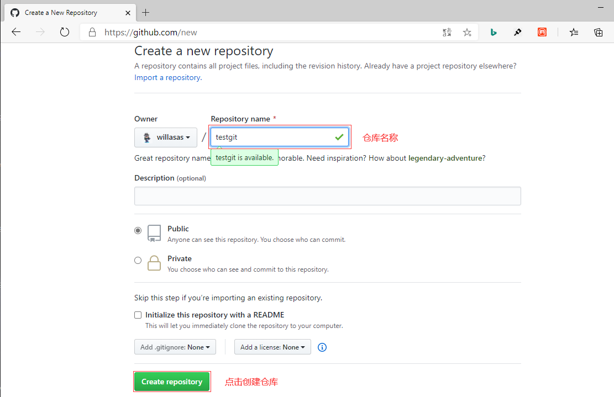
  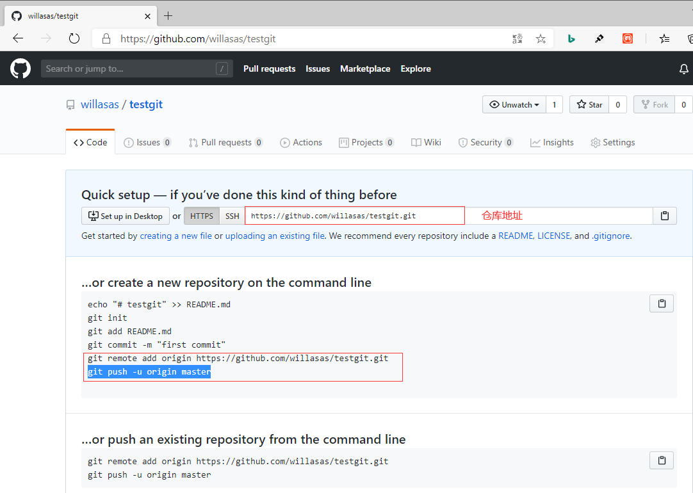

- 1.2 根据 GitHub 的提示，在本地的 testgit 仓库下运行命令:

```@Git Bash
git remote add origin https://github.com/willasas/testgit.git   #把一个已有的本地仓库与之关联
git push -u origin master         #将本地仓库分支master内容推送到源库中去
```

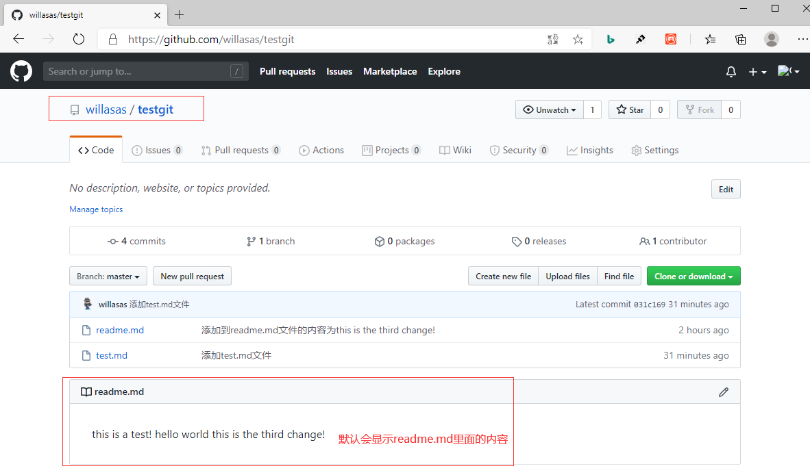

**2. 从远程库克隆**

- 2.1 将 GitHub 上的 testgit 仓库克隆到本地，先点击 Clone or download 按钮，然后复制它给的 url,再在本地用 Git Bash 工具执行如下代码：

```@git bash
git clone https://github.com/willasas/testgit.git
```

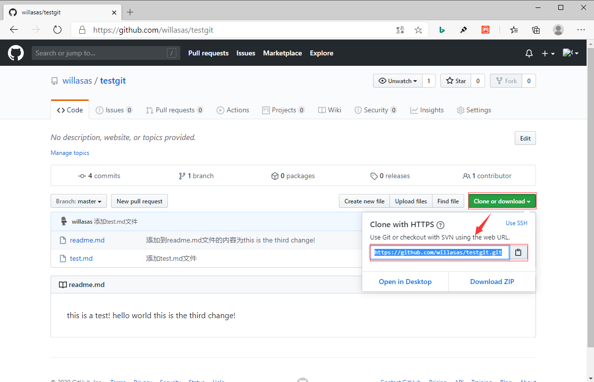

**3. 创建与合并/删除分支**

> master 分支(即主分支)：指向提交的
> HEAD 指向的就是当前分支。

- 3.1 创建 dev 分支，然后切换到 dev 分支上，代码如下：

```@git bash
git checkout -b dev       #创建并切换分支,–b参数表示创建并切换
git branch                #查看当前的分支
```

- 3.2 在 dev 分支下添加内容 5555555，操作代码如下：

```@git bash
cat readme.md                  #dev分支上未添加内容之前
git add readme.md              #添加到暂存区
git commit -m "dev分支上添加内容5555555"      #通过dev分支提交
git checkout master            #切换分支master
cat readme.md                  #查看内容777不见了，因为不是分支dev
git merge dev                  #在master分支上合并dev分支内容
cat readme.md                  #继续查看内容，多了一条5555555
```

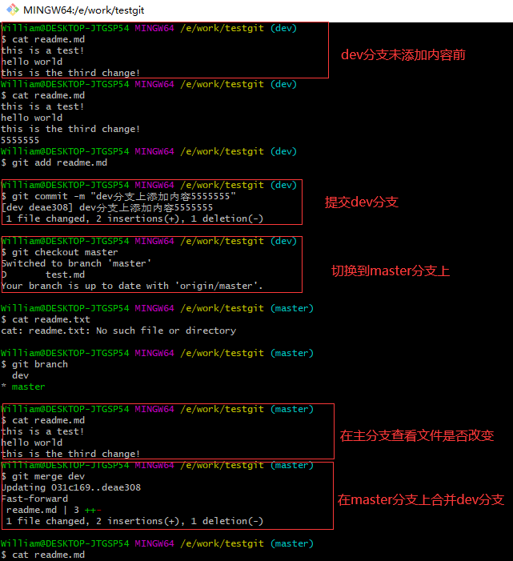

- 注意到上面的 Fast-forward 信息，Git 告诉我们，这次合并是“快进模式”，也就是直接把 master 指向 dev 的当前提交，所以合并速度非常快。

- 3.3 删除分支

```@git bash
git branch -d dev     #删除dev分支，dev为分支名称，可以改成其他分支名
git branch            #查看分支
```

**4. 解决冲突**

- 先新建一个新分支，比如名字叫 fenzhi1，在 readme.md 文件中添加一行内容 8888888，然后提交，代码如下：

```@git bash
git checkout -b fenzhi1        #新建并切换分支
cat readme.md                  #修改前内容
cat readme.md                  #添加内容后的readme.md文件内容
git add readme.md              #添加到暂存区
git commit -m "在fenzhi1分支上添加内容88888"    #提交代码

git checkout master            #切换到master分支
cat readme.md                  #修改前内容
cat readme.md                  #添加内容后的readme.md文件内容
git add readme.md              #添加到暂存区
git commit -m "在master分支上新增内容99999"     #提交代码

git merge fenzhi1              #在master分支上合并fenzhi1
git status                     #查看提交状态
cat readme.md                  #查看readme.md文件冲突内容
```

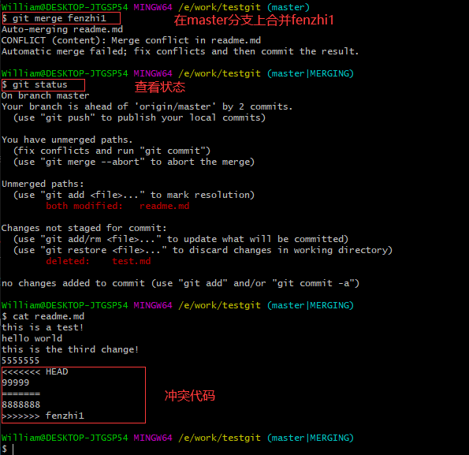

- Git 用<<<<<<<，=======，>>>>>>>标记出不同分支的内容，其中 HEAD 下面的内容是指主分支修改的内容，>>>>>fenzhi1 是指 fenzhi1 上修改的内容，我们可以修改下然后保存：

```@git bash
cat readme.md                     #查看内容，修改成和主干上的代码一样的
git add readme.md                 #添加到暂存区
git commit -m "conflict fixed"    #提交代码
git log                           #查看分支合并的历史
```

**5. 分支管理策略**

- 5.1 通常合并分支时，git 一般使用”Fast forward”模式，在这种模式下，删除分支后，会丢掉分支信息，现在我们来使用带参数 –no-ff 来禁用”Fast forward”模式。

```@Git Bash
git checkout -b dev                             #创建一个dev分支
cat readme.md                                   #查看修改后的内容
git add readme.md                               #添加到暂存区
git commit -m "add merge"                       #提交分支
git checkout master                             #切换到主分支
git merge --no-ff -m "merge with no-ff" dev     #合并dev分支， --no-ff(fast forward)表示禁用
git branch -d dev                               #删除dev分支
git branch                                      #列出所有分支
git log --graph --pretty=oneline --abbrev-commit    #查看日志
```

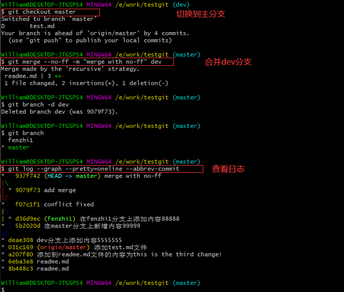

- 分支策略：master 主分支应该是非常稳定的，也就是用来发布新版本，一般情况下不允许在上面干活，干活一般情况下在新建的 dev 分支上干活，干完后，比如上要发布，或者说 dev 分支代码稳定后可以合并到主分支 master 上来。
  > master 分支：线上分支，不允许随意提交修改，仅允许 develop 分支合并，仅管理员操作
  > develop 分支：开发分支，不允许直接修改，但允许程序员发起 pr 合并至 develop，用于检出新 feature-名字分支开发新功，也用于合并至 master 分支。
  > release 分支：测试代码分支，不允许直接修改，但允许程序员发起 pr 合并至 release，用于测试环境使用
  > feature-名字分支：程序员开发使用的功能分支，从 develo 上检出的开发分支

**6. bug 分支**

- 假如我要在 dev 分支上创建一个临时分支，用来修复 bug

```@Git Bash
git checkout -b dev              #切换到dev分支
git checkout -b issue-404        #在dev分支上创建临时分支issue-404
cat readme.md                    #查看修改前文件内容
cat readme.md                    #修改后内容，将8888改成aaaa
git add readme.md                #添加到暂存区
git commit -m "fix bug 404"      #提交分支
```

- 修复完成后，切换到 master 分支上，并完成合并，最后删除 issue-404 分支,代码如下：

```@Git Bash
git checkout master         #切换到master分支上
git merge --no-ff -m "merge bug fix 404" issue-404    #合并分支issue-404内容
cat readme.md               #合并分支后的内容如下，与issue-404内容一致
git branch -d issue-404      #在dev分支上删除临时分支issue-404
```

**7. 多人协作**

- 当你从远程库克隆时候，实际上 Git 自动把本地的 master 分支和远程的 master 分支对应起来了，并且远程库的默认名称是 origin。

```@Git Bash
git remote       #查看远程库信息
git remote -v    #详细信息,fetch:抓取 push:推送
```

- 7.1 推送分支就是把该分支上所有本地提交到远程库中，推送时，要指定本地分支，这样，Git 就会把该分支推送到远程库对应的远程分支上,代码如下：

```@Git Bash
git add .                           #添加文件到版本库（只是添加到缓存区），.代表添加文件夹下所有文件
git commit -m "update readme"       #把添加的文件提交到版本库，并填写提交备注(必不可少)
git remote add orgin https://github.com/willasas/testgit.git              #把本地库与远程库关联
git push -u orgin master            #第一次推送（提交）代码时，第一次推送后，直接使用git push origin master命令即可推送修改
```

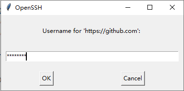
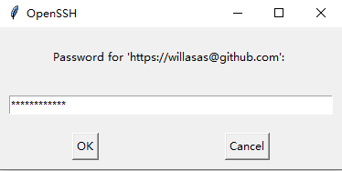
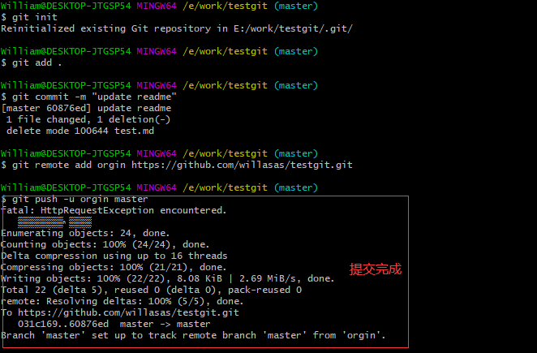

- 7.2 抓取分支，并推送合并分支

```@Git Bash
git clone https://github.com/willasas/testgit.git       #克隆远程的库到本地
git fetch                           #取回所有分支的更新
git checkout -b dev origin/dev      #新建并切换到远程仓库的dev分支
cat readme.md               #修改前readme.md文件内容，在此文件中添加内容：abcdefghijk
cat readme.md               #修改后readme.md文件内容
git add readme.md           #添加到暂存区
git commit -m "readme.md上添加abcdefghijk内容"       #把添加的文件提交到版本库，并填写提交备注
git push origin dev         #把现在的dev分支推送到远程去
```

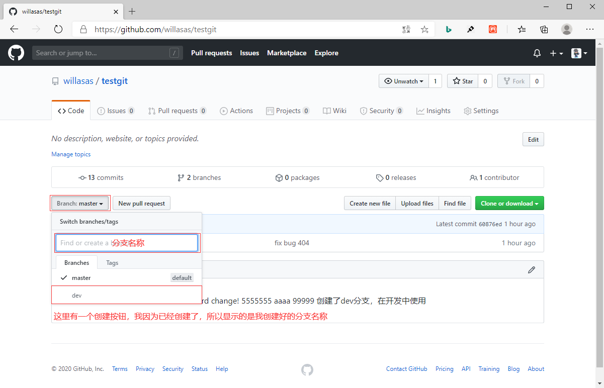

- 先用 git pull 把最新的提交从 origin/dev 抓下来，然后在本地合并，解决冲突，再推送。

```@Git Bash
git branch --set-upstream-to=origin/dev dev
git pull                #若出现冲突，则解决后在推送
cat readme.md           #查看并解决冲突
vim readme.md           #手动修改冲突内容
git add readme.md       #提交到暂存区
git commit -m "merge & fix readme.md"     #提交分支
git push origin dev     #推送到远程dev分支
```

**8. 标签管理**

- 8.1 在 dev 分支上打标签，标签名为 v0.1.1,代码如下：

```@Git Bash
git tag v0.1.1        #给dev分支打名为v0.1.1的标签
git tag               #查看所有标签
git show v0.1.1       #查看v0.1.1的标签信息
git tag -a v1.1.1 -m "正式版" 提交的历史版本号    #带说明的标签
```

- 8.2 删除标签，代码如下：

```@Git Bash
git tag -d v0.1.1     #v0.1.1为标签名
git push origin v0.1.1    #将v0.1.1标签推送到远程仓库
git push origin --tags    #将所有标签推送到远程仓库
```

- 8.3 若标签已推送至远程仓库，若要删除标签，操作代码如下：

```@Git Bash
git tag -d v0.1.1                   #本地删除tag
git push origin :refs/tags/v0.1.1   #删除远程仓库v0.1.1的tag
```

## **注意事项**

- 命令 git checkout -- readme.md 中的 -- 很重要，如果没有 -- 的话，那么命令变成创建分支了。
- master 分支是主分支，因此要时刻与远程同步；一些修复 bug 分支不需要推送到远程去，可以先合并到主分支上，然后把主分支 master 推送到远程去。
