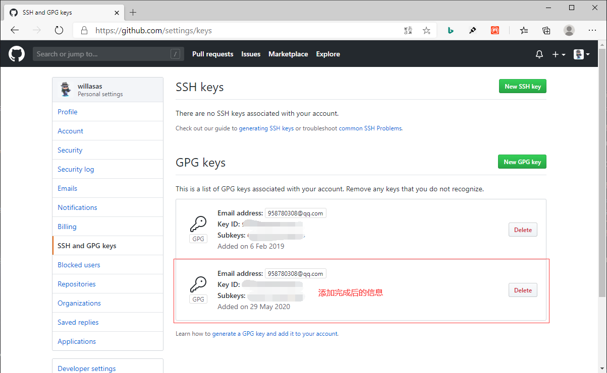

## **环境说明**

#### 准备工作
* Windows 10 1909版本（Windows系统）
* Git
* Github账号

## **步骤说明**
**1. 打开Git Bash应用程序**

**2. 验证GPG版本，执行以下命令**
``` @git bash
gpg --version
```


**3. 如果gpg版本在2.1.17以上，就用下面的命令：**
``` @git bash
gpg --full-generate-key
```

* 3.1 如果gpg版本在2.1.17以下，用下面的命令：
``` @git bash
gpg --default-new-key-algo rsa4096 --gen-key
```

* 然后按照提示输入密钥类型、密钥长度、过期时间、用户名、密码等信息，其中密钥长度推荐4096，其他按需输入即可


**4. 执行以下命令，列出已经创建好的密钥ID**
``` @git bash
gpg --list-secret-keys --keyid-format LONG
```


* 4.1 查看密钥内容，执行以下命令：
``` @git bash
 gpg --armor --export 你的密钥ID
```


**5. 在github上添加gpg密钥**
* 5.1 登录GitHub后，点击Settings->SSH and GPG keys->New GPG keys,将之前包裹在BEGIN和END在内的东西复制到文本框中，并点击Add GPG key按钮



**6. 在git中设置gpg密钥**
* 6.1 使用如下命令进行设置：
``` @git bash
gpg --list-secret-keys --keyid-format LONG       #列出所有gpg密钥ID
git config --global user.signingkey 你的密钥ID    #将密钥ID添加到git设置中
git config commit.gpgsign true                   #在当前项目中启用签名验证，须在项目路径下执行，不然会报错
git config --global commit.gpgsign true          #在所有项目中启用签名验证
```

* 通过以上设置，在使用git commit命令提交的时候，就会用gpg来签名提交，当然也可以在提交的时候使用git commit -S参数来显式启用验证。

* 当项目提交到Github之后，点击进入提交详情查看的时候，就可以看到一个绿色的Verified标志，表示这次提交已经经过验证，确认是作者本人的提交了。

## **注意事项**
