## **环境说明**

#### 准备工作
* Windows 10 1909版本（Windows系统）
* Git，Git本地仓库
* Github账号

## **步骤说明**
**1. 创建远程库，操作如下：**
* 1.1 登录github账号后，点击右上角的➕->New repository
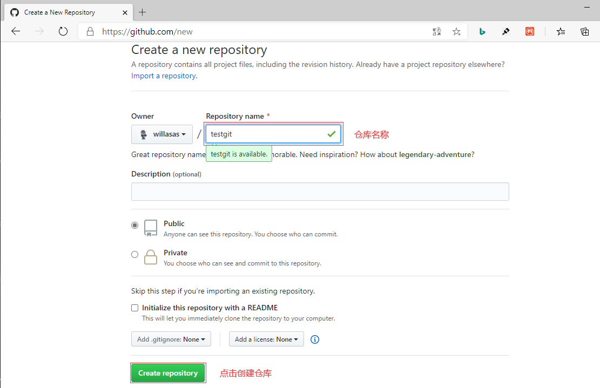
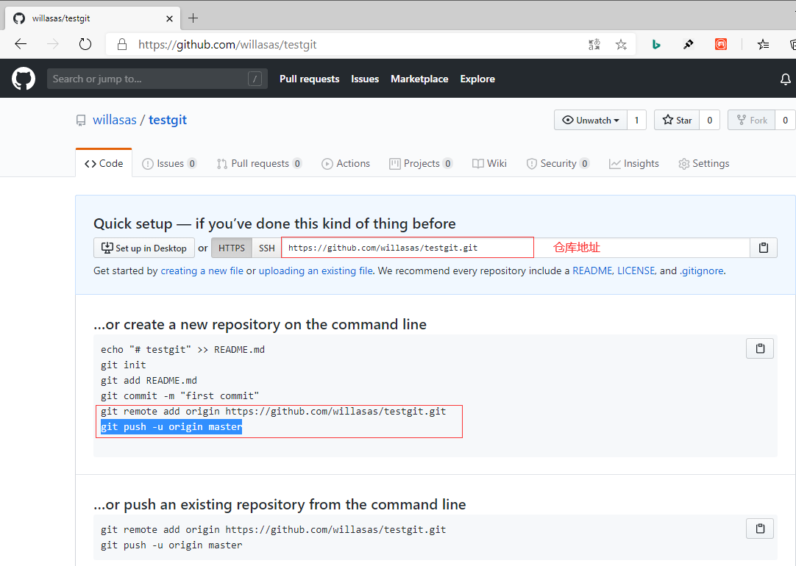

* 1.2 根据GitHub的提示，在本地的testgit仓库下运行命令:
``` @Git Bash
git remote add origin https://github.com/willasas/testgit.git   #把一个已有的本地仓库与之关联
git push -u origin master         #将本地仓库分支master内容推送到源库中去
```
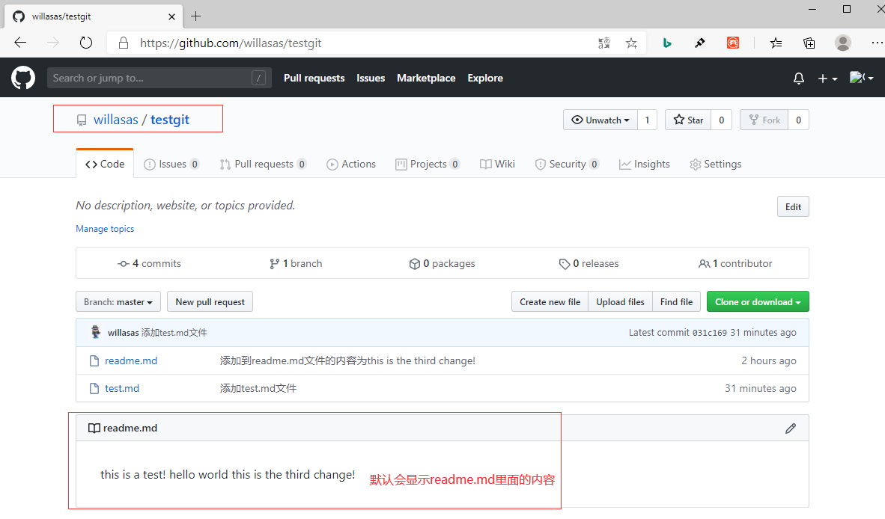

**2. 从远程库克隆**
* 2.1 将GitHub上的testgit仓库克隆到本地，先点击Clone or download按钮，然后复制它给的url,再在本地用Git Bash工具执行如下代码：
``` @git bash
git clone https://github.com/willasas/testgit.git
```
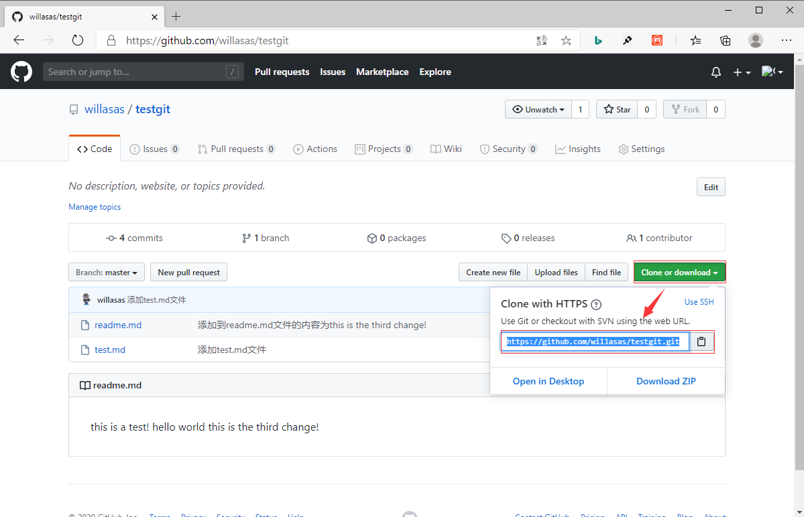

**3. 创建与合并/删除分支**
> master分支(即主分支)：指向提交的
> HEAD指向的就是当前分支。
* 3.1 创建dev分支，然后切换到dev分支上，代码如下：
``` @git bash
git checkout -b dev       #创建并切换分支,–b参数表示创建并切换
git branch                #查看当前的分支
```

* 3.2 在dev分支下添加内容5555555，操作代码如下：
``` @git bash
cat readme.md                  #dev分支上未添加内容之前
git add readme.md              #添加到暂存区
git commit -m "dev分支上添加内容5555555"      #通过dev分支提交
git checkout master            #切换分支master
cat readme.md                  #查看内容777不见了，因为不是分支dev
git merge dev                  #在master分支上合并dev分支内容
cat readme.md                  #继续查看内容，多了一条5555555
```
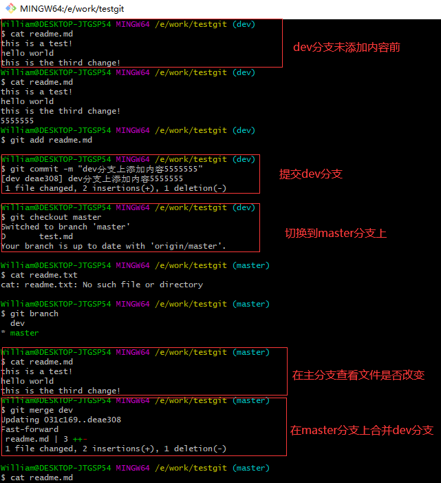
* 注意到上面的Fast-forward信息，Git告诉我们，这次合并是“快进模式”，也就是直接把master指向dev的当前提交，所以合并速度非常快。

* 3.3 删除分支
``` @git bash
git branch -d dev     #删除dev分支，dev为分支名称，可以改成其他分支名
git branch            #查看分支
```

**4. 解决冲突**
* 先新建一个新分支，比如名字叫fenzhi1，在readme.md文件中添加一行内容8888888，然后提交，代码如下：
``` @git bash
git checkout -b fenzhi1        #新建并切换分支
cat readme.md                  #修改前内容
cat readme.md                  #添加内容后的readme.md文件内容
git add readme.md              #添加到暂存区
git commit -m "在fenzhi1分支上添加内容88888"    #提交代码

git checkout master            #切换到master分支
cat readme.md                  #修改前内容
cat readme.md                  #添加内容后的readme.md文件内容
git add readme.md              #添加到暂存区
git commit -m "在master分支上新增内容99999"     #提交代码

git merge fenzhi1              #在master分支上合并fenzhi1
git status                     #查看提交状态
cat readme.md                  #查看readme.md文件冲突内容
```
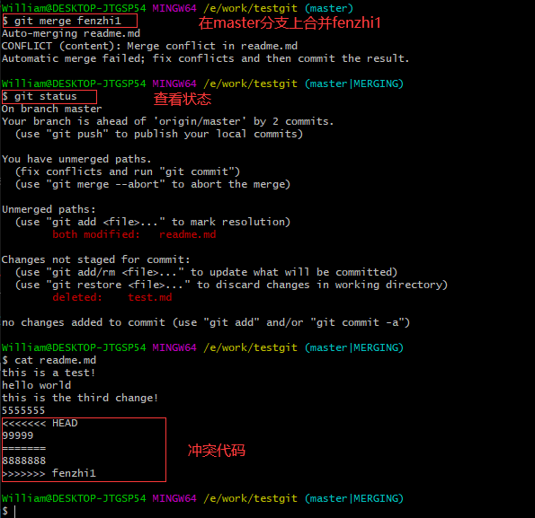

* Git用<<<<<<<，=======，>>>>>>>标记出不同分支的内容，其中HEAD下面的内容是指主分支修改的内容，>>>>>fenzhi1 是指fenzhi1上修改的内容，我们可以修改下然后保存：
``` @git bash
cat readme.md                     #查看内容，修改成和主干上的代码一样的
git add readme.md                 #添加到暂存区
git commit -m "conflict fixed"    #提交代码
git log                           #查看分支合并的历史
```

**5. 分支管理策略**
* 5.1 通常合并分支时，git一般使用”Fast forward”模式，在这种模式下，删除分支后，会丢掉分支信息，现在我们来使用带参数 –no-ff来禁用”Fast forward”模式。
``` @Git Bash
git checkout -b dev                             #创建一个dev分支
cat readme.md                                   #查看修改后的内容
git add readme.md                               #添加到暂存区
git commit -m "add merge"                       #提交分支
git checkout master                             #切换到主分支
git merge --no-ff -m "merge with no-ff" dev     #合并dev分支， --no-ff(fast forward)表示禁用
git branch -d dev                               #删除dev分支
git branch                                      #列出所有分支
git log --graph --pretty=oneline --abbrev-commit    #查看日志
```
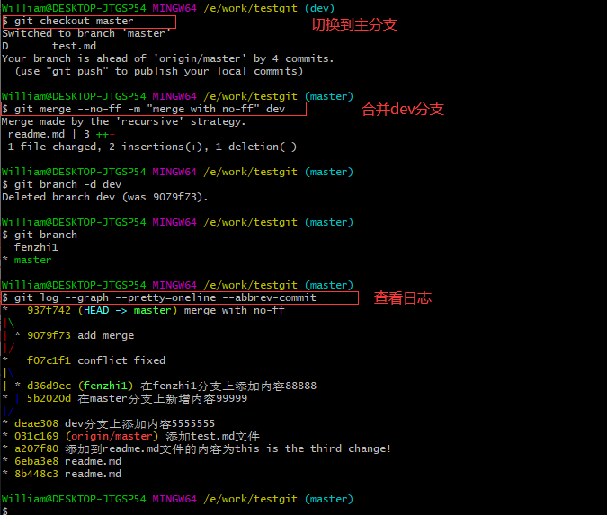
* 分支策略：master主分支应该是非常稳定的，也就是用来发布新版本，一般情况下不允许在上面干活，干活一般情况下在新建的dev分支上干活，干完后，比如上要发布，或者说dev分支代码稳定后可以合并到主分支master上来。
> master分支：线上分支，不允许随意提交修改，仅允许develop分支合并，仅管理员操作
develop分支：开发分支，不允许直接修改，但允许程序员发起pr合并至develop，用于检出新feature-名字分支开发新功，也用于合并至master分支。
release分支：测试代码分支，不允许直接修改，但允许程序员发起pr合并至release，用于测试环境使用
feature-名字分支：程序员开发使用的功能分支，从develo上检出的开发分支

**6. bug分支**
* 假如我要在dev分支上创建一个临时分支，用来修复bug
``` @Git Bash
git checkout -b dev              #切换到dev分支
git checkout -b issue-404        #在dev分支上创建临时分支issue-404
cat readme.md                    #查看修改前文件内容
cat readme.md                    #修改后内容，将8888改成aaaa
git add readme.md                #添加到暂存区
git commit -m "fix bug 404"      #提交分支
```

* 修复完成后，切换到master分支上，并完成合并，最后删除issue-404分支,代码如下：
``` @Git Bash
git checkout master         #切换到master分支上
git merge --no-ff -m "merge bug fix 404" issue-404    #合并分支issue-404内容
cat readme.md               #合并分支后的内容如下，与issue-404内容一致
git branch -d issue-404      #在dev分支上删除临时分支issue-404
```

**7. 多人协作**
* 当你从远程库克隆时候，实际上Git自动把本地的master分支和远程的master分支对应起来了，并且远程库的默认名称是origin。
``` @Git Bash
git remote       #查看远程库信息
git remote -v    #详细信息,fetch:抓取 push:推送
```

* 7.1 推送分支就是把该分支上所有本地提交到远程库中，推送时，要指定本地分支，这样，Git就会把该分支推送到远程库对应的远程分支上,代码如下：
``` @Git Bash
git add .                           #添加文件到版本库（只是添加到缓存区），.代表添加文件夹下所有文件 
git commit -m "update readme"       #把添加的文件提交到版本库，并填写提交备注(必不可少)
git remote add orgin https://github.com/willasas/testgit.git              #把本地库与远程库关联
git push -u orgin master            #第一次推送（提交）代码时，第一次推送后，直接使用git push origin master命令即可推送修改
```
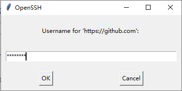
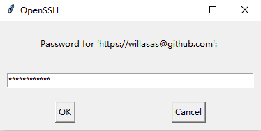
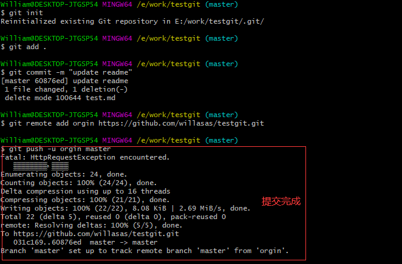

* 7.2 抓取分支，并推送合并分支
``` @Git Bash
git clone https://github.com/willasas/testgit.git       #克隆远程的库到本地
git fetch                           #取回所有分支的更新
git checkout -b dev origin/dev      #新建并切换到远程仓库的dev分支
cat readme.md               #修改前readme.md文件内容，在此文件中添加内容：abcdefghijk
cat readme.md               #修改后readme.md文件内容
git add readme.md           #添加到暂存区
git commit -m "readme.md上添加abcdefghijk内容"       #把添加的文件提交到版本库，并填写提交备注
git push origin dev         #把现在的dev分支推送到远程去
```
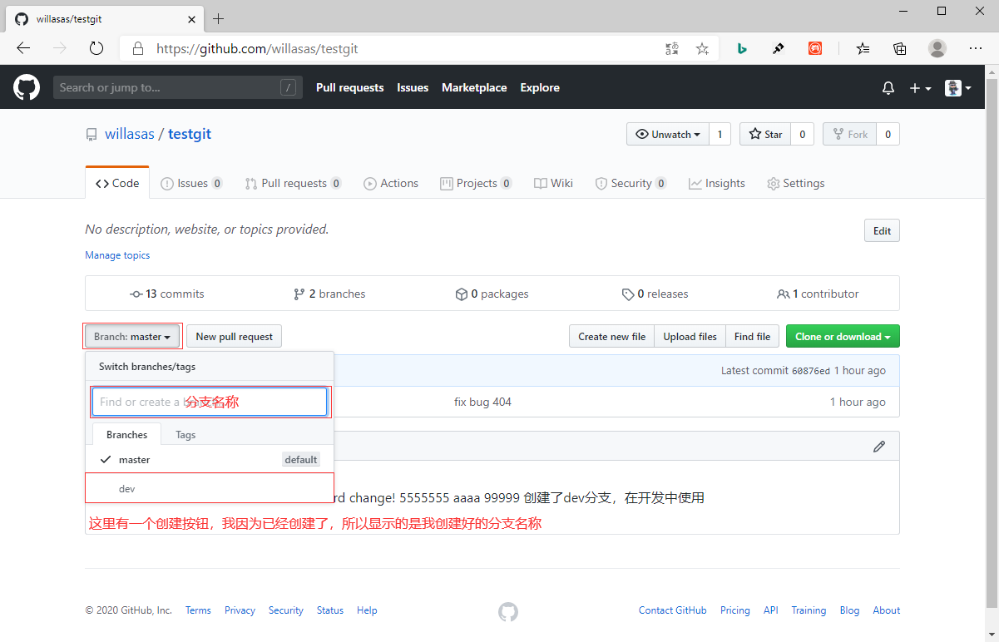

* 先用git pull把最新的提交从origin/dev抓下来，然后在本地合并，解决冲突，再推送。
``` @Git Bash
git branch --set-upstream-to=origin/dev dev  
git pull                #若出现冲突，则解决后在推送
cat readme.md           #查看并解决冲突
vim readme.md           #手动修改冲突内容
git add readme.md       #提交到暂存区
git commit -m "merge & fix readme.md"     #提交分支
git push origin dev     #推送到远程dev分支
```

**8. 标签管理**
* 8.1 在dev分支上打标签，标签名为v0.1.1,代码如下：
``` @Git Bash
git tag v0.1.1        #给dev分支打名为v0.1.1的标签
git tag               #查看所有标签
git show v0.1.1       #查看v0.1.1的标签信息
git tag -a v1.1.1 -m "正式版" 提交的历史版本号    #带说明的标签
```

* 8.2 删除标签，代码如下：
``` @Git Bash
git tag -d v0.1.1     #v0.1.1为标签名
git push origin v0.1.1    #将v0.1.1标签推送到远程仓库
git push origin --tags    #将所有标签推送到远程仓库
```

* 8.3 若标签已推送至远程仓库，若要删除标签，操作代码如下：
``` @Git Bash
git tag -d v0.1.1                   #本地删除tag
git push origin :refs/tags/v0.1.1   #删除远程仓库v0.1.1的tag
```

## **注意事项**
* 命令git checkout -- readme.md中的 -- 很重要，如果没有 -- 的话，那么命令变成创建分支了。
* master分支是主分支，因此要时刻与远程同步；一些修复bug分支不需要推送到远程去，可以先合并到主分支上，然后把主分支master推送到远程去。