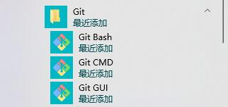
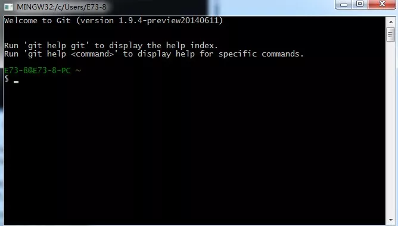
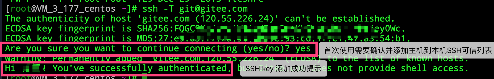

## **环境说明**

#### 准备工作
* Windows 10 1909版本（Windows系统）
* [Git下载](https://git-scm.com/downloads)
* [码云官网](https://gitee.com/)

## **步骤说明**
**1. 在Windows上安装Git**
* 1.1 从管网下载，然后进行默认安装即可。安装完成后，在开始菜单里面找到 "Git --> Git Bash",如下：


会弹出一个类似的命令窗口的东西，就说明Git安装成功。如下：


* 1.2 安装完成后，还需要最后一步设置，在命令行输入如下：
```
Admin@WILLIAM-MASTER MINGW64 / (master)
$ git config --global user.name "此处改成你的用户名"
Admin@WILLIAM-MASTER MINGW64 / (master)
$ git config --global user.email "你的邮箱地址，比如QQ邮箱"
```
因为Git是分布式版本控制系统，所以需要填写用户名和邮箱作为一个标识。
注意：git config --global 参数，有了这个参数，表示你这台机器上所有的Git仓库都会使用这个配置，当然你也可以对某个仓库指定的不同的用户名和邮箱。

* 1.3 测试安装是否成功，运行CMD，输入git --version查看git的版本号，代码如下
``` @cmd.exe
git --version
```

**2. 配置SSH(远程仓库)**
* 2.1 先注册一个Gitee账号

* 2.2 生成ssh秘钥（可选项，请先看注意事项）
``` @cmd.exe
ssh-keygen -t rsa -C "你的邮箱地址，比如QQ邮箱"
```
按照提示完成三次回车，即可生成 ssh key。通过查看 ~/.ssh/id_rsa.pub 文件内容，获取到你的 public key，命令如下：
``` @cmd.exe
cat ~/.ssh/id_rsa.pub
# ssh-rsa AAAAB3NzaC1yc2EAAAADAQABAAABAQC6eNtGpNGwstc....
```

* 2.3 复制生成后的 ssh key，通过仓库主页 「管理」->「部署公钥管理」->「添加部署公钥」 ，添加生成的 public key 添加到仓库中。


* 2.4 在终端（Terminal）中输入如下命令：
``` @Terminal
ssh -T git@gitee.com
```
首次使用需要确认并添加主机到本机SSH可信列表。若返回 Hi XXX! You've successfully authenticated, but Gitee.com does not provide shell access. 内容，则证明添加成功。

添加成功后，就可以使用SSH协议对仓库进行操作了

* 2.5 为了便于用户在多个项目仓库下使用一套公钥，免于重复部署和管理的繁琐，码云推出了「可部署公钥」功能，支持在一个仓库空间下使用当前账户名下/参与的另一个仓库空间的部署公钥，实现公钥共用。

* 注：ssh key分公钥（id_rsa）和私钥（id_rsa.pub）两个文件，可以在C盘的C:\Users\用户名\.ssh文件夹内找到id_rsa.pub和id_rsa文件

至此所有配置都已完成。
## **注意事项**
* 若之前配置过GitHub的SSH则不用重复生成SSH的步骤，只需要在码云添加对应的SSH key就可以了
