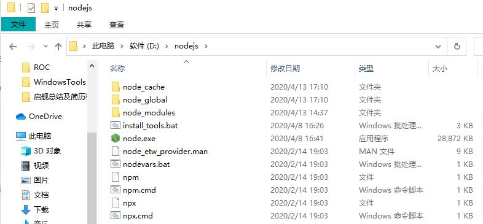

## **环境说明**
#### 准备工作
* Windows 10 1909版本（Windows系统）
* [node安装包下载](https://nodejs.org/en/download/)

## **步骤说明**
**1. 双击下载好的应用程序，下一步下一步即可（笔者安装路径为“D:\nodejs”）**

**2. 测试安装是否成功，运行CMD，分别输入node -v 和 npm -v 分别查看node和npm的版本号，代码如下**
``` @cmd.exe
node -v
npm -v
```
安装完成后系统目录如图所示（其中，npm随安装程序自动安装，作用就是对Node.js依赖的包进行管理）



**3. 配置npm在安装全局模块时的路径和缓存cache的路径**
* 配置自定义的全局模块安装目录，在node.js安装目录下新建两个文件夹 node_global和node_cache配置自定义的全局模块安装目录(如上图)，
* 然后在cmd命令下执行如下两个命令

```
npm config set prefix "D:\nodejs\node_global"
npm config set cache "D:\nodejs\node_cache"
```

**4. 配置环境变量**
* “此电脑” -> 右键 -> “属性” -> “高级系统设置” -> “高级” -> “环境变量” -> “系统变量”：新建一个变量名为 “NODE_PATH”， 值为"D:\nodejs\node_global"，如下表：

变量名 | 变量值
---|---
NODE_PATH | D:\nodejs\node_global

* “环境变量” -> “用户变量”：编辑用户变量里的Path，将相应npm的路径（“C:\Users\用户名\AppData\Roaming\npm”）改为："D:\nodejs\node_global"，如下表：

变量名 | 变量值
---|---
Path | D:\nodejs\node_global

**5. 测试**
* 在cmd命令下执行 npm install webpack -g 安装webpack，代码如下：

``` @cmd.exe
npm install webpack -g
```
* 安装成功，自定义文件夹如下所示

``` @file
> node_global
    > node_modules文件夹
    > webpack
    > webpack.cmd
    > webpack.ps1
> node_cache
    > _cacache文件夹
    > _locks文件夹
    > anonymous-cli-metrics.json
```

* 在cmd命令下执行 webpack -v 查看webpack版本，代码如下
``` @cmd.exe
webpack -v
```

**6. 安装淘宝镜像（cnpm）**
* 注:npm 是国外的服务器，所以出现下载慢或者出现异常;

     cnpm 则是淘宝团队做的npm的镜像，解决上述问题，目前10分钟更新一次,保证与官服同步。其操作方式用 npm一致;在命令行窗口执行如下命令进行安装：
```
npm install cnpm -g --registry=https://registry.npm.taobao.org
```
* 安装成功后 运行 cnpm -v 命令，出现如下结果说明安装成功


#### 注意事项
* 在配置3的时候注意set后面的变量名，不然后面可能会出现输入webpack -v时会报错