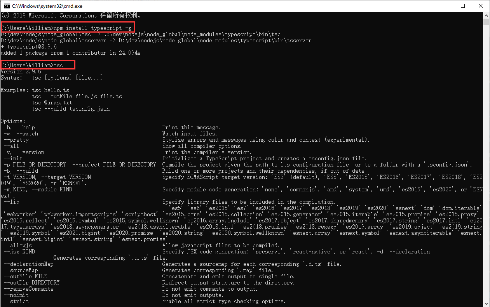
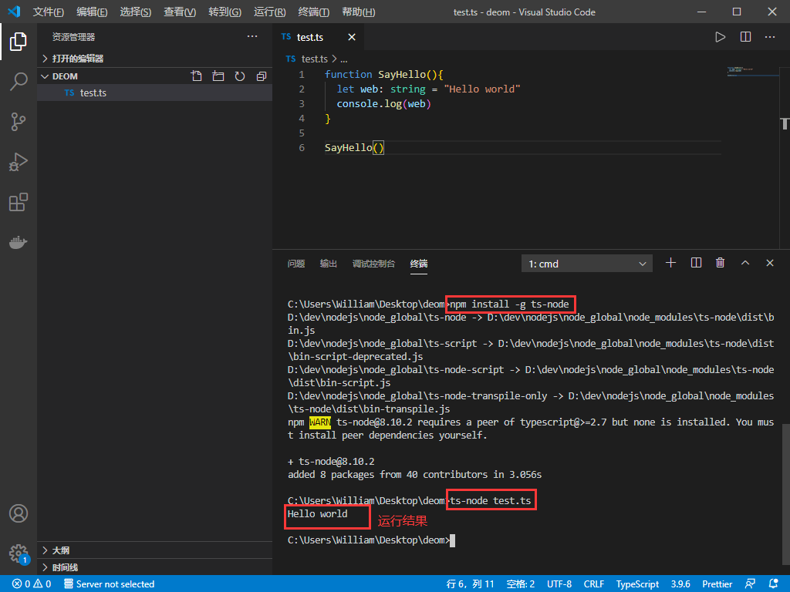

## **环境说明**

#### 准备工作

- Windows 10 1909 版本（Windows 系统）
- node.js 环境
- vs code 编辑器

## **步骤说明**

**1. 安装 node.js**

**2. 测试安装是否成功，运行 CMD，分别输入 node -v 和 npm -v 分别查看 node 和 npm 的版本号，代码如下**

```@cmd
node -v
npm -v
```

安装完成后系统目录如图所示（其中，npm 随安装程序自动安装，作用就是对 Node.js 依赖的包进行管理）


**3. 全局安装 typescript**

```@cmd
npm install typescript -g
tsc
```



**4. 创建项目文件夹，并创建一个.ts 结尾的文件，编写如下代码：**

```@ts
function SayHello(){
  let web: string = "Hello world"
  console.log(web)
}

SayHello()
```

**5. 测试**

- 在终端下执行 tsc test.ts 命令，在项目文件夹下会生成一个 test.js 的文件，再执行 node test.js 命令运行该文件，代码如下：

```@terminal
tsc test.ts
node test.js
```

- 使用 ts-bode 插件，实现 ts 文件自动转换为 js 文件，安装方式如下：

```@terminal
npm install -g ts-node  #全局安装ts-node
ts-node test.ts   #运行，test.ts为文件名
```



#### 注意事项
