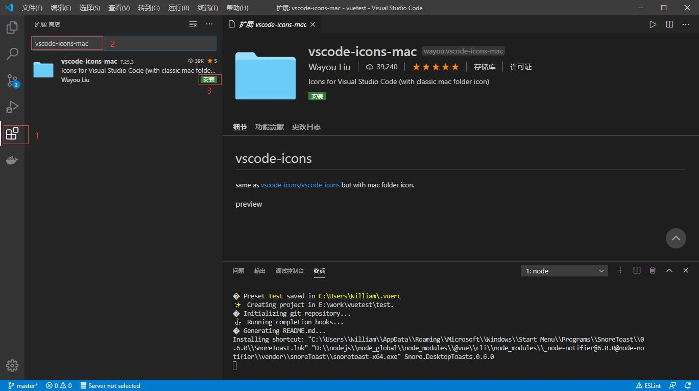

## **环境说明**

#### 准备工作

- Windows 10 1909 版本（Windows 系统）
- VS Code

#### 插件介绍

| 插件名                                             | 说明                                |
| -------------------------------------------------- | ----------------------------------- |
| ESLint                                             | 代码规范                            |
| Prettier-Code formatter                            | 规范代码工具                        |
| vscode-icons                                       | 图标美化                            |
| Debugger for Chrome                                | 调试                                |
| Beautify                                           | 代码格式化                          |
| Prettier                                           | 代码格式化                          |
| ESLint                                             | 代码规范                            |
| JavaScript (ES6) code snippets                     | javascript 语法提示                 |
| vetur                                              | vue 必备                            |
| VueHelper                                          | vue 及相关技术栈语法提示            |
| Sass                                               | sass 文件高亮&格式化                |
| Stylus language                                    | stylus 编码支持                     |
| Auto Close Tag                                     | 自动闭合标签                        |
| Auto Rename Tag                                    | 自动更改对应标签名                  |
| Path Autocomplete                                  | 自动补全路径                        |
| Git Lens                                           | 本地项目 git 管理                   |
| View in Browser                                    | 右击在浏览器打开文件                |
| Markdown All in One                                | markdown 支持                       |
| Npm                                                | npm 支持                            |
| Npm Intellisense                                   | npm 友好化                          |
| Chinese(Simplified)Language Pack for Visual Studio | 汉化 vscode                         |
| vscode-icons-mac                                   | Mac 风格图标                        |
| Path Intellisense                                  | 文件名或者文件路径的自动补全        |
| topper                                             | 在.py 文件的开头添加一些说明 header |
| Bracket Pair Colorizer                             | 给代码中的括号增加颜色              |
| Dracula Official                                   | 皮肤                                |
| indent-rainbow                                     | 彩虹缩进                            |
| todo                                               | 待做                                |
| todo Highlight                                     | 待做高亮显示                        |
| deawio                                             | 流程图插件                          |

## **步骤说明**

**1.点击 VS Code 左侧的扩展功能按钮或者按 Ctrl+Shift+X 快捷键**

**2.在文本框中输入要安装的插件名称，点击后面的 Install（安装）按钮即可进行安装**

#### 注意事项

- 有一些插件安装好后还需要进行一些配置才会生效，可以参照插件的说明，或到对应的官网查说明后再进行配置。
