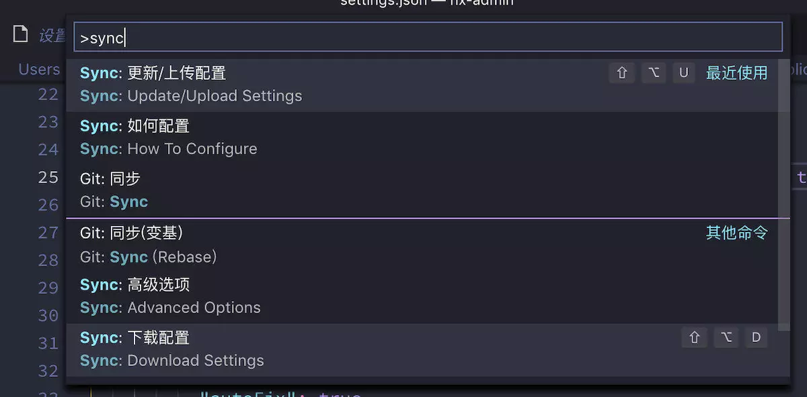

## **环境说明**
#### 准备工作
* Windows 10 1909版本（Windows系统）
* [VS Code](https://code.visualstudio.com/)
* Settings Sync插件
* Github账号

## **步骤说明**
* 当在不同办公环境中使用vs code进行编辑文件时，为避免重复配置和节约时间，我们就可以配置Settings Sync插件,通过这个插件我们可以将当前vs code中的配置上传到Gist，之后再通过Gist下载，就可以将所有配置同步到新环境中了。

**1.下载vs code一步一步默认安装即可**


**2. 在Github首页点击头像，选择Settings进入设置页面**


* 2.1 点击左侧侧边栏Developer settings，进入开发者设置


* 2.2 选择Personal access tokens，点击右侧Generate new token


* 2.3 填写token名称，在下方勾选gist


* 2.4 点击下方的Generate token按钮生成一个新的token


* 2.5 将生成的新的token保存下来


**3. 配置vscode程序**
* 3.1 在vscode中安装Settings Sync插件，输入Ctrl+Shift+p输入Sync，选择更新/上传配置。


* 3.2 将github中生成的token输入，点击回车


* 在控制台中自动生成一串id,之后便可以通过token和id进行配置同步


* 3.3 输入Ctrl+Shift+p输入Sync，选择下载配置，输入token和id即可同步下载


**4. 其他配置**
* 可以在配置文件中选择是否自动上传和下载
```
"sync.removeExtensions": true,
      "sync.syncExtensions": true,
      "sync.autoDownload": true,h
      "sync.autoUpload": true,he
      "sync.gist": "改成你的id,即前面生成的id"
```
#### 注意事项