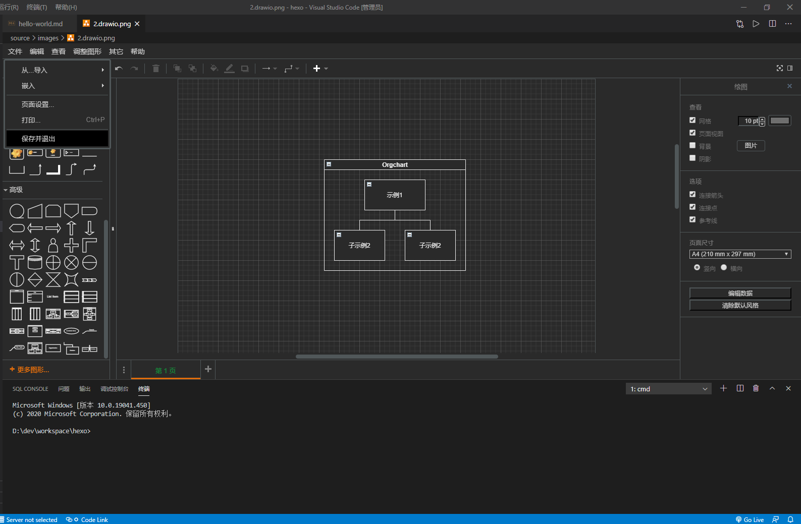

## **环境说明**

#### 准备工作

- Windows 10 1909 版本（Windows 系统）
- [drawio 插件下载](https://marketplace.visualstudio.com/items?itemName=hediet.vscode-drawio)
- [drawio 仓库](https://github.com/jgraph/drawio)
- [drawio 官网和网页版](https://www.diagrams.net/)
- VS Code

## **步骤说明**

**1. 下载并安装 drawio 插件**

**2. Draw.io Integration 插件使用**

- 创建一个以.drawio, _.drawio.svg 或 _.drawio.png 的文件并打开
- 保存并引用文件

- 修改主题

**3. Drawio Markdown 插件使用**

3.1 使用

- 安装插件
- 打开 markdown 文件
- 点击工具栏小图标
- 稍等打开浏览器,进入 drawio
- 选 browser,新建
- 修改文件名,扩展名从.drawio 改为 .svg
- 你会在当前 markdown 文件夹下 的 drawio_assets 中看到这个文件,vscode 中也会有更新保存提示.
- 插入 svg 到 markdown 的标准方法如下：

3.2 打开已有文件

- 打开 markdown 文件
- 选择保存位置: browser 浏览器
- 选择打开已有流程图,你会看到你 drawio_assets 中所有文件

#### 注意事项
