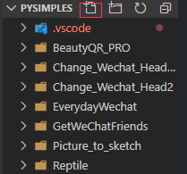
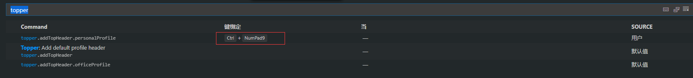

## **环境说明**

#### 准备工作

- Windows 10 1909 版本（Windows 系统）
- [Python 下载](https://www.python.org/)与安装
- VS Code

## **步骤说明**

**1.下载 python3 一步一步默认安装即可**

**2.安装完成后，按键盘上的 win+R 组合键，打开运行窗口，在文本框中输入 cmd 命令后，打开命令行窗口，输入 python 即可查看安装的 python 版本号**

**3. 配置**

- 3.1 建一个 python 文件夹，作为我们的 Python 编程工作空间，只要一次配置好了这个工作空间，以后这个工作空间的配置就会对它之下的所有的.py 文件都起作用。

- 3.2 打开 vscode，点击左上角文件 —> 打开文件夹，然后打开刚刚建立的 python 文件夹

- 3.3 点击 python 文件夹上面的添加文件按钮,添加一个.py 文件，例如名字叫做 vscode.py
  

- 3.4 配置 launch.json 文件
- 点击菜单栏调试 —> 打开配置，就会弹出一个选择框，我们在这里要选择 Python，然后就打开了 launch.json 文件：

```
{
  // 使用 IntelliSense 了解相关属性。
  // 悬停以查看现有属性的描述。
  // 欲了解更多信息，请访问: https://go.microsoft.com/fwlink/?linkid=830387
  "version": "0.2.0",
  "configurations": [
    {
      "name": "Python: 当前文件",
      "type": "python",
      "request": "launch",
      "stopOnEntry": false,
      "pythonPath": "C:/Users/william/AppData/Local/Programs/Python/Python38-32/Scripts", //python3的安装路径
      "program": "${file}",
      "cwd": "${workspaceFolder}",
      "env": {},
      "envFile": "${workspaceFolder}/.env",
      "console": "integratedTerminal",
      "debugOptions": ["RedirectOutput"]
    },
    {
      "name": "Python: Terminal (integrated)",
      "type": "python",
      "request": "launch",
      "stopOnEntry": false,
      "pythonPath": "C:/Users/william/AppData/Local/Programs/Python/Python38-32/Scripts",
      "program": "${file}",
      "cwd": "",
      "console": "integratedTerminal",
      "env": {},
      "envFile": "${workspaceFolder}/.env",
      "debugOptions": []
    },
    {
      "name": "Python: Terminal (external)",
      "type": "python",
      "request": "launch",
      "stopOnEntry": false,
      "pythonPath": "C:/Users/william/AppData/Local/Programs/Python/Python38-32/Scripts",
      "program": "${file}",
      "cwd": "",
      "console": "externalTerminal",
      "env": {},
      "envFile": "${workspaceFolder}/.env",
      "debugOptions": []
    },
    {
      "name": "Python: Django",
      "type": "python",
      "request": "launch",
      "stopOnEntry": true,
      "pythonPath": "C:/Users/william/AppData/Local/Programs/Python/Python38-32/Scripts",
      "program": "${workspaceFolder}/manage.py",
      "cwd": "${workspaceFolder}",
      "args": ["runserver", "--noreload", "--nothreading"],
      "env": {},
      "envFile": "${workspaceFolder}/.env",
      "debugOptions": ["RedirectOutput", "Django"]
    }
  ]
}
```

- 3.5 配置 tasks.json 文件
- 点击菜单栏任务 —> 配置任务，就会弹出一个选择框，我们在这里要选择使用模板创建 tasks.json 文件，然后又弹出一个选择框，这里选择 Others，就打开了 tasks.json 文件：
  对 tasks.json 文件的配置如下:

```
{
    // See https://go.microsoft.com/fwlink/?LinkId=733558
    // for the documentation about the tasks.json format
    "version": "2.0.0",
    "tasks": [
        {
            "label": "echo",
            "type": "shell",
            "command": "C:/Users/william/AppData/Local/Programs/Python/Python38-32/Scripts",
            "args": ["${file}"]

        }
    ]
}
```

**4. 配置用户设置**

- 4.1 点击菜单栏文件 —> 首选项—> 设置，然后打开用户设置：
  settings.json 文件的配置如下：

```
{
    "workbench.colorTheme": "Son of Obsidian", // 配色方案
    "kite.developerMode": true,
    "python.pythonPath": "C:/Users/william/AppData/Local/Programs/Python/Python38-32/python", // python3路径
    "files.autoSave": "onWindowChange",
    "git.ignoreLegacyWarning": true,
    "workbench.iconTheme": "vscode-icons", //启用vscode图标
    "editor.lineHeight": 26, // 编辑器中的行高
    "editor.fontSize": 18, // 编辑器中的字体
    "editor.wordWrap": "on",
    "editor.formatOnSave": true, //编辑器自动保存
    "python.linting.flake8Enabled": true, //启用flake8，首先需要pip3 install falke8
    "python.formatting.provider": "yapf", ///启用yapf，首先需要pip3 install yapf
    "editor.renderIndentGuides": false,
    "path-intellisense.autoSlashAfterDirectory": true,
    "path-intellisense.extensionOnImport": true,
    "python.linting.pylintArgs": [
        "--load-plugins",
        "pylint_django",
        "--disable-msg=C0111"
    ], // 忽略的警告信息
    // 下面是topper的插入header配置
    "topper.customTemplateParameters": [
        {
            "personalProfile": {
                "author": "你的名字",
                "website": "bulbasaur.github.bitbucket.yababbdadado.com",
                "copyright": "None \n None",
                "license": "None",
                "email": "你的邮箱"
            }
        },
        {
            "officeProfile": {
                "author": "John Doe",
                "department": "Product Development",
                "email": "john.doe@doejohn.com"
            }
        }
    ],
    "topper.headerTemplates": [
        {
            "defaultCStyled": {
                "headerBegin": "/**",
                "headerPrefix": "*",
                "headerEnd": "*/",
                "template": [
                    "${headerBegin}",
                    "${headerPrefix} ${fileName}",
                    "${headerPrefix} @author ${author}",
                    "${headerPrefix} @description ${description}",
                    "${headerPrefix} @created ${createdDate}",
                    "${headerPrefix} @copyright ${copyright}",
                    "${headerPrefix} @last-modified ${lastModifiedDate}",
                    "${headerEnd}"
                ]
            }
        },
        {
            "python": {
                "headerBegin": "# -*- coding: utf-8 -*-",
                "headerPrefix": "#",
                "headerEnd": "#",
                "template": [
                    "${headerBegin}",
                    "${headerPrefix} ${fileName}",
                    "${headerPrefix} @author ${author}",
                    "${headerPrefix} @description ${description}",
                    "${headerPrefix} @created ${createdDate}",
                    "${headerPrefix} @last-modified ${lastModifiedDate}",
                    "${headerEnd}"
                ]
            }
        }
    ],
    "editor.fontFamily": "monospace",
    "terminal.integrated.fontFamily": "monospace",
    "editor.fontWeight": "500",
}
```

- 4.2 配置快捷键
- 打开文件->首选项->键盘快捷方式：
  在搜索框输入 topper，然后点击要配置的命令，然后输入想要设定的快捷键，例如我对 topper.addTopHeader.persionalProfile 设置的快捷键为 Crtl+9。
  
  在一个 python 文件中按下 Crtl+9 时，就会插入 header，至此配置完成。

#### 注意事项
