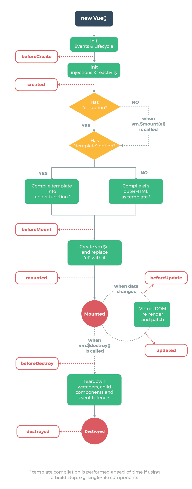

## **环境说明**

#### 准备工作

- node.js version > 8.9
- @vue/cli 4.5.6
- [vue-cli 官网](https://github.com/vuejs/vue-cli)

## **步骤说明**

**1. vue 基本生命周期**



- vue 源码中最终执行生命周期函数都是调用 callHook 方法，callHook 函数的逻辑很简单，根据传入的生命周期类型 hook，去拿到 vm.\$options[hook]对应的回调函数数组，然后遍历执行，执行的时候把 vm 作为函数执行的上下文。

- 1.1 图解如下：

  - new Vue(options)：创建一个 vm 实例；
  - mergeOptions(resolveConstructorOptions(vm.constructor), options, vm)：合并 Vue 构造函数里 options 和传入的 options 或合并父子的 options。比如：在 mergeOptions 函数中会调用 mergeHook 方法合并生命周期的钩子函数，mergeHook 方法原理是只有父时返回父，只有子时返回数组类型的子。父、子都存在时，将子添加在父的后面返回组合而成的数组。这也是父子均有钩子函数的时候，先执行父的后执行子的的原因；
  - initLifecycle(vm)、initEvents(vm)、initRender(vm)：在创建的 vm 实例上初始化生命周期、事件、渲染相关的属性；
  - callHook(vm, 'beforeCreate')：调用 beforeCreate 生命周期钩子函数；
  - initInjections(vm)、initState(vm)、initProvide(vm)：初始化数据：inject、state、provide。initState 的作用是初始化 props、data、methods、watch、computed 等属性；
  - callHook(vm, 'created')：调用 created 生命周期钩子函数；
  - vm.$mount(vm.$options.el)：$mount方法在多个文件中都有定义，如"src/platform/web/entry-runtime-with-compiler.js"、"src/platform/web/runtime/index.js"、"src/platform/weex/runtime/index.js"。因为$mount 方法的实现是和平台、构建方式相关的。以"entry-runtime-with-compiler.js"为例，关键步骤是查看 vm.$options中是否有render方法，如果没有则会根据el和template属性确定最终的template字符串，再调用compileToFunctions方法将template字符串转为render方法，最后，调用原先原型上的$mount 方法，即开始执行"lifecycle.js"中 mountComponent 方法；
  - callHook(vm, 'beforeMount')：调用 beforeMount 生命周期钩子函数；
  - vm.\_render() => vm.\_update() => vm.**patch**()：先执行 vm.\_render 方法，即调用 createElement 生成虚拟 DOM，即 VNode ，每个 VNode 有 children ，children 每个元素也是⼀个 VNode，这样就形成了⼀个 VNode Tree；再调用 vm.\_update 方法进行首次渲染，vm.\_update 方法核心是调用 vm.patch 方法，这个方法跟 vm.\$mount 一样跟平台相关；vm.patch 方法则是根据生成的 VNode Tree 递归 createElm 方法创建真实 Dom Tree 挂载到 Dom 上；
  - callHook(vm, 'mount')：调用 mount 生命周期钩子函数：VNode patch 到 Dom 之后会执行 'invokeInsertHook'函数，把 insertedVnodeQueue 中保存的 mount 钩子函数执行一遍，insertedVnodeQueue 队列中的钩子函数是在根据 VNode Tree 递归 createElm 方法创建真实 Dom Tree 过程生成的钩子函数顺序队列，因此 mounted 钩子函数的执行顺序是先子后父；
  - data changes：数据更新，nextTick 中执行 flushSchedulerQueue 方法，该方法会执行 watcher 队列中的 watcher；
  - callHook(vm, 'beforeUpdate')：执行 watcher 时会执行 watcher 的 before 方法，即调用 beforeUpdate 生命周期钩子函数；
  - Virtual DOM re-render and patch：重新 render 生成新的 Virtual DOM，并且 patch 到 DOM 上；
  - callHook(vm, 'updated')：调用 updated 生命周期钩子函数；
  - vm.\$destroy()：启动卸销毁过程；
  - callHook(vm, 'beforeDestroy')：调用 beforeDestroy 生命周期钩子函数；
  - Teardown watchers, childcomponents and event listeners：执行一系列销毁动作，在 \$destroy 的执行过程中，它又会执行 vm.**patch**(vm.\_vnode, null) 触发它子组件的销毁钩子函数，这样一层层的递归调用，所以 destroyed 钩子函数执行顺序是先子后父，和 mounted 过程一样。
  - callHook(vm, 'destroyed ')：调用 destroyed 生命周期钩子函数。

- 1.2 errorCaptured 生命周期钩子函数

  - 当捕获一个来自子孙组件的错误时被调用。此钩子会收到三个参数：错误对象、发生错误的组件实例以及一个包含错误来源信息的字符串。此钩子可以返回 false 以阻止该错误继续向上传播。
  - 如果一个组件的继承或父级从属链路中存在多个 errorCaptured 钩子，则它们将会被相同的错误逐个唤起。
  - 默认情况下，如果全局的 config.errorHandler 被定义，所有的错误仍会发送它，因此这些错误仍然会向单一的分析服务的地方进行汇报。

- 1.3 keep-alive 组件

  - keep-alive 组件是 vue 的内置抽象（abstract）组件，抽象组件在 initLifecycle 过程中 组件实例建立父子关系时会被忽略，因此他自身不会渲染一个 DOM 元素，也不会出现在父组件链中。
  - keep-alive 作用是用于包裹动态组件，缓存不活动的组件实例。keep-alive 自定义实现了 render 函数并利用了插槽 slot，render 函数中先获取它的默认插槽，再获取到它的第一个组件子节点，因此 keep-alive 组件只处理第一个子元素，所以一般和它搭配使用的有 component 动态组件或者 router-view。
  - keep-alive 组件在 created 钩子中定义了 this.cache 和 this.keys，本质上是去缓存已创建的 vnode，缓存策略采用 LRU 策略，每次缓存命中时将当前 vnode 移到缓存数组末尾，需要删除时则删除缓存数组第一个 vnode。

- 1.4 keep-alive 组件接收三个 props：

  - include：数组、字符串或者正则表达式，只有匹配的组件才会缓存。
  - exclude：数组、字符串或者正则表达式，任何匹配的组件都不会被缓存。
  - max：字符串或数字，指定可以缓存的组件最大个数，如果个数超过 max，则销毁缓存数组中的第一个组件。

- 1.5 keep-alive 组件子组件渲染机制：

  - 首次渲染：和普通组件一样执行正常的 init 生命周期钩子函数，同时将生成的 vnode 缓存到内存中；
  - 组件切换：切换到新组件时，旧组件不会销毁，而是变成未激活状态，即不会执行 destroy 相关的钩子函数，而是执行 deactivated 生命周期钩子函数，如果新组件不在缓存数组中，则执行首次渲染，否则执行缓存渲染；
  - 缓存渲染：缓存渲染即组件由未激活状态变成激活状态，因此不会执行 created、mounted 等钩子函数，而是执行 activated 生命周期钩子函数。

**2. Composition API**

- Composition API 使我们能够更好地将代码组织为更多的模块化功能，而不是根据属性的类型（方法，计算的数据）进行分离。

**3. 生命周期和钩子函数**

> 生命周期：Vue 是组件化编程，从一个组件诞生到消亡，会经历很多过程，这些过程就叫做生命周期。
> 钩子函数： 伴随着生命周期，给用户使用的函数，操控生命周期，主要是操控钩子函数。

- 常用生命周期函数示例：

```vue
<script lang="ts">
import { onMounted, onBeforeMount, onBeforeUpdate, onUpdated } from 'vue'

const app = {
	name: 'App',
	setup() {
		console.log('1-开始创建组件-----setup()')

		onBeforeMount(() => {
			console.log('2-组件挂载到页面之前执行-----onBeforeMount()')
		})

		onMounted(() => {
			console.log('3-组件挂载到页面之后执行-----onMounted()')
		})

		onBeforeUpdate(() => {
			console.log('4-组件更新之前-----onBeforeUpdate()')
		})

		onUpdated(() => {
			console.log('5-组件更新之后-----onUpdated()')
		})
	},
}
export default app
</script>
```

**4. 从 Vue2 转换到 Vue3**

```
Vue2--------------vue3
beforeCreate  -> setup()
created       -> setup()
beforeMount   -> onBeforeMount
mounted       -> onMounted
beforeUpdate  -> onBeforeUpdate
updated       -> onUpdated
beforeDestroy -> onBeforeUnmount
destroyed     -> onUnmounted
activated     -> onActivated
deactivated   -> onDeactivated
errorCaptured -> onErrorCaptured
```

**5. onRenderTracked()和 onRenderTriggered()钩子函数的使用**

- 调试用的钩子函数 onRenderTracked（状态跟踪）和 onRenderTriggered（状态触发）

```vue
<script lang="ts">
import { onRenderTracked, onRenderTriggered } from 'vue'

const app = {
	name: 'App',
	setup() {
		onRenderTracked((event) => {
			console.log('状态跟踪组件----------->')
			console.log(event)
		})

		onRenderTriggered((event) => {
			console.log('状态触发组件--------------->')
			console.log(event)
		})
	},
}
export default app
</script>
```
