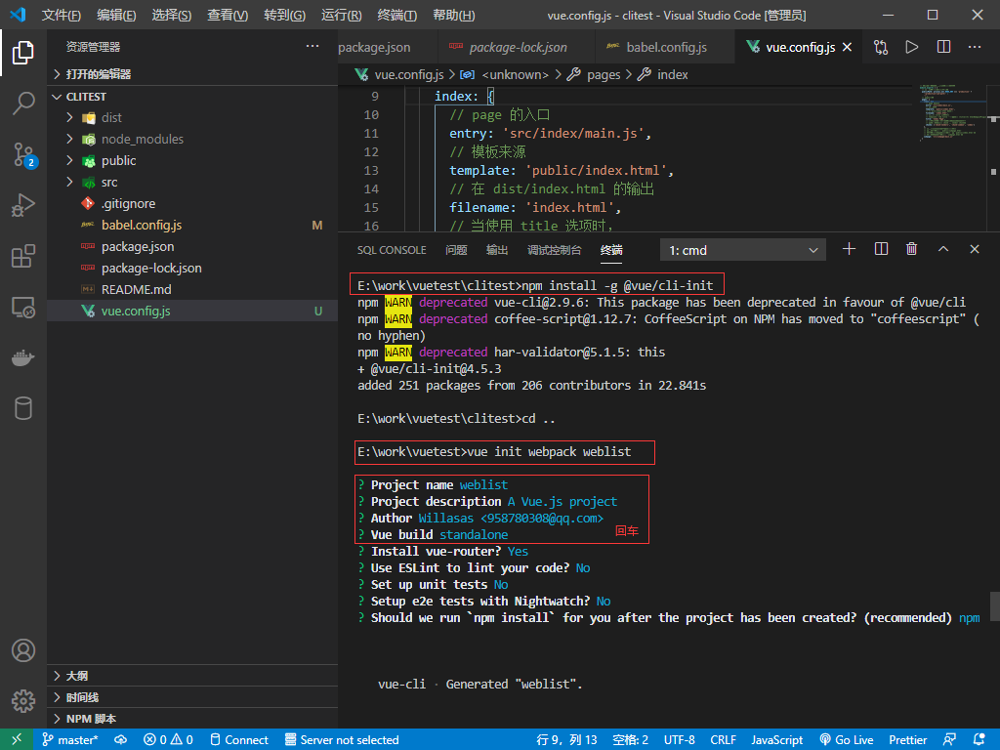
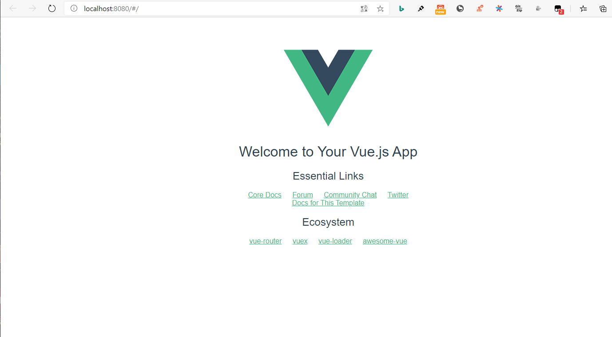

## **环境说明**

#### 准备工作

- node.js version > 8.9
- vue.js
- [vue-cli 官网](https://github.com/vuejs/vue-cli)
- [RAP2 接口管理平台官网](http://rap2.taobao.org/)

## **步骤说明**

**1. 安装@vue/cli,使用如下命令均可**

```cmd
npm install -g @vue/cli
npm install -g @vue/cli-init  #安装初始化组件
# OR
yarn global add @vue/cli
```

**2. 检测是否安装成功**

```cmd
vue --version
```

**3. 快速原型开发**

- 安装一个全局的扩展

```shell
npm install -g @vue/cli-service-global
vue init webpack test  # 通过webpack生成项目
```



- 创建一个项目

```shell
vue create clitest  #创建一个名为clitest的项目
vue ui  #以图形化界面创建和管理项目
vue add eslint  #在现有的项目中安装插件(eslint)
```

**4. 运行项目**

```shell
npm run serve
# or
npx vue-cli-service serve
npm run dev  #运行webpack生成的项目
```




- 生成用于生产环境的包

```shell
npm run build
# or
npx vue-cli-service build
# 现代模式，会生成两个版本
npx vue-cli-service build --modern
```

**5. 安装 axios**

```shell
npm install axios --save-dev
```

- 导入 axios,在项目的 main.js 文件中，导入 axios,命令如下：

```main.js
import axios from 'axios'  //引入axios

Vue.prototype.$http = axios   //修改内部的$http为axios
```

- 使用 axios

  - 在需要发送异步请求的位置：this.$http.get("url").then((res)=>{})  this.$http.post("url").then((res)=>{})

## **项目说明**

**1. HTML 和静态资源**

- public/index.html 文件是一个会被 html-webpack-plugin 处理的模板。可以使用 lodash template 语法插入内容：

```html
<%= VALUE %> 用来做不转义插值； <%- VALUE %> 用来做 HTML 转义插值； <%
expression %> 用来描述 JavaScript 流程控制。 # 例如：
<link rel="icon" href="<%= BASE_URL %>favicon.ico" />
```

**2. 处理静态资源**

- 从相对路径导入

  - 当你在 JavaScript、CSS 或 \*.vue 文件中使用相对路径 (必须以 . 开头) 引用一个静态资源时，该资源将会被包含进入 webpack 的依赖图中。

- URL 转换规则:

  - 如果 URL 是一个绝对路径 (例如 /images/foo.png)，它将会被保留不变。
  - 如果 URL 以 . 开头，它会作为一个相对模块请求被解释且基于你的文件系统中的目录结构进行解析。
  - 如果 URL 以 ~ 开头，其后的任何内容都会作为一个模块请求被解析。这意味着你甚至可以引用 Node 模块中的资源：

  ```html
  
  ```

  - 如果 URL 以 @ 开头，它也会作为一个模块请求被解析。它的用处在于 Vue CLI 默认会设置一个指向 <projectRoot>/src 的别名 @。(仅作用于模版中)

- 放置在 public 目录下或通过绝对路径被引用

  - 任何放置在 public 文件夹的静态资源都会被简单的复制，而不经过 webpack。你需要通过绝对路径来引用它们。

**3. CSS 相关**

- 预处理器（Sass/Less/Stylus）安装

```shell
# Sass Install
npm install -D sass-loader sass
# Less Install
npm install -D less-loader less
# Stylus Install
npm install -D stylus-loader stylus
```

- 然后你就可以导入相应的文件类型，或在 \*.vue 文件中这样来使用：

```vue
<style lang="scss">
$color: red;
</style>
```

**4. vue.config.js**

- vue.config.js 是一个可选的配置文件，如果项目的 (和 package.json 同级的) 根目录中存在这个文件，那么它会被 @vue/cli-service 自动加载。你也可以使用 package.json 中的 vue 字段，但是注意这种写法需要你严格遵照 JSON 的格式来写。

## **部署**

**0. 打包后将整个 dist 文件夹拷贝到后端代码的 static 文件夹内，并修改 index.html 中对应的路径**

**1. 云开发（CloudBase）**

- 安装云开发 CloudBase CLI，通过 CloudBase Framework 来一键部署应用

```shell
npm install -g @cloudbase/cli  #全局安装
```

- 一键部署,在项目根目录运行以下命令部署 Vue CLI 创建的应用

```
cloudbase login
cloudbase init --without-template
cloudbase framework:deploy
```

**2. 在 Docker 容器中使用 Nginx 部署你的应用**

- 安装 Docker

- 在项目根目录创建 Dockerfile 文件

```Dockerfile
FROM node:10
COPY ./ /app
WORKDIR /app
RUN npm install && npm run build

FROM nginx
RUN mkdir /app
COPY --from=0 /app/dist /app
COPY nginx.conf /etc/nginx/nginx.conf
```

- 在项目根目录创建 .dockerignore 文件,并设置 .dockerignore 文件能防止 node_modules 和其他中间构建产物被复制到镜像中导致构建问题

```.dockerignore
**/node_modules
**/dist
```

- 在项目根目录创建 nginx.conf 文件

```nginx.conf
user  nginx;
worker_processes  1;
error_log  /var/log/nginx/error.log warn;
pid        /var/run/nginx.pid;
events {
  worker_connections  1024;
}
http {
  include       /etc/nginx/mime.types;
  default_type  application/octet-stream;
  log_format  main  '$remote_addr - $remote_user [$time_local] "$request" '
                    '$status $body_bytes_sent "$http_referer" '
                    '"$http_user_agent" "$http_x_forwarded_for"';
  access_log  /var/log/nginx/access.log  main;
  sendfile        on;
  keepalive_timeout  65;
  server {
    listen       80;
    server_name  localhost;
    location / {
      root   /app;
      index  index.html;
      try_files $uri $uri/ /index.html;
    }
    error_page   500 502 503 504  /50x.html;
    location = /50x.html {
      root   /usr/share/nginx/html;
    }
  }
}
```

- 构建 Docker 镜像

```shell
docker build . -t my-app
# Sending build context to Docker daemon  884.7kB
# ...
# Successfully built 4b00e5ee82ae
# Successfully tagged my-app:latest
```

- 运行 Docker 镜像

```shell
docker run -d -p 8080:80 my-app
curl localhost:8080
# <!DOCTYPE html><html lang=en>...</html>
```

#### 注意事项
