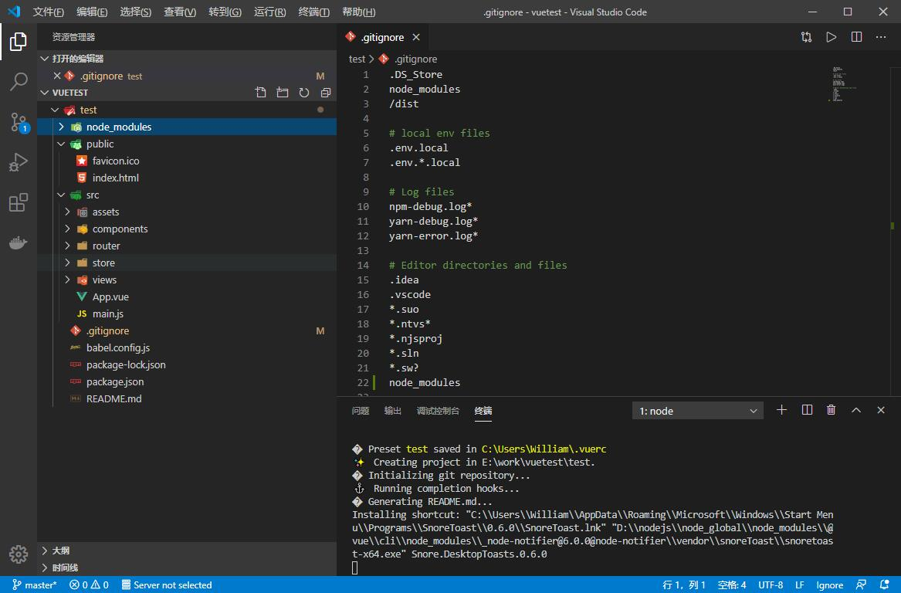

## **环境说明**
#### 准备工作
* [安装node.js环境](../Nodejs/node_js安装教程.md)
* VS Code IDE

## **步骤说明**
**1. 安装全局vue,在命令行执行如下代码:**
``` @cmd.exe
npm install -g vue
```


**2. 安装vue最新版脚手架，代码如下**
```
cnpm install @vue/cli -g
```
* 至此环境就已经搭建好了

**3. 安装VS Code插件**

插件名 | 说明
---|---
Auto Close Tag | 自动闭合标签
Code Runner | 快速运行代码 支持多种语言 支持文件运行 支持文件中部分代码运行
Document This | 注释插件
ESLint | JavaScript代码检查工具
HTML Class Suggestions | 引导类建议
HTML CSS Support | html css支持
HTML Snippets | html片段支持
JavaSCRIPT(ES6) code snippets | 用于CloudStudio代码编辑器的ES6语法中的JavaScript代码片段(支持JavaScript和TypeScript)
open in browser | 在浏览器中打开
Path Intellisense | 自动提示相关的文件路径
px to rem | 像素转rem
px2rem | px转换成rem的插件
pxtorem | vue中将px转换成rem插件
Vetur | vue插件

**4. 创建项目**
* 4.1 新建一个文件夹，然后在vs code中打开该文件夹，在控制台输入以下命令：
```
vue ui
```


* 4.2 进入项目管理器 选择创建 选择项目位置（即刚才选中的文件夹），点击创建


* 4.3 创建项目


* 点击右侧的【启动app】按钮，会出现欢迎界面：

* 此时VS Code中对应的项目代码如下：


**5. 测试**
* 原理讲解，以index.html主页面为例

*首先请求到main.js文件，而mian.js文件中引入了各个组件


* 再通过App.vue解析


* router下的index.js文件再引入对应的组件


* 总结如下：index.html  ->  App.vue的export外的js代码  ->  main.js调用公共函数外的代码  ->  App.vue公共函数的定时器外的代码  ->  main.js调用公共函数内创建实例前的代码  ->  App.vue的export里面的js代码  ->  main.js调用公共函数内创建实例后的代码  ->  App.vue公共函数的定时器内执行回调函数后的代码  ->  Index.vue的export外的js代码  

#### 注意事项