## **环境说明**

#### 准备工作

- [安装 node.js 环境](../Nodejs/node_js安装教程.md)
- VS Code IDE

## **步骤说明**

**1. 安装全局 vue,在命令行执行如下代码:**

```@cmd.exe
npm install -g vue
```

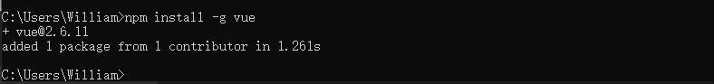

**2. 安装 vue 最新版脚手架，代码如下**

```
cnpm install -g @vue/cli
```

- 至此环境就已经搭建好了

**3. 安装 VS Code 插件**

| 插件名                        | 说明                                                                                          |
| ----------------------------- | --------------------------------------------------------------------------------------------- |
| Auto Close Tag                | 自动闭合标签                                                                                  |
| Code Runner                   | 快速运行代码 支持多种语言 支持文件运行 支持文件中部分代码运行                                 |
| Document This                 | 注释插件                                                                                      |
| ESLint                        | JavaScript 代码检查工具                                                                       |
| HTML Class Suggestions        | 引导类建议                                                                                    |
| HTML CSS Support              | html css 支持                                                                                 |
| HTML Snippets                 | html 片段支持                                                                                 |
| JavaSCRIPT(ES6) code snippets | 用于 CloudStudio 代码编辑器的 ES6 语法中的 JavaScript 代码片段(支持 JavaScript 和 TypeScript) |
| open in browser               | 在浏览器中打开                                                                                |
| Path Intellisense             | 自动提示相关的文件路径                                                                        |
| px to rem                     | 像素转 rem                                                                                    |
| px2rem                        | px 转换成 rem 的插件                                                                          |
| pxtorem                       | vue 中将 px 转换成 rem 插件                                                                   |
| Vetur                         | vue 插件                                                                                      |

**4. 创建项目**

- 4.1 新建一个文件夹，然后在 vs code 中打开该文件夹，在终端输入以下命令：

```terminal
vue ui
vue add vue-next  #vue3支持
```

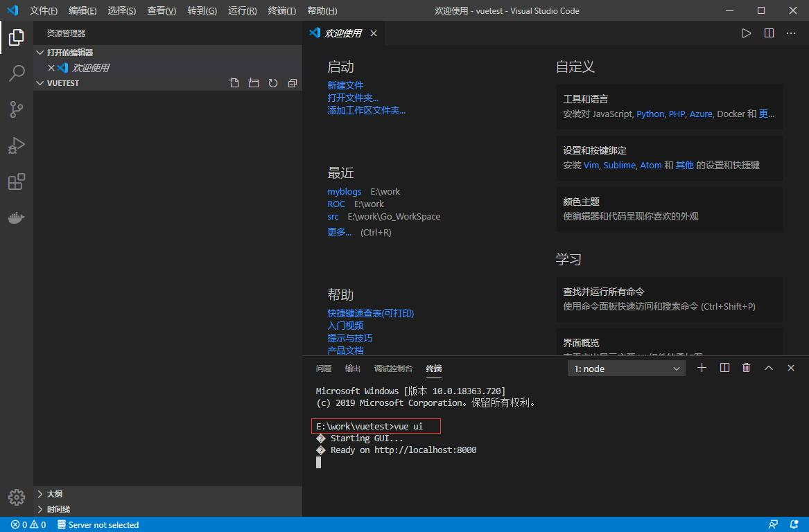

- 4.2 进入项目管理器 选择创建 选择项目位置（即刚才选中的文件夹），点击创建
  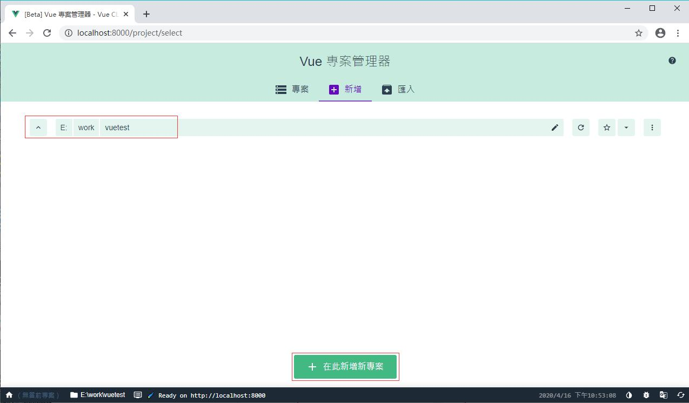

- 4.3 创建项目
  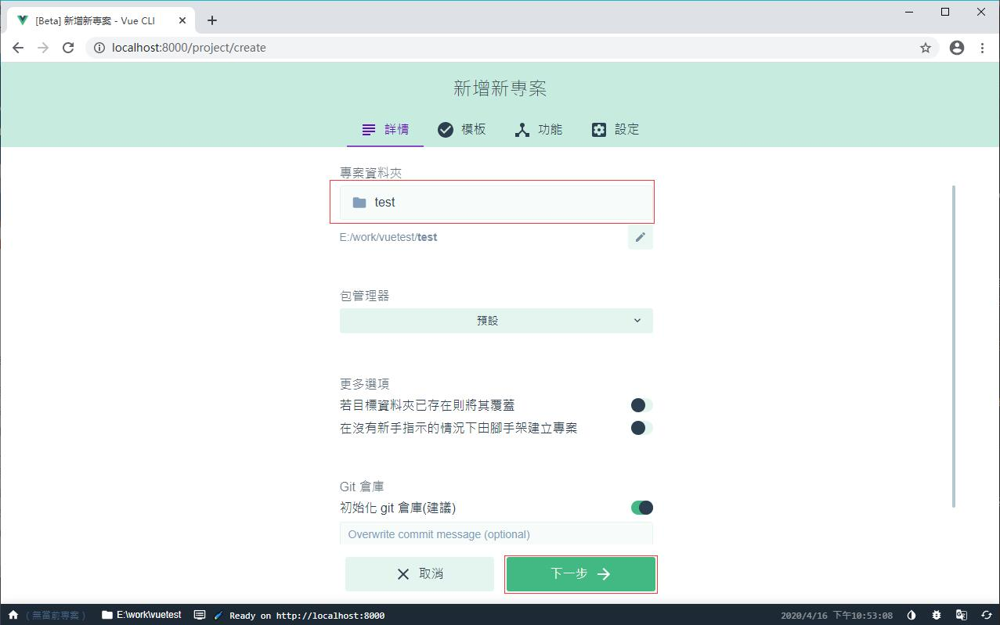

  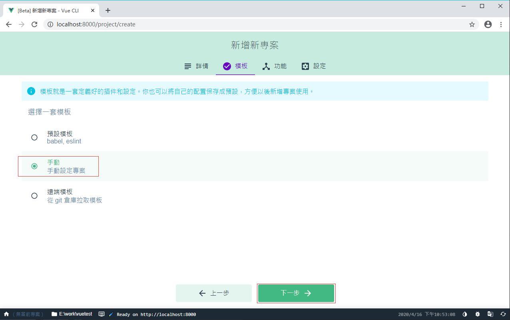

  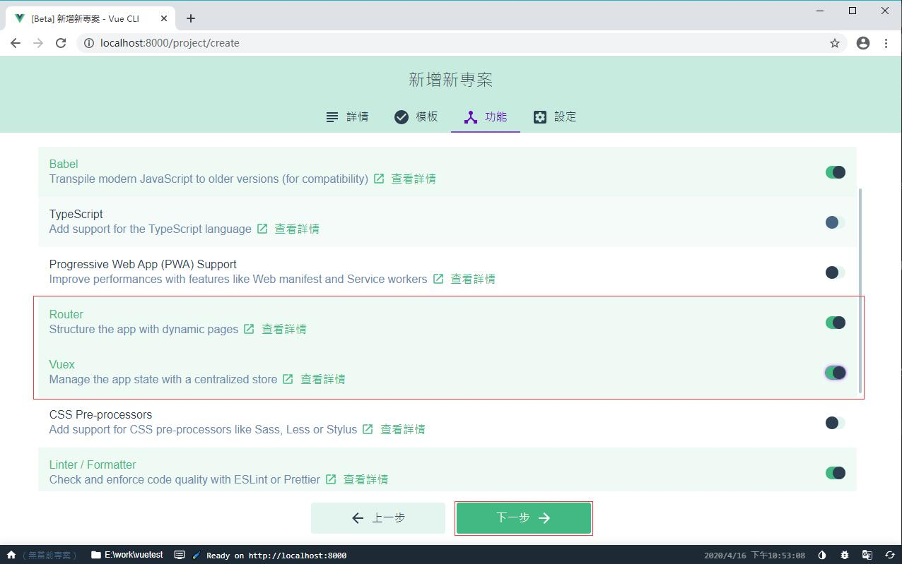

  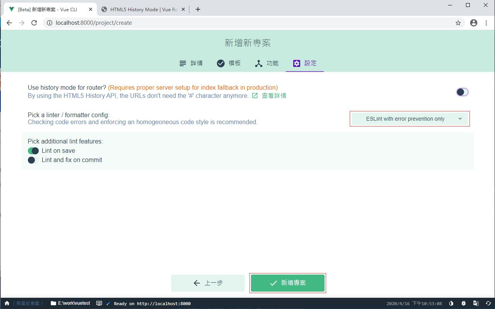

  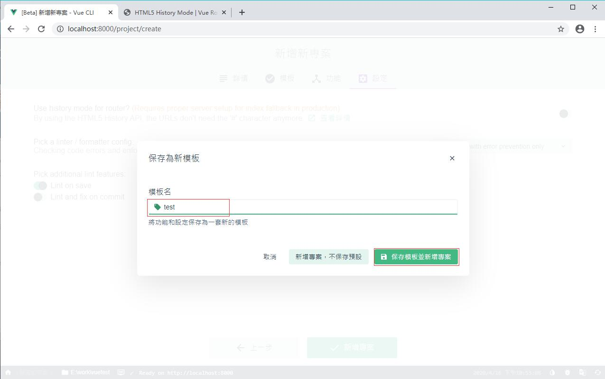

  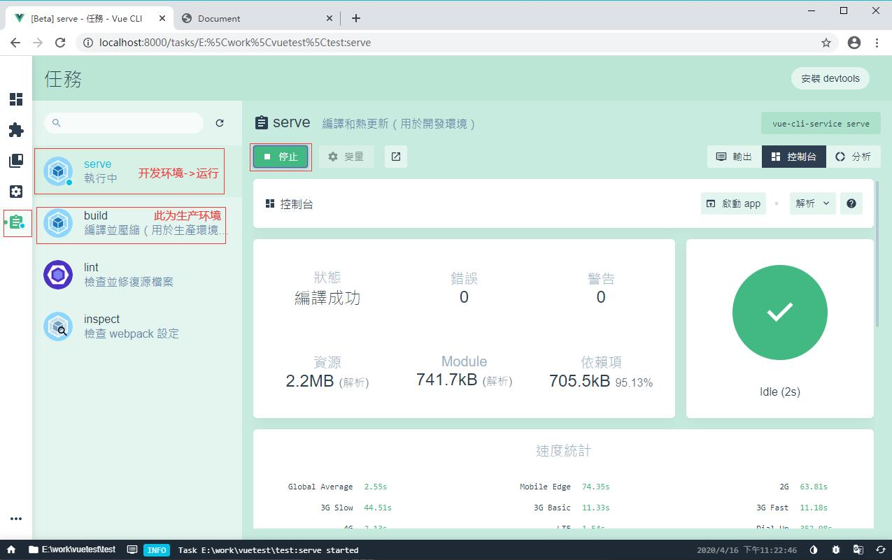

- 点击右侧的【启动 app】按钮，会出现欢迎界面：
  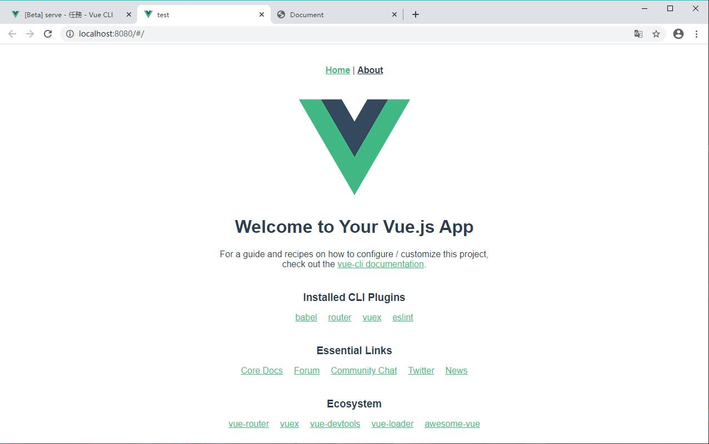

- 此时 VS Code 中对应的项目代码如下：
  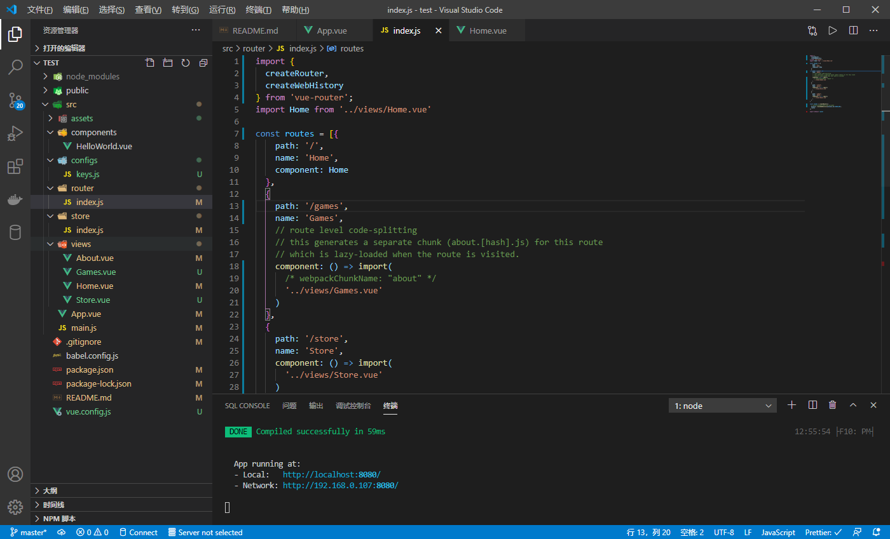

- 4.4 安装 axios 和参数序列化 qs

```terminal
cnpm i axios qs -S  #安装参数序列化qs
```

**5. 测试**

```terminal
npm run serve  #运行项目
```

- 原理讲解，以 index.html 主页面为例

- 首先请求到 main.js 文件，而 mian.js 文件中引入了各个组件
  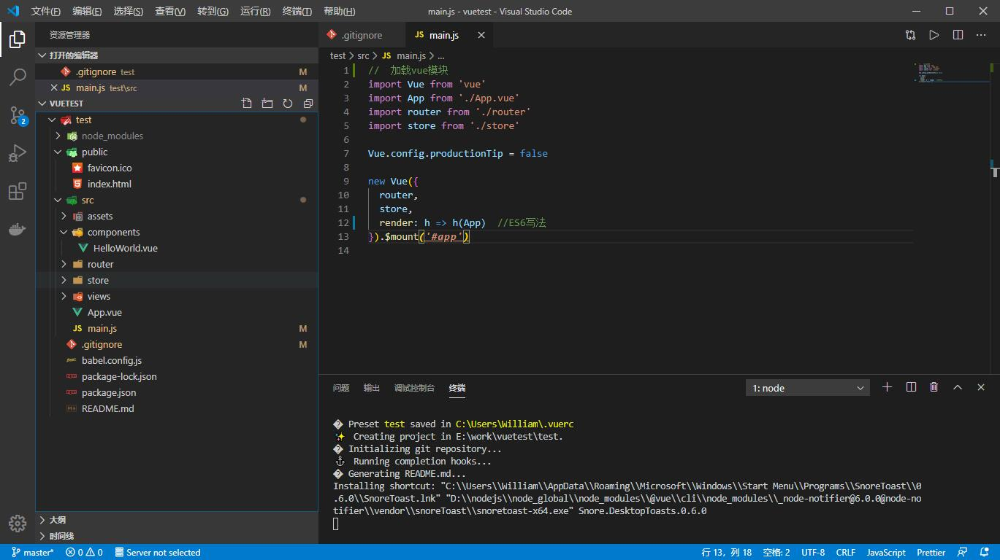

- 再通过 App.vue 解析
  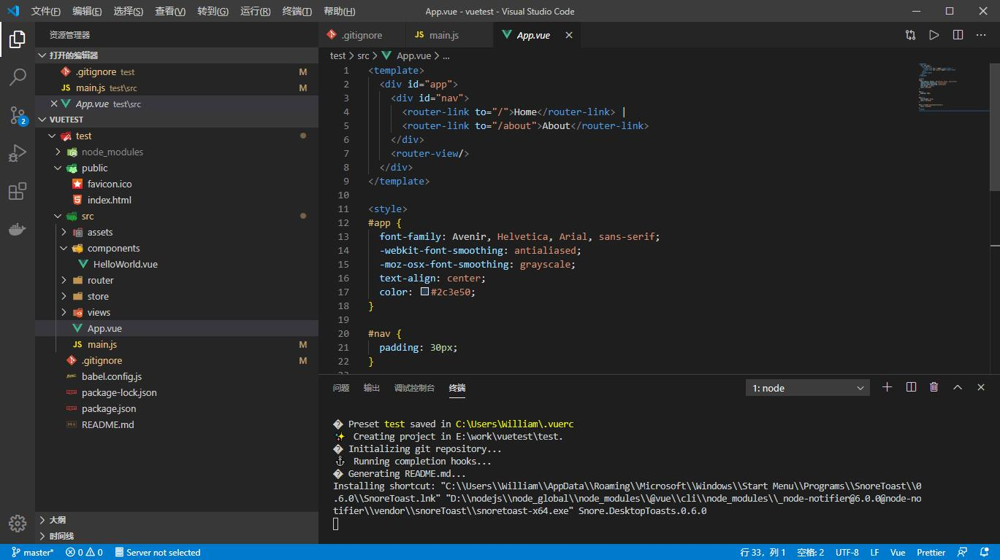

- router 下的 index.js 文件再引入对应的组件
  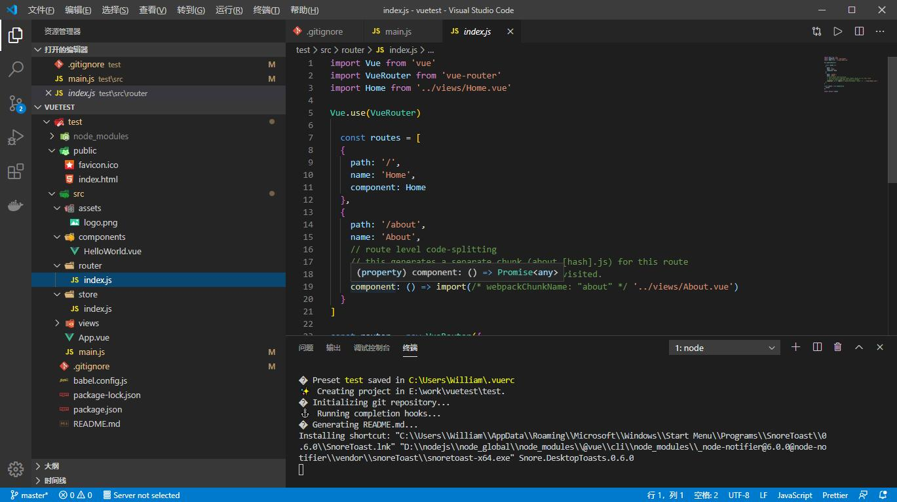

- 总结如下：index.html -> App.vue 的 export 外的 js 代码 -> main.js 调用公共函数外的代码 -> App.vue 公共函数的定时器外的代码 -> main.js 调用公共函数内创建实例前的代码 -> App.vue 的 export 里面的 js 代码 -> main.js 调用公共函数内创建实例后的代码 -> App.vue 公共函数的定时器内执行回调函数后的代码 -> Index.vue 的 export 外的 js 代码

**6. 项目结构**

```
node_modules
public
src
  assets
    css
      border.css #解决移动端边框的问题
      resets.css #标签样式初始化工具
    img #图片
    js
      common.js     #对HTML字体大小、项目初始化、错误处理的设置
      fastclick.js  #解决移动端触摸延迟问题
  components
  configs
    keys.js  #api_key管理文件
  router
   index.js   #路由配置
  store
  views #页面视图
  App.vue
  main.js
babel.config.js
package.json  #项目组件配置信息
package-lock.json
README.md
vue.config.js   #vue3.0的配置文件,配置代理等
```

#### 注意事项
