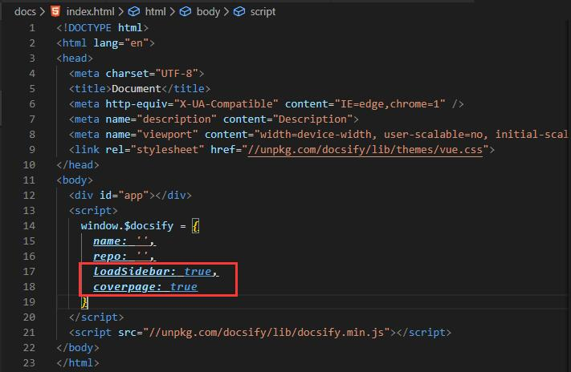
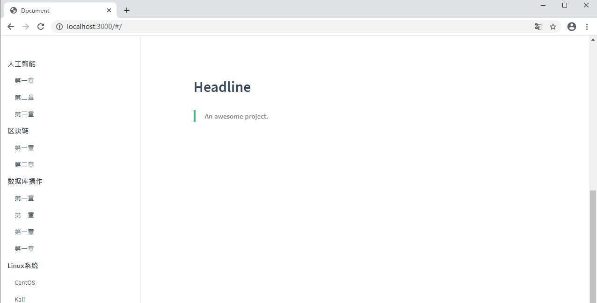
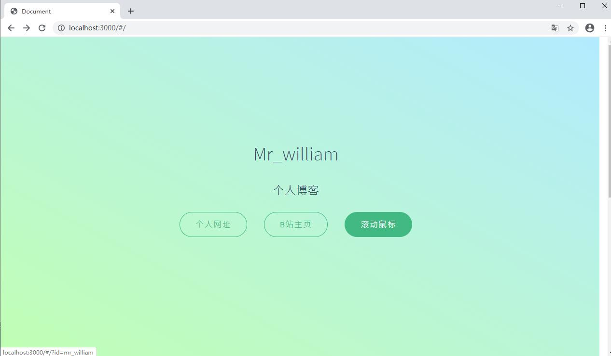
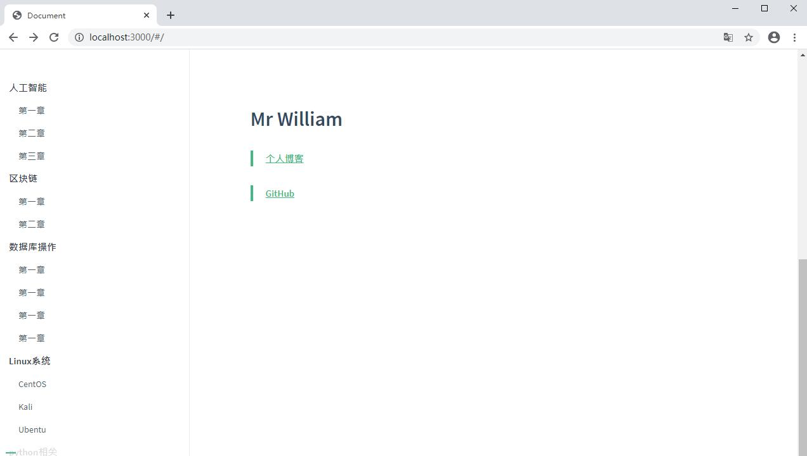
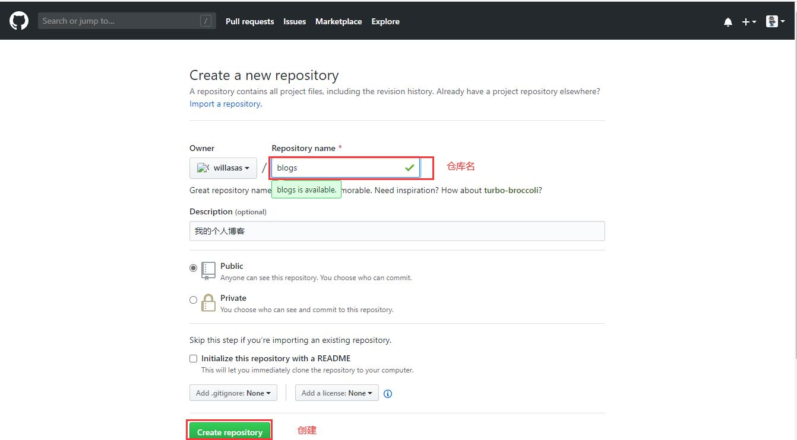
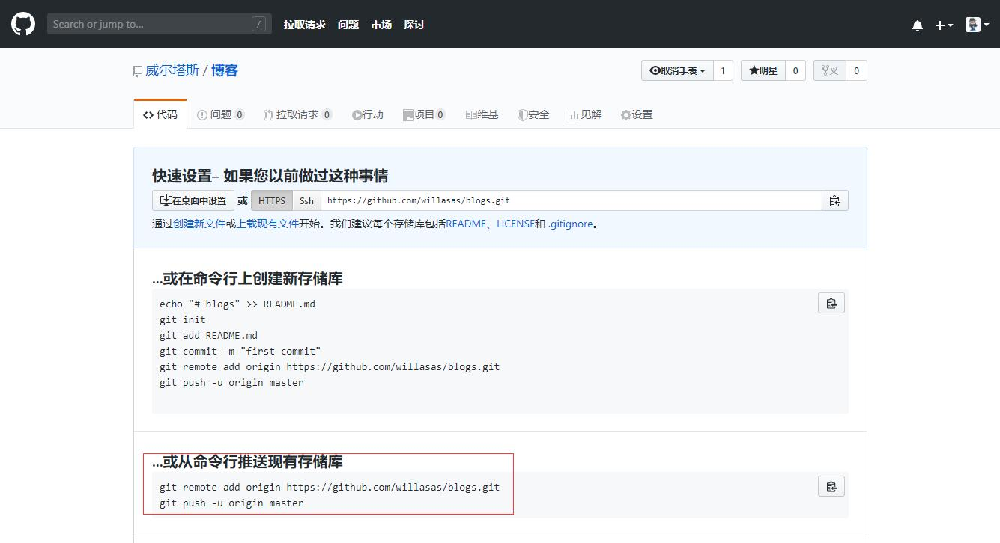
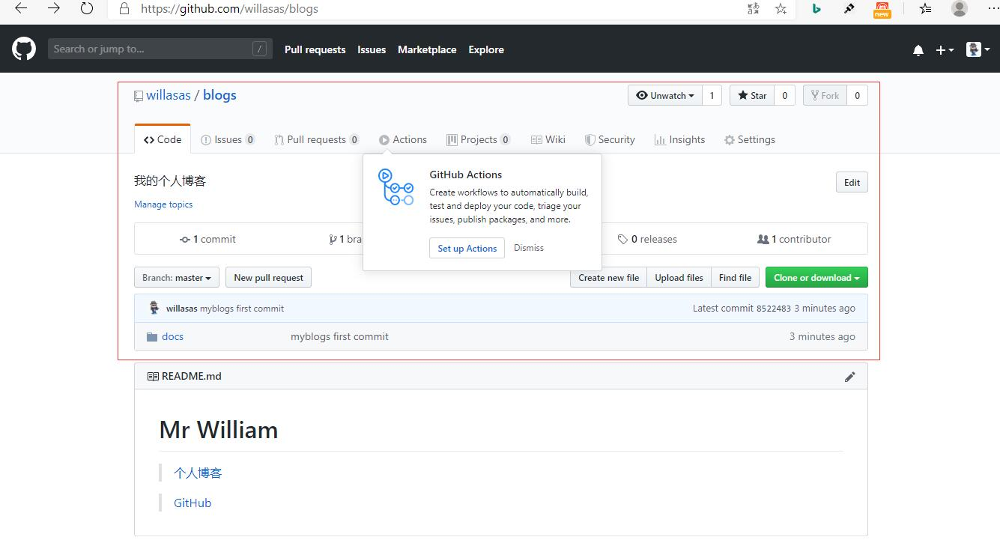
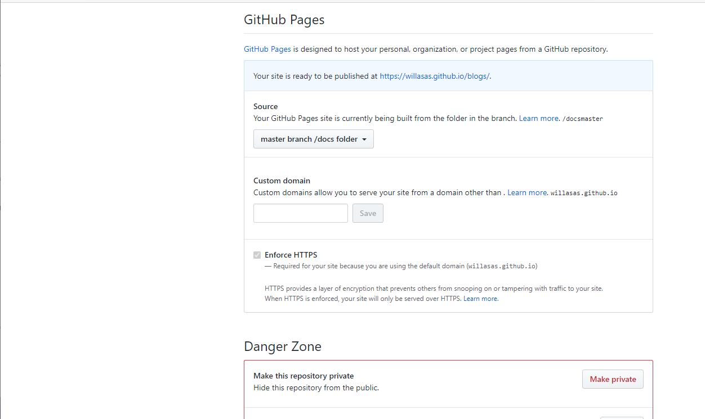

## **环境说明**

#### 框架技术

- docsify 框架
- 基于 Github Pages 的站点部署

#### 准备工作

- Windows 10 1909 版本（Windows 系统）
- [Git 安装与配置](Web/Git/Git安装与配置.md)
- [node 下载](https://nodejs.org/en/download/)和[node_js 安装教程](../Web/Nodejs/node_jsStart.md)

## **步骤说明**

**1. 配置并使用 docsify 命令生成文档站点**-->[docsify 官网](https://docsify.js.org/#/)

**2. 安装 docsify-cli 工具**(方便创建及本地预览文档网站)，在命令行窗口执行以下命令（需要先配置 node 环境）

```@cmd.exe
npm i docsify-cli -g
```

**3. 初始化项目**

- 选择一个目录，作为我们的博客站点目录。也就是项目要生成的目录，比如我在 E 盘下的 work 文件夹下创建一个名为 myblogs 的目录

- 打开 Git Bash 工具，进到目标文件夹，依次执行如下命令

```@Bash
e:
cd work/myblogs/
docsify init ./docs
docsify serve --port 4000  #指定端口（可选）
```

- 执行以上命令后，在 myblogs 目录下会多出一个 docs 目录(此目录就是将来我们存放 MD 格式的博客文件的地方)，此时 docs 文件夹下的结构如下

```@file
    - index.html 入口文件
    - README.md 会做为主页内容渲染
    - .nojekyll 用于阻止 GitHub Pages 会忽略掉下划线开头的文件
```

- 启动项目，预览效果，在命令行窗口执行以下命令

```@cmd.exe
docsify serve docs
```

在浏览器中输入

```@url
http://localhost:3000
```

**4. 配置项目**

- 主要配置一下封面、左侧导航栏和首页，其他的配置可以参考 docsify 官网
  4.1. 配置左侧导航栏，在 E:\work\myblogs\docs 目录下新建一个\_sidebar.md 的文件，文件内容如下：

```@_sidebar.md
- 人工智能

    - [第一章](AI/什么是人工智能.md)
    - [第二章](AI/人工智能发展前景.md)
    - [第三章](AI/什么是人工智能.md)

- 区块链

    - [第一章](Block-chain/区块链是什么.md)
    - [第二章](Block-chain/区块链的特点.md)

- 数据库操作

    - [第一章](Database/数据库操作.md)
    - [第一章](Database/数据库操作.md)
    - [第一章](Database/数据库操作.md)
    - [第一章](Database/数据库操作.md)
```

这其实就是最基本的 md 文件，里面写了一些链接。当然了我们诸如 AI/什么是人工智能.md 是相对路径，目录下也要放 什么是人工智能.md 的文件才行。
还需要在 index.html 文件中配置,即在内嵌的 js 脚本中加上下面这句代码：

```
loadSidebar: true
```




4.2. 配置封面

- 新建一个\_coverpage.md 的文件，这里面的内容就是你封面的内容。

```@_coverpage.md
# Mr_william
> 个人博客
[个人网址](https://www.baidu.com)
[B站主页](https://space.bilibili.com/250154329)
[滚动鼠标](#introduction)
```

- 然后在 index.html 文件中修改 js 脚本配置，添加一句：

```
coverpage: true
```

效果如下:


4.3 配置首页

- 其实就是 E:\work\myblogs\docs 目录下的 README.md 文件里的内容

```@README.md
# Mr William
> [个人博客](http://willasas.github.io/blogs)
> [GitHub](https://github.com/willasas/repositories)
```

效果如下:


**5. 部署项目**

- 通过 Github Pages 的功能，我们可以将个人站点托管到 github 上
  5.1 登录 github 账号，创建仓库，如下图：
  

仓库创建好了，我们使用第二种方式导入一个本地仓库（本地仓库还没有创建，接下来会建一个）


5.2 创建本地仓库，推送到 GitHub 上

- 首先我们进入我们的本地博客站点目录，也就是 E:\work\myblogs 右键 GitBashHere 打开 git 命令行初始化一个仓库，并提交所有的博客文件到 git 本地仓库。
  使用如下代码：

```@Git Bash
git init //初始化一个仓库
git add -A //添加所有文件到暂存区，也就是交给由git管理着
git commit -m "myblogs first commit"  //提交到git仓库，-m后面是注释
git remote add origin https://github.com/willasas/blogs.git
git push -u origin master //推送到远程myblogs仓库
```

按上面的命令顺序操作，不出意外的话，我们的本地 myblogs 已经同步到了 github 上面了
刷新 github 的页面来看下


5.3 使用 Github Pages 功能建立站点

- 在 blogs 仓库下，选中 Settings 选项，然后鼠标一直向下滚动，直到看到 GitHubPages 页签，在 Source 下面选择 master branch/docs folder 选项
  
- 通过[个人博客](http://willasas.github.io/blogs)即可访问了
