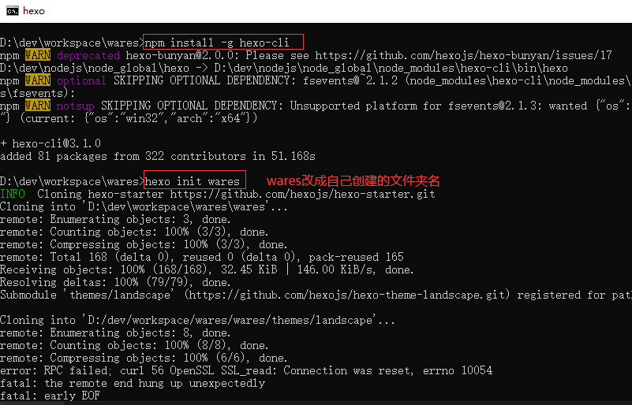
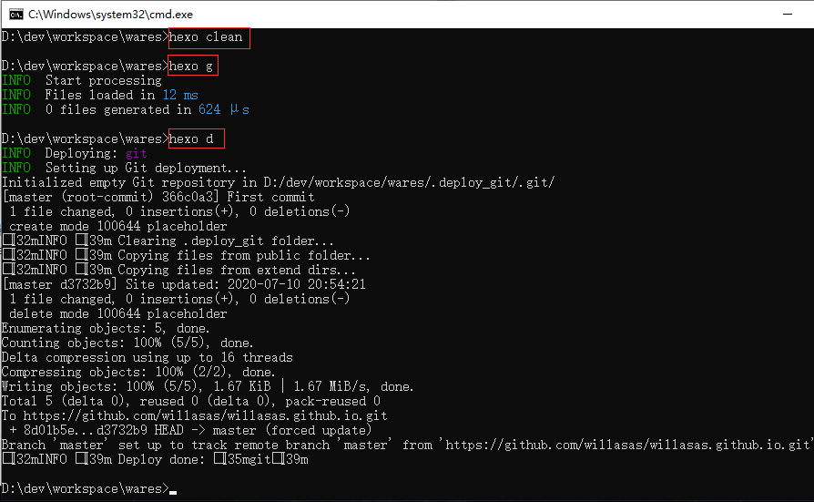

## **环境说明**

#### 准备工作

- 网站域名
- Windows 10 1909 版本（Windows 系统）
- [hexo 官网](https://hexo.io/)
- Node.js
- [Git 安装](Web/Git/Git安装与配置.md)
- [obsidian 主题](https://github.com/TriDiamond/hexo-theme-obsidian/blob/master/README_CN.md)

## **步骤说明**

**1. 购买网站域名**

**2. 登录 GitHub 账号，创建个人仓库，仓库名应该为：用户名.http://github.io 这个用户名使用你的 GitHub 帐号名称代替**

**3. 安装 Git 和安装 Node.js**

**4. 安装 Hexo,并配置项目**

- 在本地创建网站的文件夹，并进入该文件夹，在命令行窗口下执行如下命令：

```cmd
d:
cd dev/workspace/wares
npm install -g hexo-cli     #安装hexo
hexo init wares   #初始化网站
```



- 测试是否创建成功，执行以下命令，并在浏览器中输入 localhost:4000，查看结果

```cmd
hexo new test_my_site  #新建文章
hexo g    #生成
hexo s    #启动服务预览
```

- 打开站点配置文件，即\_config.yml 文件，在文件底部配置如下内容,repository 的值改成你网站对应的仓库地址，并保存：

```_config.yml
# Deployment
## Docs: https://hexo.io/docs/deployment.html
deploy:
  type: git
  repository: https://github.com/willasas/willasas.github.io.git
  branch: master
```

- 执行如下命令,安装 Git 部署插件,并提交代码到仓库

```cmd
npm install hexo-deployer-git --save
hexo clean
hexo g
hexo d
```



**5. 配置主题**

- 执行如下命令来下载主题，通过修改配置文件\_config.yml，把主題改為 butterfly

```cmd
git clone -b master https://github.com/jerryc127/hexo-theme-butterfly.git themes/butterfly
git clone https://github.com/TriDiamond/hexo-theme-obsidian.git obsidian
```

```yml
theme: butterfly
```

**6. 文章编辑（文件一般存放在 source/\_post 文件夹内）与发布，在命令行执行如下命令，或在代码编码器下进行编辑**

```cmd
hexo n "文件名（不用带md后缀）"
hexo s --debug   #在本地浏览器的localhost:4000 预览博文效果
hexo g    #生成
hexo d    #部署网页
```

**7. 个性化设置**

- 网站描述，修改\_config.yml 文件内容如下：

```yml
# Site
title: willasas's website
subtitle: Welcome to wares.
description: willasas
keywords: website,will
author: John Doe
language: en
timezone: Asia/Shanghai
```
