## **支付原理**

#### 支付流程与付款码支付后台调用流程

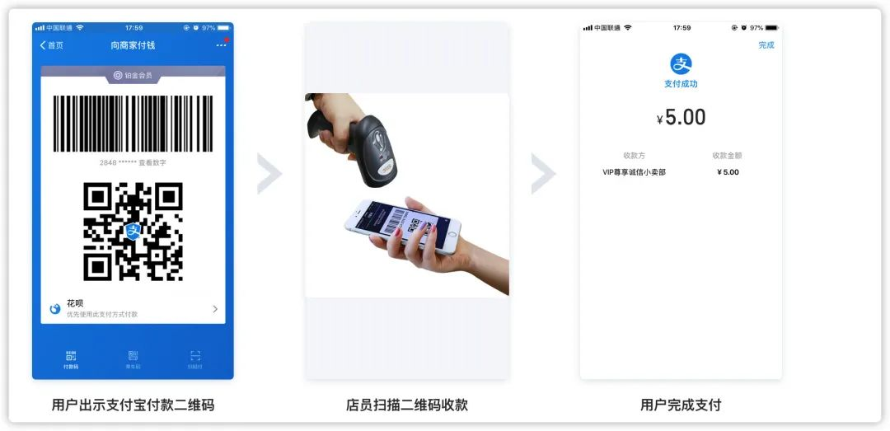
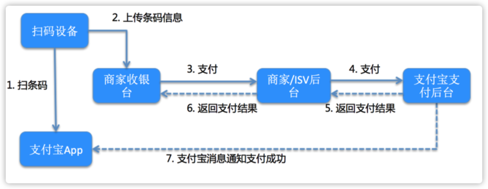

## **付款码支付详细版流程**

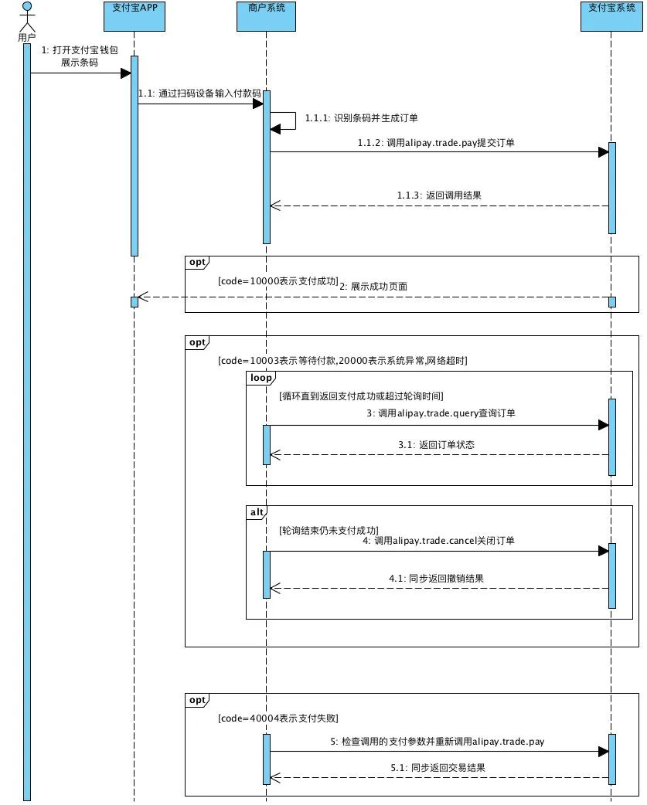

**1. 付款码支付可以说是一个同步的接口，即接口同步返回扣款结果，无需通过另外异步通知获取结果。**

**2. 由于涉及安全风控等问题，付款码支付过程用户端可能需要输入密码确认支付，此时付款码接口将会返回等待用户支付。**

**3. 接入时务必正确判断返回信息，若返回以下结果，代表此时用户正在输入密码。**

- 微信支付: err_code=USERPAYING 或 err_code=SYSTEMERROR

- 支付宝：code=10003 或 code=20000

**4. 微信付款码支付在以下情况需要输入密码二次确认**

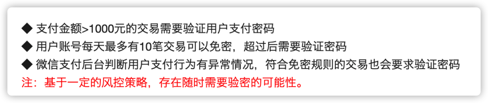

- 注意：微信/支付宝其他支付接口，支付成功之后，微信/支付宝服务端将会发送消息通知支付结果。但是付款码不一样，该接口是不会有消息通知。

**5. 如果付款码支付若返回等待用户输入密码，商家后台服务必须定时调用调用微信支付/支付宝查询接口，获取支付结果。**

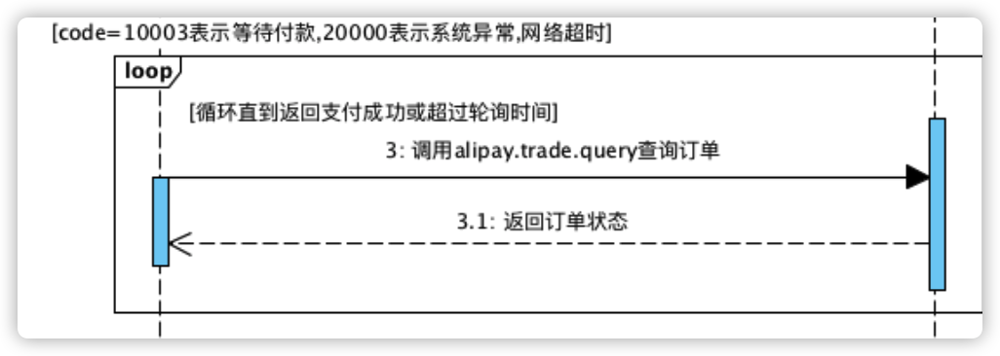

## **撤销支付**

- 如果在一段时间内比如 30s，轮询查询支付结果返回都是等待用户支付，或者支付交易过程返回失败或支付系统超时，这两种情况官方文档都是建议立刻调用撤销接口撤销交易。

- 如果此订单用户支付失败，撤销接口将会订单关闭；如果用户支付成功，撤销接口将会订单资金退还给用户。

- 也就是说撤销支付接口功能上等同与<b>关闭订单</b>加上<b>退款</b>。虽然撤销也具有退款功能，但是两者存在比较大的区别：

**1、支付类型限制**

- 微信/支付宝撤销支付<b>仅能撤销付款码支付类型的订单</b>，而退款可以支持多种支付类型的订单。

**2、退款金额**

- 撤销接口只能是<b>全额退款</b>，而退款接口支持传入金额，可以全额退款，也可以部分退款。

**3、时间限制**

- 撤销接口时间限制比较短，比如微信支付撤销支持 7 天内的订单，而支付宝撤销接口仅支持当天的订单。

- 但是退款接口可以支持较长时间订单退款，比如微信支付退款支持一年内的订单，而支付宝仅支持 3 个月内订单。

- <b>基于以上区别，其他正常支付的单如需实现相同功能请调用退款接口，官方文档建议仅在异常的情况下才建议调用撤销支付接口。</b>

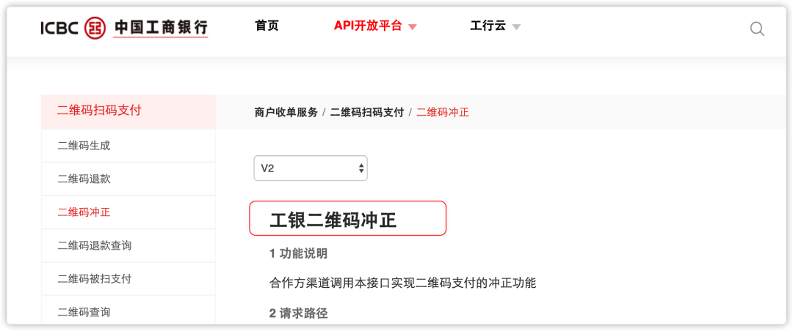

- 实际上提供的功能与微信/支付宝撤销类似，这里需要各家支付公司提供文档具体研究。

## **撤销支付相关问题**

> 由于规定，支付机构不能直连微信/支付宝,所以以下测试基于银联微信/支付宝通道。
银联提供的接口与直连微信/支付宝存在些许差别，但是主要功能一样。

**1、重复撤销**

- 通过实测，微信/支付宝撤销接口幂等实现，重复撤销返回结果一致。
- 不过需要注意需要正确判断撤销的返回结果。
- 比如微信撤销接口成功判断还需要结合 recall 字段，支付宝也有类似字段。

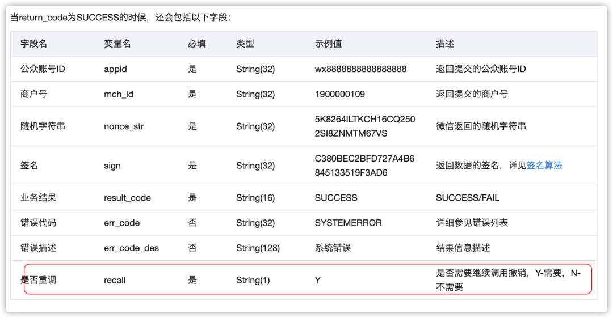

**2、订单状态**

- 微信/支付宝订单状态处理不太一致，微信订单状态比较复杂

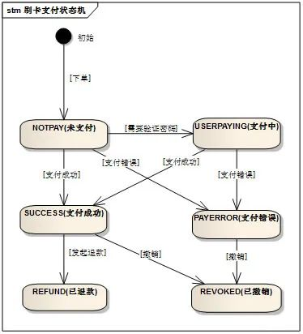

- 也就是说，付款码订单一旦被撤销成功，再次查询订单，状态将会返回为已撤销（REVOKED）。

- 另外微信对于付款码支付订单有限制，是无法调用关闭订单接口关闭订单，所以在付款码的场景中，是不存在订单状态为 CLOSED—已关闭。

- 支付宝的状态，支付宝文档没有给出类似的订单状态机，我根据官方一些文档，以及一些测试结果总结出下方订单状态图。

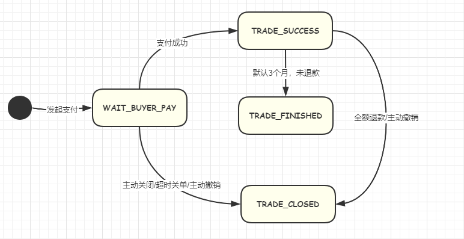

- 所以支付宝的付款码订单一旦撤销成功，再次查询原单状态将会返回 TRADE_CLOSED。

**3、对账文件数据**

- 当天产生交易之后，次日我们需要拉取微信/支付宝对账文件，逐一核对数据，防止少账，多账问题。

- 微信/支付宝对账文件只会记录交易成功的订单，所以未支付的订单被撤销是不会出现在对账文件中。但是如果支付成功了，然后又被撤销成功，将会在对账文件中产生两笔记录，一笔正交易，一笔反向退款记录。

- 正交易与普通的退款的记录都比较好识别，一般可以使用我们上送给微信支付宝订单号。但是撤销导致退款记录，我们无法仅用一个单号识别，我们需要结合另外的字段区分判断。

- 微信对账文件撤销产生那笔退款，交易状态为 REVOKED，所以我们可以采用商户订单号加交易状态识别出一条记录是否为撤销产生退款记录。

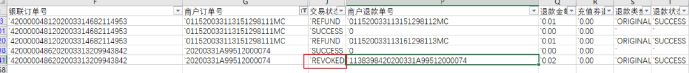

> 上面银联订单号可以当做是微信支付宝内部产生订单号

- 支付宝对账文件比较麻烦，撤销产生的退款记录不能跟微信根据交易状态区分。从对账文件上看支付宝撤销产生退款与普通退款接口产生退款记录是一样的。

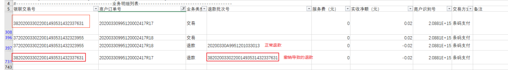

- 仔细研究对账文件可以发现一些区别，撤销导致退款记录退款批次与正交易支付宝内部订单号是一致的。而正常退款记录，退款批次号是由商户自己上送的。所以我们可以以此筛选出撤销产生的退款记录。

**4、撤销失败**

- 极端情况下，有可能产生多次撤销都失败的奇葩情况，那怎么办？
  - 这种情况下就不用往系统自动处理方向考虑了，通过线下人工介入处理