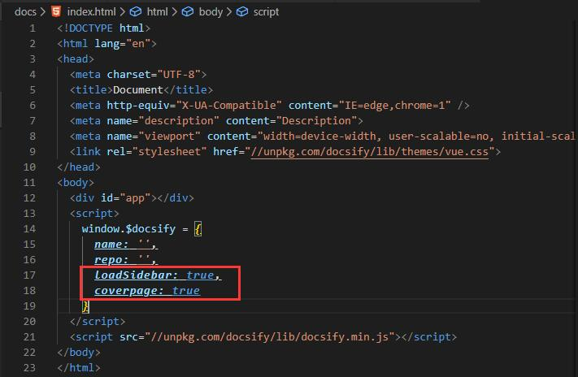
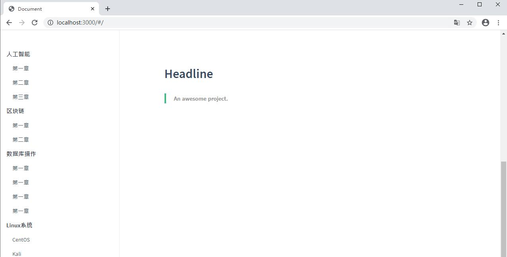
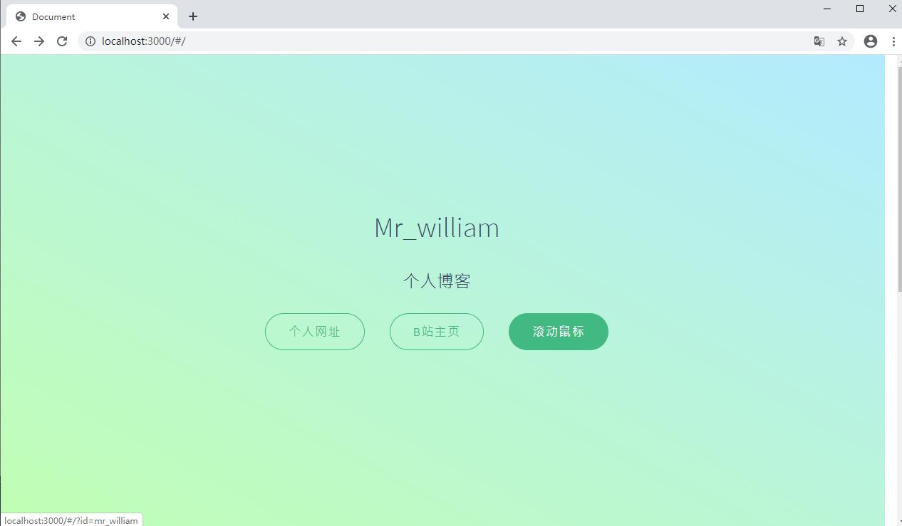
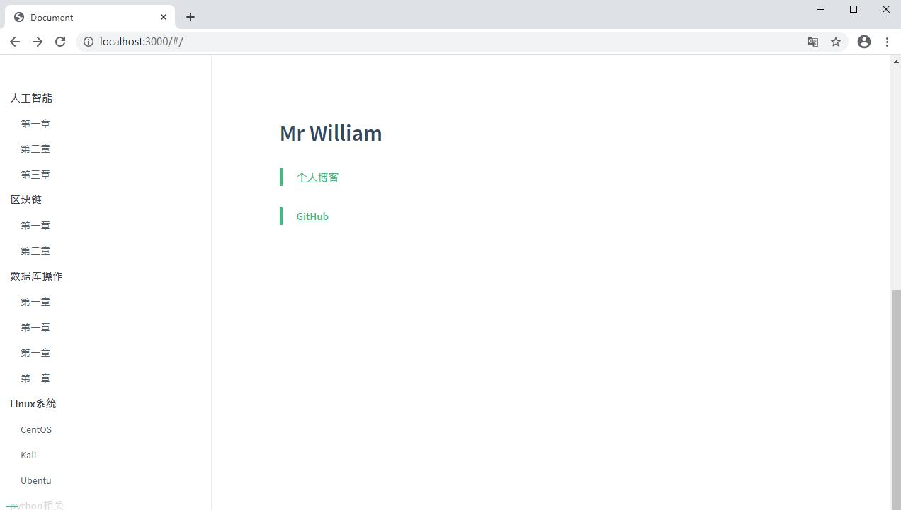
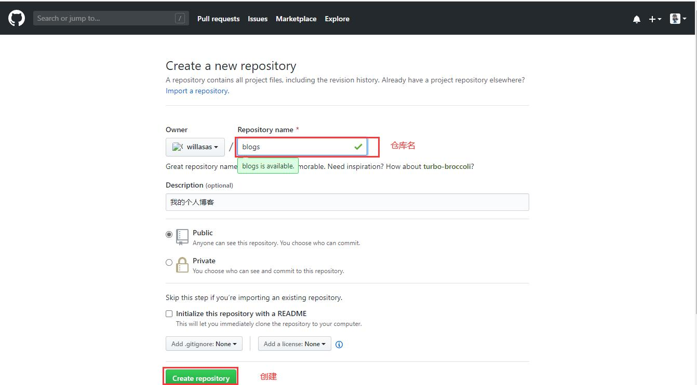
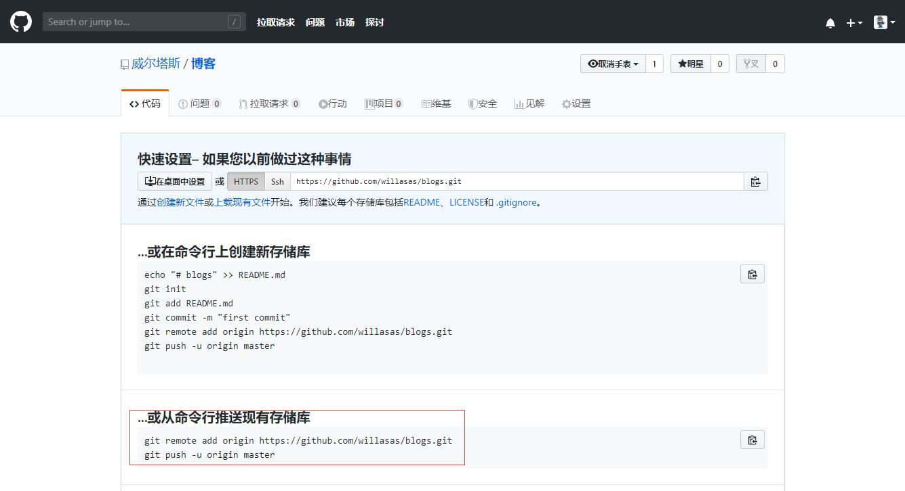
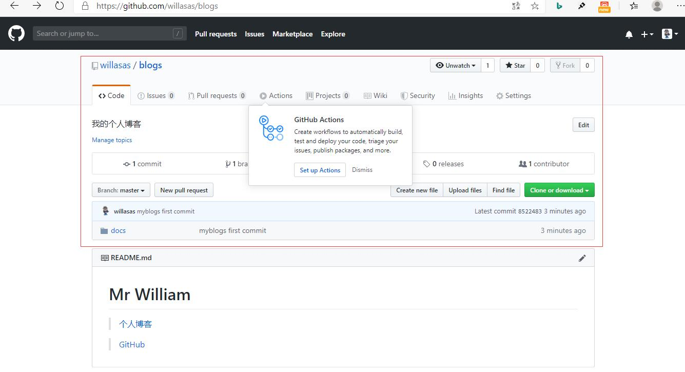
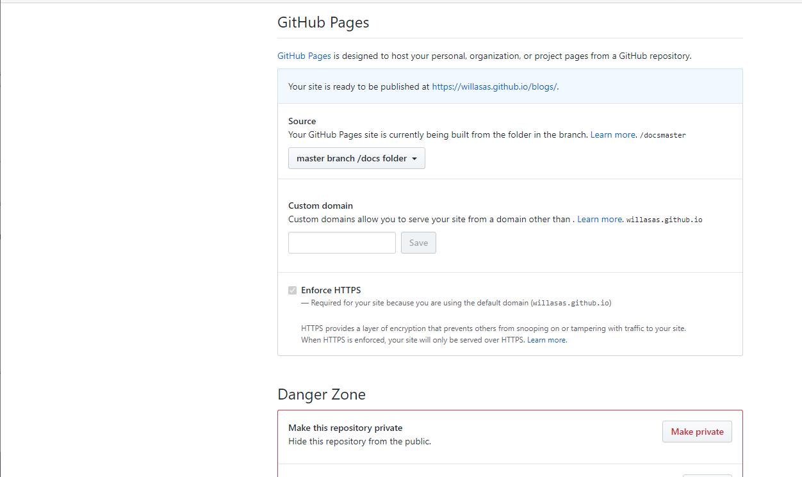

## **环境说明**
#### 框架技术
* docsify框架
* 基于Github Pages的站点部署

#### 准备工作
* Windows 10 1909版本（Windows系统）
* [Git安装与配置](Web/Git/Git安装与配置.md)
* [node下载](https://nodejs.org/en/download/)和[node_js安装教程](../Web/Nodejs/node_js安装教程.md)

## **步骤说明**
**1. 配置并使用docsify命令生成文档站点**-->[docsify官网](https://docsify.js.org/#/)

**2. 安装docsify-cli工具**(方便创建及本地预览文档网站)，在命令行窗口执行以下命令（需要先配置node环境）
``` @cmd.exe
npm i docsify-cli -g
```

**3. 初始化项目**
* 选择一个目录，作为我们的博客站点目录。也就是项目要生成的目录，比如我在E盘下的work文件夹下创建一个名为myblogs的目录

* 打开Git Bash工具，进到目标文件夹，依次执行如下命令
``` @Bash
e:
cd work/myblogs/
docsify init ./docs
docsify serve --port 4000  #指定端口（可选）
```

* 执行以上命令后，在myblogs目录下会多出一个docs目录(此目录就是将来我们存放MD格式的博客文件的地方)，此时docs文件夹下的结构如下
``` @file
    - index.html 入口文件
    - README.md 会做为主页内容渲染
    - .nojekyll 用于阻止 GitHub Pages 会忽略掉下划线开头的文件
```

* 启动项目，预览效果，在命令行窗口执行以下命令
``` @cmd.exe
docsify serve docs
```
在浏览器中输入

``` @url
http://localhost:3000
```

**4. 配置项目**
* 主要配置一下封面、左侧导航栏和首页，其他的配置可以参考docsify官网
4.1. 配置左侧导航栏，在E:\work\myblogs\docs目录下新建一个_sidebar.md的文件，文件内容如下：

``` @_sidebar.md
- 人工智能

    - [第一章](AI/什么是人工智能.md)
    - [第二章](AI/人工智能发展前景.md)
    - [第三章](AI/什么是人工智能.md)

- 区块链

    - [第一章](Block-chain/区块链是什么.md)
    - [第二章](Block-chain/区块链的特点.md)

- 数据库操作

    - [第一章](Database/数据库操作.md)
    - [第一章](Database/数据库操作.md)
    - [第一章](Database/数据库操作.md)
    - [第一章](Database/数据库操作.md) 
```
这其实就是最基本的md文件，里面写了一些链接。当然了我们诸如 AI/什么是人工智能.md是相对路径，目录下也要放 什么是人工智能.md的文件才行。
还需要在index.html文件中配置,即在内嵌的js脚本中加上下面这句代码：
```
loadSidebar: true
```



4.2. 配置封面
* 新建一个_coverpage.md的文件，这里面的内容就是你封面的内容。
``` @_coverpage.md
# Mr_william
> 个人博客
[个人网址](https://www.baidu.com)
[B站主页](https://space.bilibili.com/250154329)
[滚动鼠标](#introduction)
```

* 然后在index.html文件中修改js脚本配置，添加一句：
```
coverpage: true
```

效果如下:


4.3 配置首页
* 其实就是E:\work\myblogs\docs目录下的README.md文件里的内容
``` @README.md
# Mr William
> [个人博客](http://willasas.github.io/blogs)
> [GitHub](https://github.com/willasas/repositories)
```
效果如下:


**5. 部署项目**
* 通过Github Pages的功能，我们可以将个人站点托管到github上
5.1 登录github账号，创建仓库，如下图：


仓库创建好了，我们使用第二种方式导入一个本地仓库（本地仓库还没有创建，接下来会建一个）


5.2 创建本地仓库，推送到GitHub上
* 首先我们进入我们的本地博客站点目录，也就是 E:\work\myblogs右键 GitBashHere 打开git命令行初始化一个仓库，并提交所有的博客文件到git本地仓库。
使用如下代码：
``` @Git Bash
git init //初始化一个仓库
git add -A //添加所有文件到暂存区，也就是交给由git管理着
git commit -m "myblogs first commit"  //提交到git仓库，-m后面是注释
git remote add origin https://github.com/willasas/blogs.git
git push -u origin master //推送到远程myblogs仓库
```
按上面的命令顺序操作，不出意外的话，我们的本地myblogs已经同步到了github上面了
刷新github的页面来看下


5.3 使用Github Pages功能建立站点
* 在blogs仓库下，选中Settings选项，然后鼠标一直向下滚动，直到看到 GitHubPages 页签，在Source下面选择 master branch/docs folder 选项

* 通过[个人博客](http://willasas.github.io/blogs)即可访问了