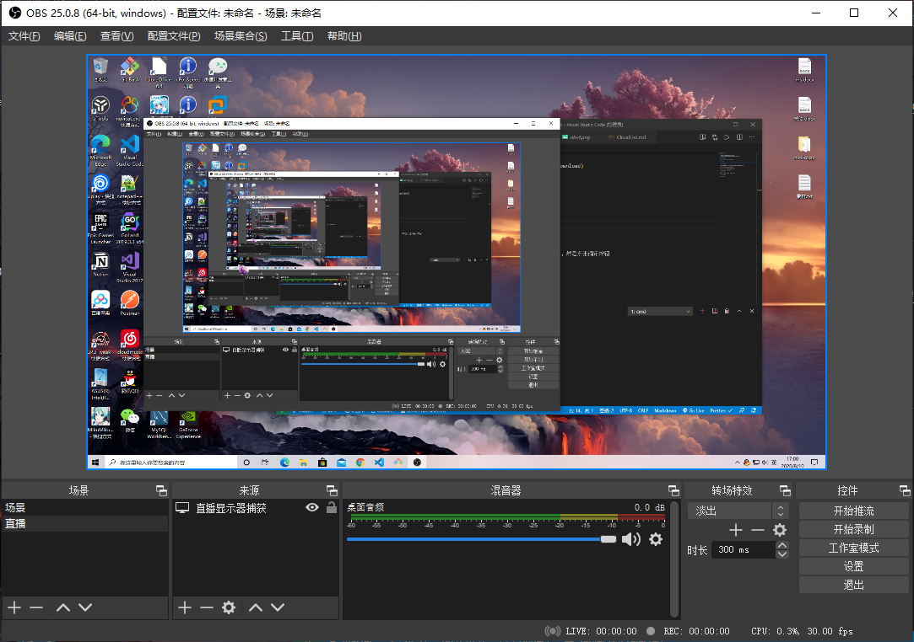
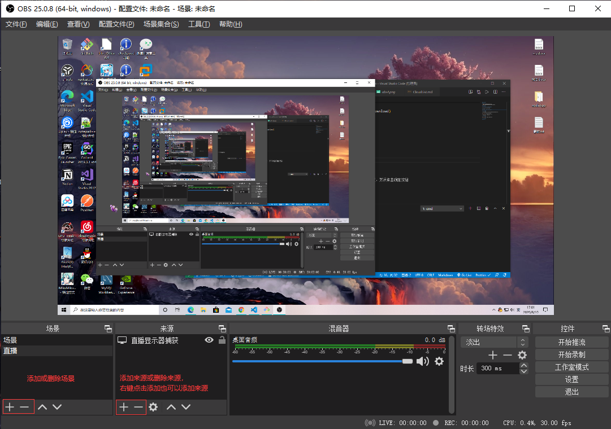
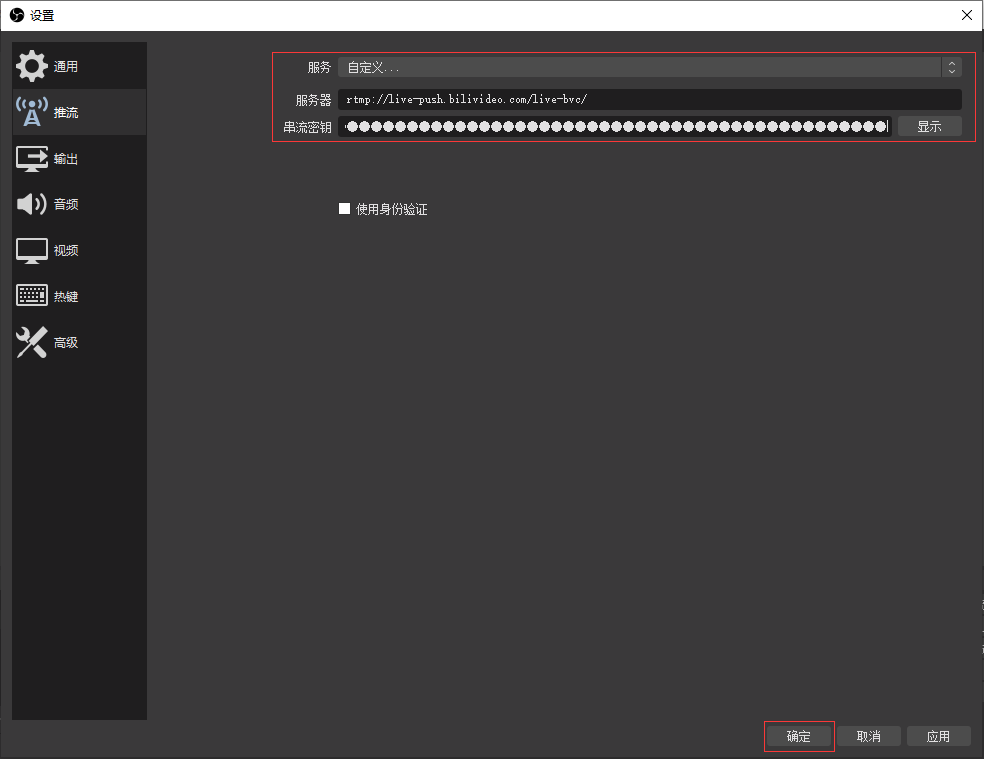
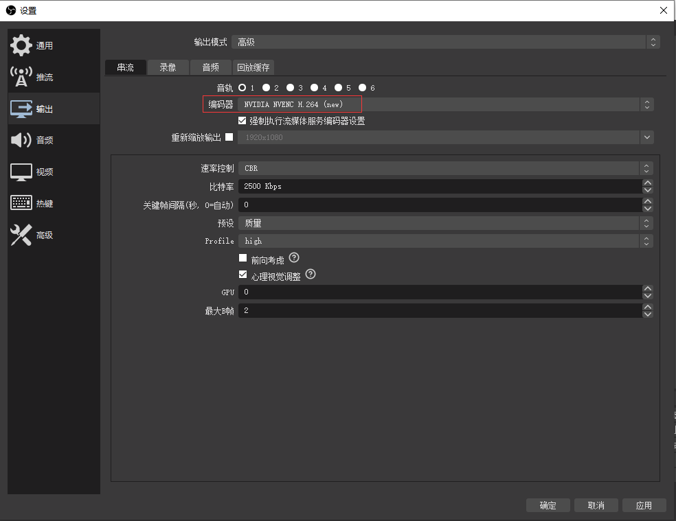
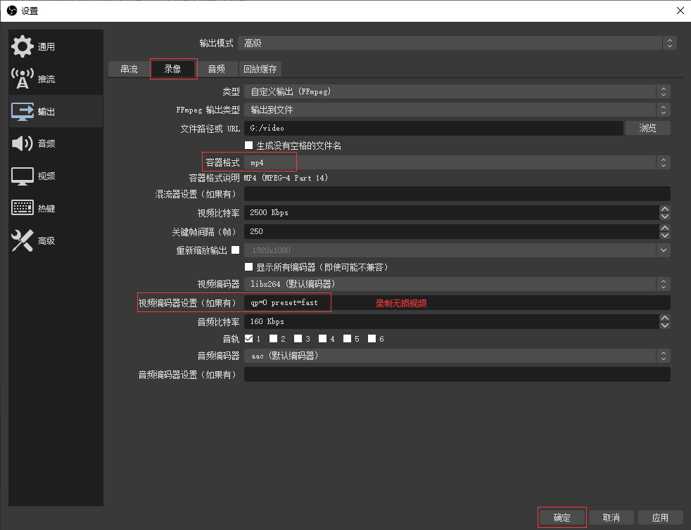

## **环境说明**

#### 准备工作

- Windows 10 2004 版本（Windows 系统）
- [OBS 下载](https://obsproject.com/zh-cn/download)

## **步骤说明**

**1. 下载后运行应用程序默认安装即可**

**2. 设置**

**3. 直播设置**

- 将直播平台的服务器和串流密钥复制到对应的位置，然后点击确定按钮

- 设置完成，点击开始推流即可

**4. 录像设置**

**5. 其他设置**

#### 注意事项
