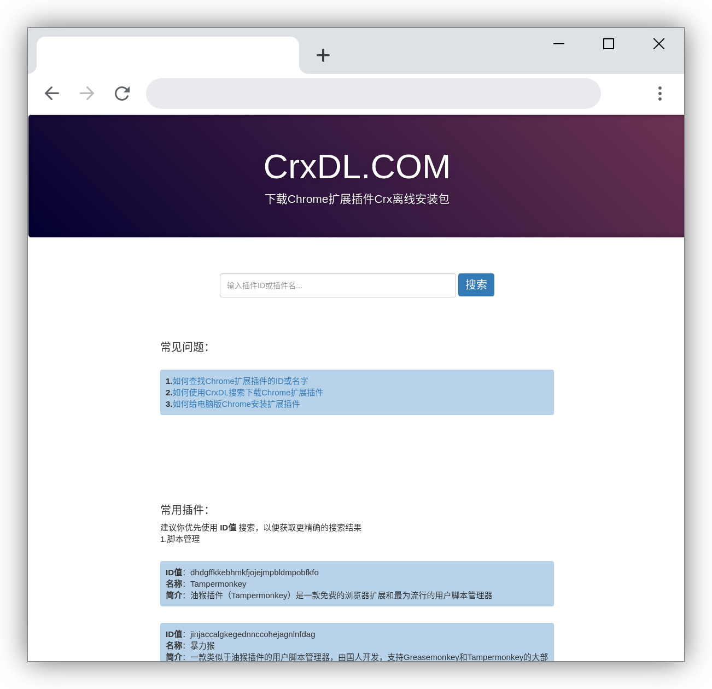
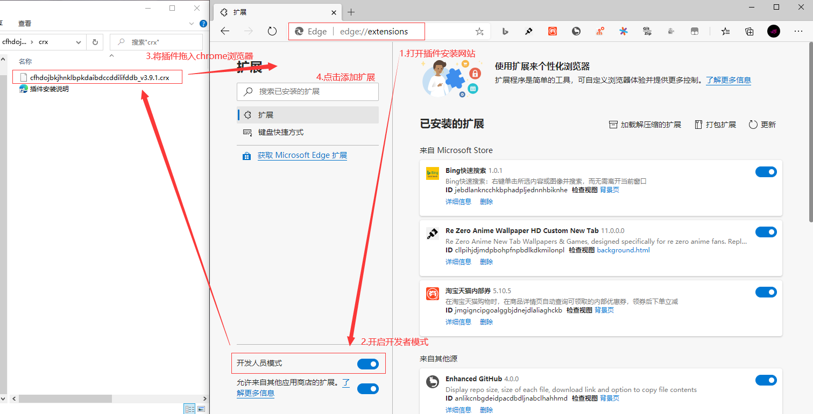
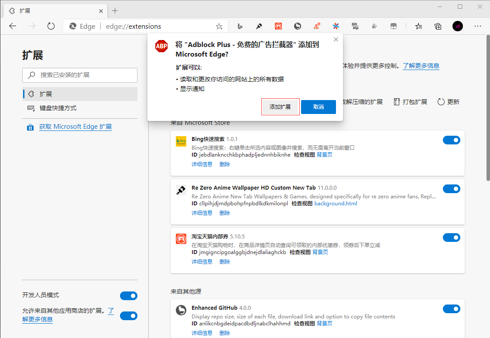

## **环境说明**

#### 准备工作

- Chrome 浏览器
- [插件下载](https://crxdl.com/)
- Windows 10 1909 版本（Windows 系统）

## **步骤说明**

**1.下载插件**

- 在玩机 APP 或者 CrxDL 搜索下载待安装的 Chrome 插件，下载完成后，将下载的压缩包解压，我们以 Adblock Plus 插件为例：
  - 插件 ID：cfhdojbkjhnklbpkdaibdccddilifddb
  - 插件名称：Adblock Plus

**2.打开 Chrome 浏览器，复制 chrome://extensions/ 到浏览器地址打开，点击右上角开启开发者选项，最后将文件夹内.crx 后缀的离线安装包拖动到打开的页面，松手，根据提示完成安装。**

- 如果安装插件时遇到程序包无效：“CRX_HEADER_INVALID”等错误，可以查看：安装 Chrome 插件.Crx 提示程序包无效：“CRX_HEADER_INVALID”

**3.在线安装（需要科学上网）**

- 在浏览器地址栏打开[Chrome 官方插件应用商店的地址](https://chrome.google.com/webstore/category/extensions?hl=zh-CN)

- 在商店左侧搜索框，搜索插件的 ID 或者名称，在右侧可以看到搜索结果，点击添加至 Chrome 开始安装。

#### 注意事项

- 若要配置其他设置，请参照[官方文档](https://docs.rainmeter.net/manual/installing-rainmeter/)
