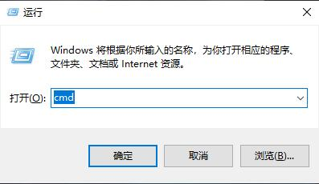

## **环境说明**

#### 准备工作

- Windows 10 1909 版本（Windows 系统）

#### DOS 命令介绍

| 命令                                                                 | 说明                                                                                                                                              |
| -------------------------------------------------------------------- | ------------------------------------------------------------------------------------------------------------------------------------------------- |
| calc                                                                 | 启动计算器                                                                                                                                        |
| certmgr.msc                                                          | 证书管理实用程序                                                                                                                                  |
| charmap                                                              | 启动字符映射表                                                                                                                                    |
| chkdsk.exe                                                           | Chkdsk 磁盘检查（需要以管理员身份运行命令行工具才能执行）                                                                                         |
| cleanmgr                                                             | 磁盘垃圾整理                                                                                                                                      |
| cliconfg                                                             | SQL SERVER 客户端网络实用工具                                                                                                                     |
| cmd.exe                                                              | CMD 命令提示符(在运行中输入)                                                                                                                      |
| compmgmt.msc                                                         | 计算机管理                                                                                                                                        |
| dcomcnfg                                                             | 打开系统组件服务                                                                                                                                  |
| devmgmt.msc                                                          | 设备管理器                                                                                                                                        |
| diskmgmt.msc                                                         | 磁盘管理实用程序                                                                                                                                  |
| dvdplay                                                              | DVD 播放器                                                                                                                                        |
| dxdiag                                                               | DirectX 诊断工具                                                                                                                                  |
| explorer                                                             | 打开文件资源管理器                                                                                                                                |
| eudcedit                                                             | 专用字符编辑程序                                                                                                                                  |
| eventvwr                                                             | 事件查看器                                                                                                                                        |
| fsmgmt.msc                                                           | 共享文件夹管理器                                                                                                                                  |
| gpedit.msc                                                           | 本地组策略编辑器                                                                                                                                  |
| iexpress                                                             | 木马捆绑工具，系统自带                                                                                                                            |
| logoff                                                               | 注销当前用户                                                                                                                                      |
| lusrmgr.msc                                                          | 本地用户和组                                                                                                                                      |
| notepad                                                              | 打开记事本                                                                                                                                        |
| magnify                                                              | 放大镜实用程序                                                                                                                                    |
| mmc                                                                  | 打开控制台                                                                                                                                        |
| mobsync                                                              | 同步中心程序                                                                                                                                      |
| msconfig.exe                                                         | 系统配置实用程序(包含启动项、引导等设置)                                                                                                          |
| mspaint                                                              | 画图工具                                                                                                                                          |
| mstsc                                                                | 远程桌面连接                                                                                                                                      |
| narrator                                                             | 屏幕“讲述人”                                                                                                                                      |
| netstat -an                                                          | 接口检测                                                                                                                                          |
| nslookup                                                             | IP 地址侦测器 ，是一个监测网络中 DNS 服务器是否能正确实现域名解析的命令行工具.                                                                    |
| odbcad32                                                             | ODBC 数据源管理程序                                                                                                                               |
| osk                                                                  | 打开屏幕键盘                                                                                                                                      |
| perfmon.msc                                                          | 计算机性能检测器                                                                                                                                  |
| regedit.exe                                                          | 注册表编辑器                                                                                                                                      |
| regedt32                                                             | 注册表编辑器                                                                                                                                      |
| regsvr32 /u \*.dll                                                   | 停止 dll 文件运行                                                                                                                                 |
| regsvr32 /u zipfldr.dll                                              | 取消 ZIP 支持                                                                                                                                     |
| rononce -p                                                           | 15 秒关机                                                                                                                                         |
| rsop.msc                                                             | 组策略结果集                                                                                                                                      |
| secpol.msc                                                           | 本地安全策略                                                                                                                                      |
| services.msc                                                         | 服务                                                                                                                                              |
| sfc [/scannow] [/verifyonly] [/scanfile=<file>] [/verifyfile=<file>] | 系统文件检测                                                                                                                                      |
| shrpubw                                                              | 创建共享文件夹                                                                                                                                    |
| shutdown [参数]                                                      | 关机命令                                                                                                                                          |
| sigverif                                                             | 文件签名验证程序                                                                                                                                  |
| taskmgr                                                              | 任务管理器                                                                                                                                        |
| utilman                                                              | 设置                                                                                                                                              |
| wiaacmgr                                                             | 扫描仪                                                                                                                                            |
| winver                                                               | 检查 Windows 版本                                                                                                                                 |
| write                                                                | 写字板                                                                                                                                            |
| wmimgmt.msc                                                          | 打开 windows 管理体系结构（WMI)                                                                                                                   |
| wscript                                                              | windows 脚本宿主设置                                                                                                                              |
| ipconfig                                                             | 查看本地 ip 地址                                                                                                                                  |
| ipconfig -all                                                        | 显示全部 ip 配置信息                                                                                                                              |
| schtasks.exe                                                         | 查看所有的计划任务                                                                                                                                |
| finger username @host                                                | 查看最近有哪些用户登陆                                                                                                                            |
| route print                                                          | 查看 ip 路由                                                                                                                                      |
| arp                                                                  | 查看和处理 ARP 缓存                                                                                                                               |
| arp -a                                                               | 显示出全部信息                                                                                                                                    |
| dir                                                                  | 查看文件                                                                                                                                          |
| data /t                                                              | 显示当前日期                                                                                                                                      |
| time /t                                                              | 显示当前时间                                                                                                                                      |
| set                                                                  | 显示当前所有的环境变量                                                                                                                            |
| set p                                                                | 显示所有 p 开头的环境变量（若参数为 f，则显示所有 f 开头的环境变量）                                                                              |
| title 标题名字                                                       | 更改 CMD 窗口标题名字                                                                                                                             |
| color 颜色值                                                         | 设置 cmd 控制台前景和背景颜色（0=黑、1=蓝、2=绿、3=浅绿、4=红、5=紫、6=黄、7=白、8=灰、9=淡蓝、A=淡绿、B=淡浅绿、C=淡红、D=淡紫、E=淡黄、F=亮白） |
| prompt 名称                                                          | 更改 cmd.exe 的显示的命令提示符                                                                                                                   |
| ver                                                                  | 在 DOS 窗口下显示版本信息                                                                                                                         |
| md 目录名                                                            | 创建目录                                                                                                                                          |
| ren 原文件名　新文件名                                               | 重命名文件名                                                                                                                                      |
| tree                                                                 | 以树形结构显示出目录                                                                                                                              |
| type 文件名                                                          | 显示文本文件的内容                                                                                                                                |
| more 文件名                                                          | 逐屏显示输出文件                                                                                                                                  |
| exit                                                                 | 退出 cmd.exe 程序或当前窗口                                                                                                                       |
| cmd /?                                                               | cmd 相关命令操作                                                                                                                                  |
| regedit /s 注册表文件名                                              | 导入注册表（参数/s 指安静模式导入，无任何提示；）                                                                                                 |
| regedit /e 注册表文件名                                              | 导出注册表                                                                                                                                        |

## **步骤说明**

**1.按下 WIN+R 键，打开运行窗口，在运行窗口中输入 cmd 回车**

**2.在命令行窗口中输入对应的 dos 命令即可打开对应的程序/服务**

#### 注意事项

- 有一些命名涉及到权限等问题，需要有管理员身份才能执行！
- 输入的命令不区分大小写
