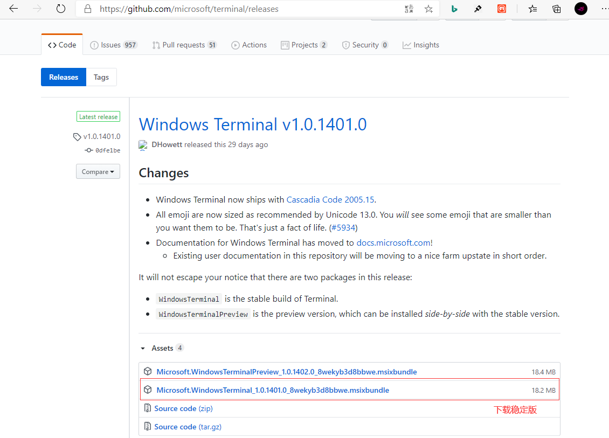
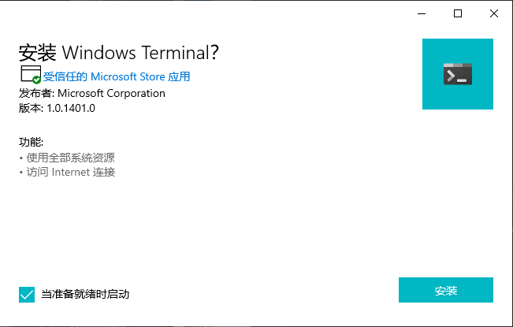
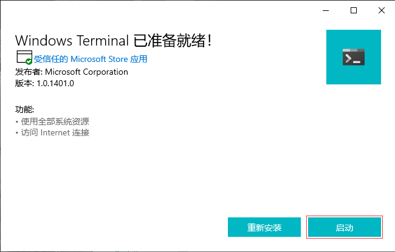
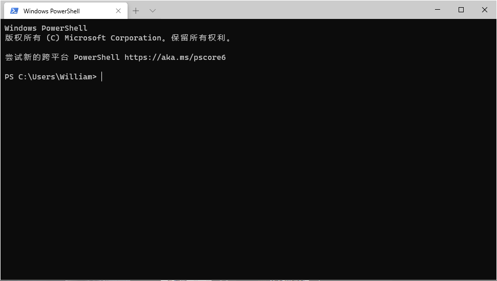

## **环境说明**
#### 准备工作
* Windows 10 1909版本（Windows系统）
* [Windows Terminal v1.0.1401.0下载](https://github.com/microsoft/terminal/releases)

## **步骤说明**
**1.点击提供的下载网址，下载稳定版的terminal程序**

**2.运行下载好的程序，点击下一步下一步安装即可**

#### 注意事项
* 111111