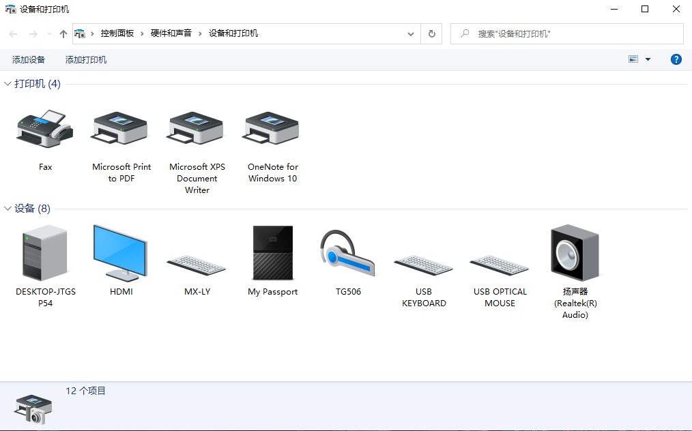
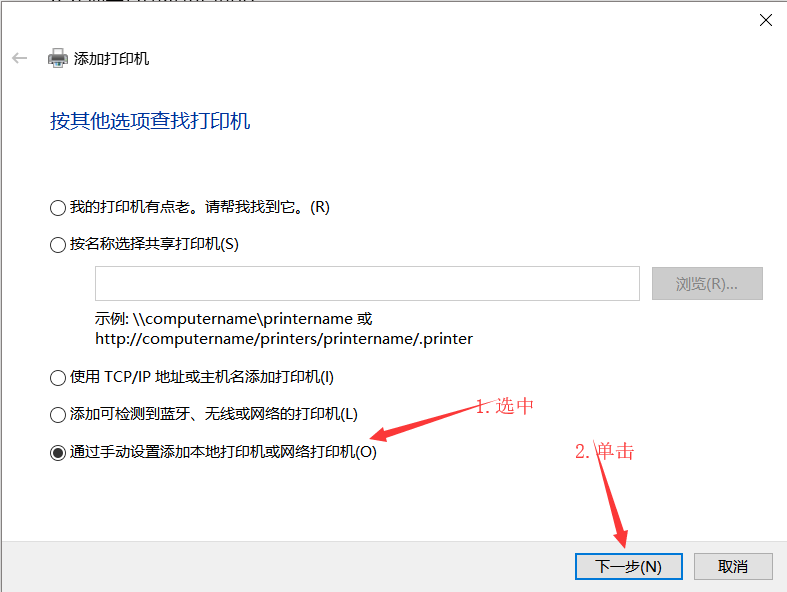
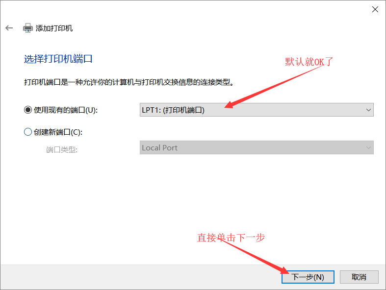
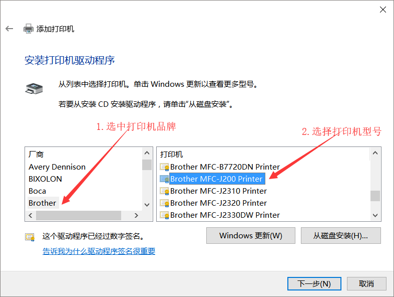
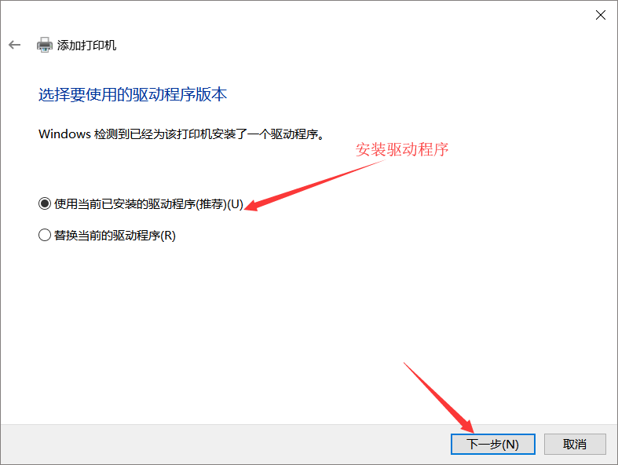
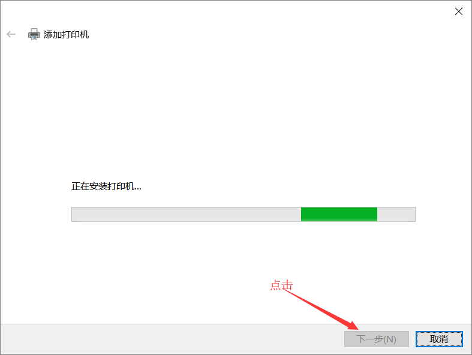
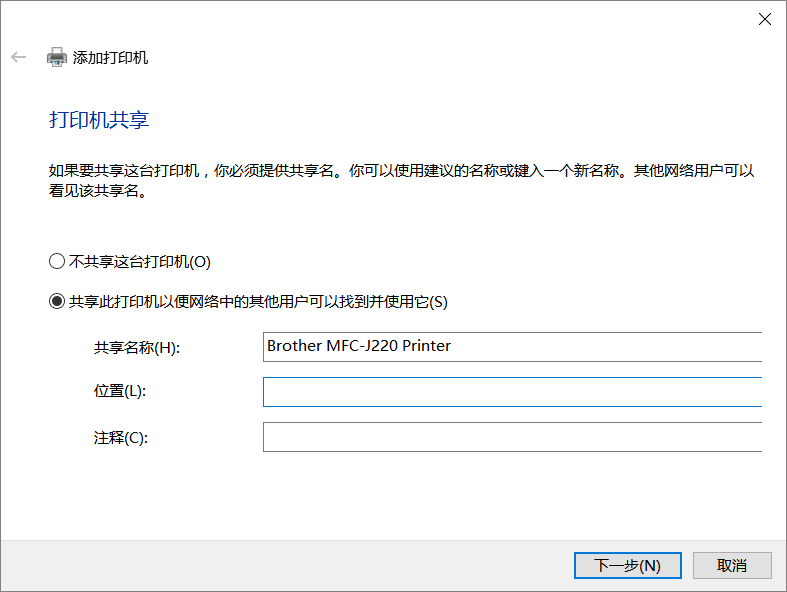
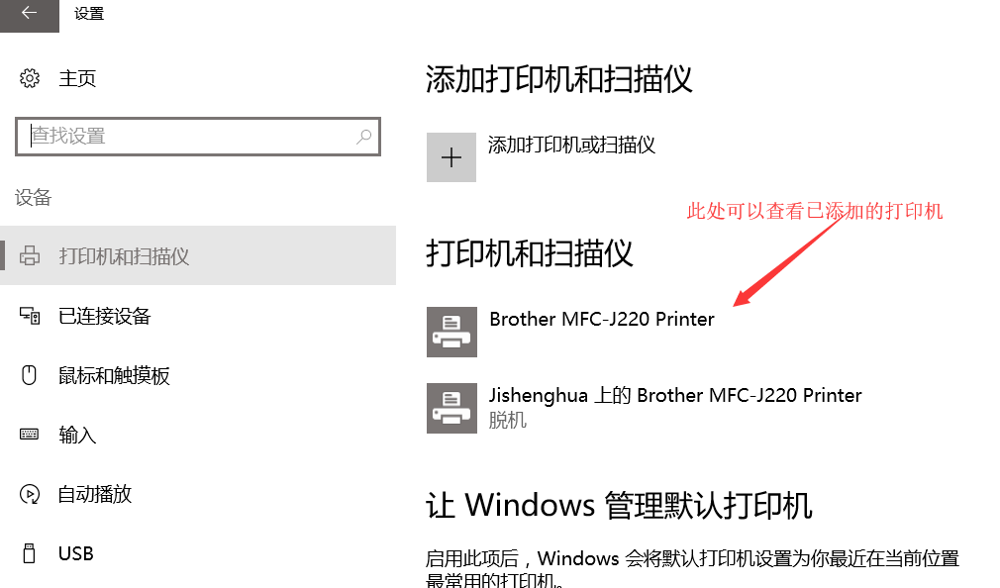

## **环境说明**

#### 准备工作

- Windows 10 1909 版本（Windows 系统）
- 打印机
- 打印机驱动（根据具体型号到对应的官网下载）

## **步骤说明**

**1. 先确认电脑和打印机是否在同一局域网**

**2. 点击开始->设置->设备->设备和打印机**

**3. 若列表中没有列出的打印机，则单击添加打印机，若系统没有搜索到所在网络的打印机，则单击我需要的打印机不在列表处，跳转至添加打印机界面**

#### 注意事项
