## **环境说明**

#### 准备工作

- 一台 PC
- U 盘(容量大于等于 8G)
- [U 盘制作工具下载](https://www.microsoft.com/en-us/software-download/windows10)与安装

## **步骤说明**

**1.下载微软官方启动 U 盘制作工具 MediaCreationTool.exe**
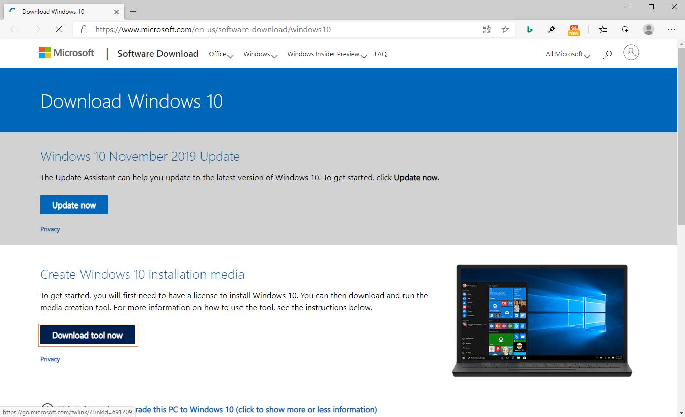

**2.将 U 盘插入电脑，运行 MediaCreationTool.exe 程序，根据提示信息进行每一步操作。联网下在完成 Windows10 后，此工具会自动制作启动 U 盘，等待“完成”提示后关闭窗口即可。**

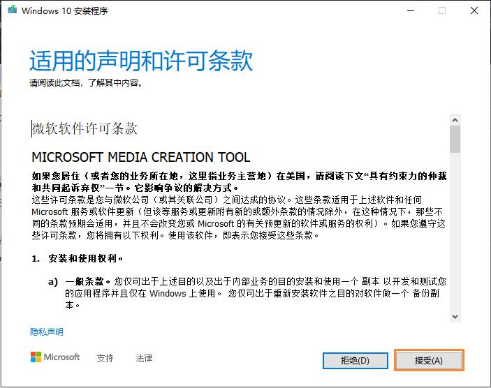

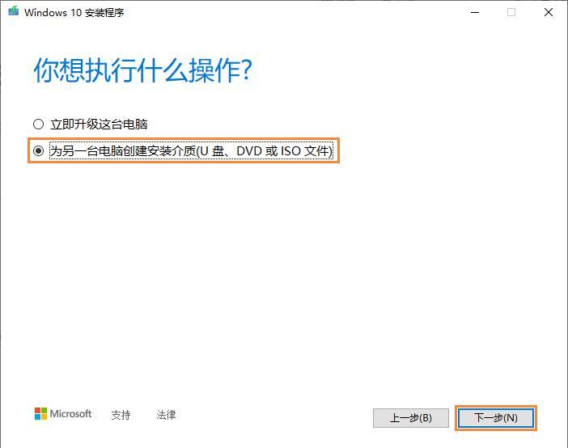

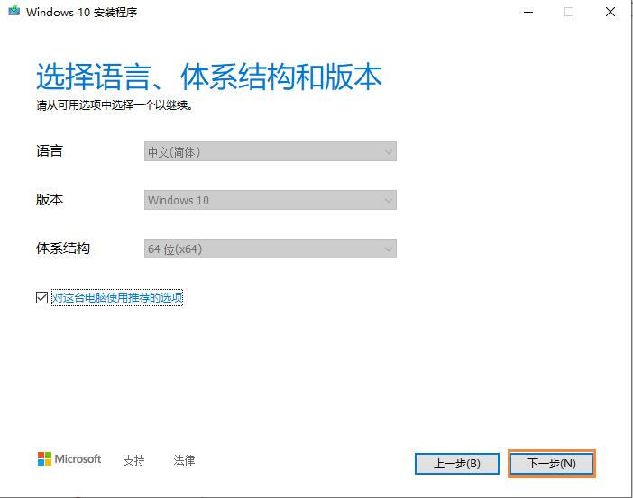

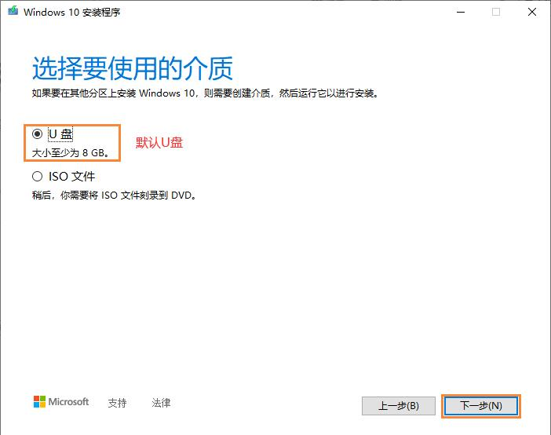

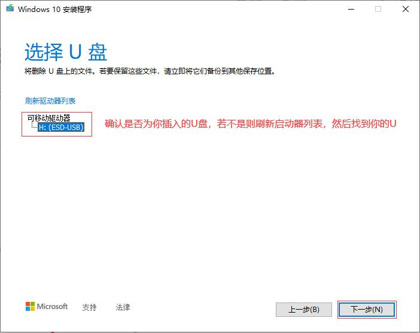

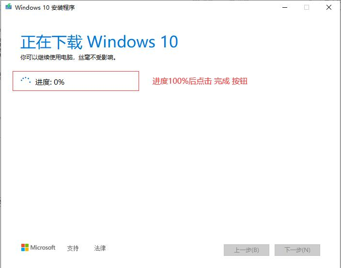

- 制作完成 U 盘目录如下：
  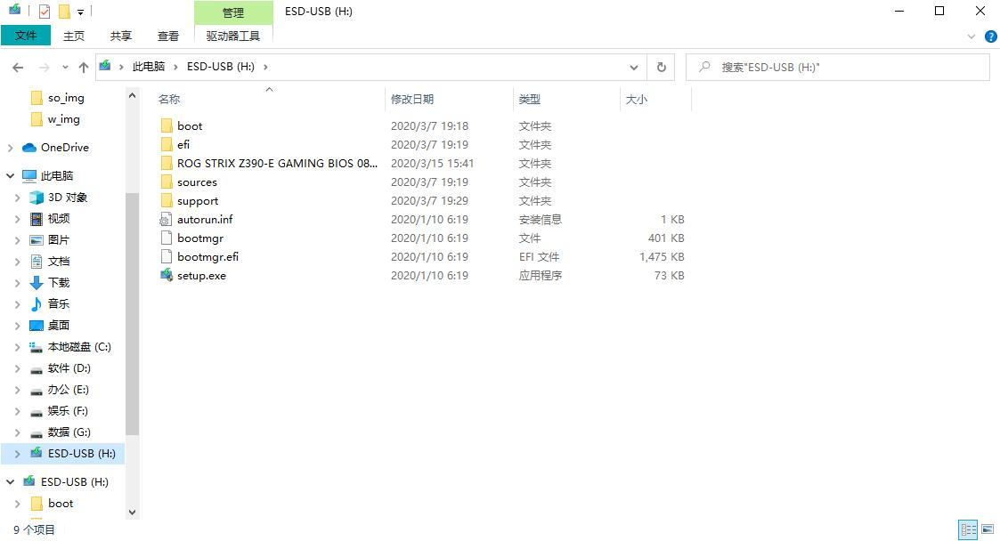

**3.安装系统**

- 3.1 将制作好的 U 盘插入需要安装系统的电脑上，电脑开机，按对应的快捷键进入快速启动选项（以华硕 Z 390 主板为例），按 F8 后弹出启动菜单，选中你的 U 盘名后按回车键
  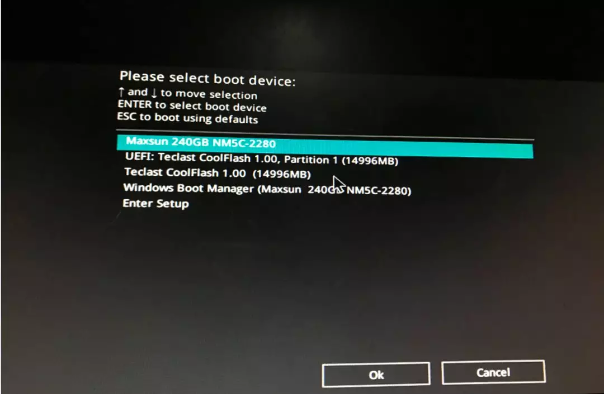

- 3.2 选择安装的语言
  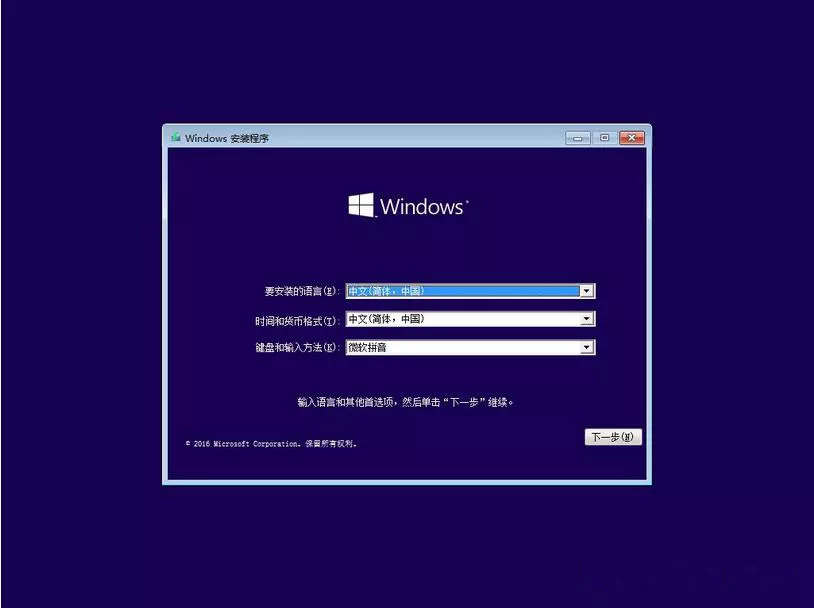

- 3.3 点击现在安装
  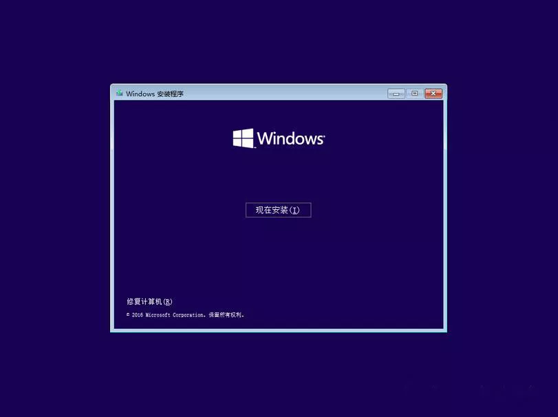

- 3.4 点击我没有产品密钥
  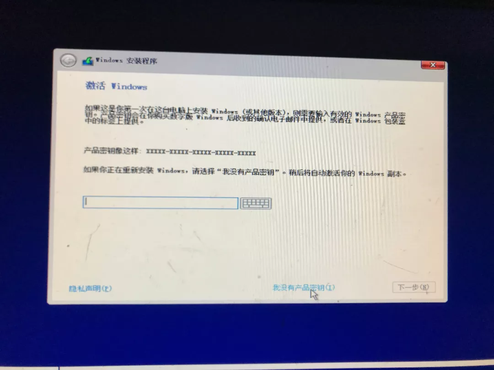

- 3.5 选择安装 windows 的版本（专业版/企业版等）
  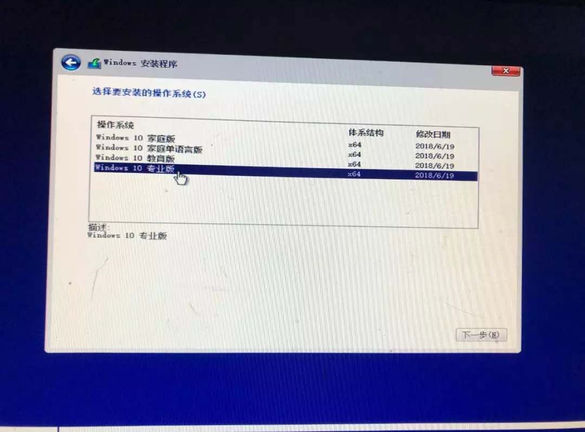

- 3.6 同意协议后，选择自定义，仅安装 windows(高级)选项
  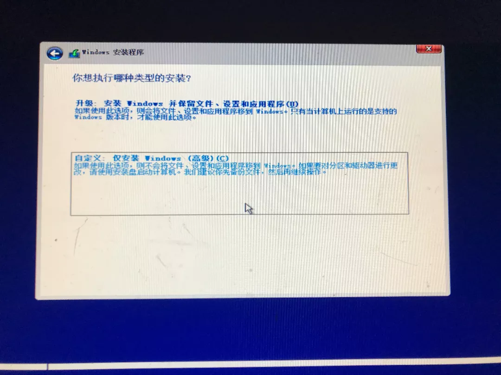

- 3.6 选择要将系统安装到哪个盘，然后等待安装完成后，电脑会自动重新启动，此时将 U 盘拔出，
  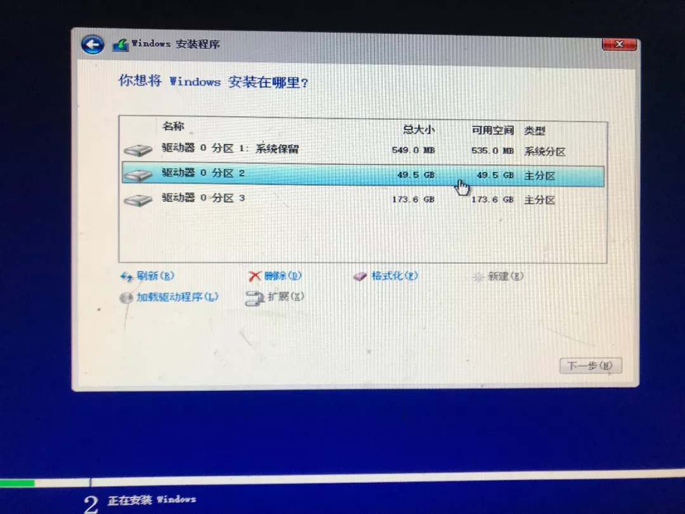

- 3.6 系统需要继续进行配置，配置完成就可以使用了

#### 注意事项

- 制作过程中需要联网
- 制作时 U 盘上的所有文件都会被格式化，若有重要文件在 U 盘中请先转移到别的地方
- 在安装系统上系统盘分配的容量应该保证足够（保证最少 20G）
