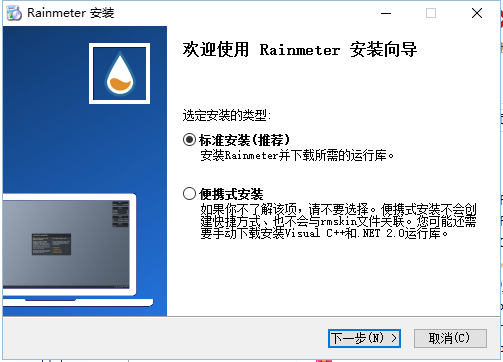

## **环境说明**
#### 准备工作
* Windows 10 1909版本（Windows系统）
* [Rainmeter下载](https://www.rainmeter.cn/)与安装
* 自定义主题文件

## **步骤说明**
**1.下载Rainmeter程序，选择标准安装，单击下一步**

**2.选择安装目录后，点击安装按钮**

* 安装完成默认主题如下：

**3.安装主题**
* 主题文件一般以.rmskin结尾，先右击点击Install rainmeter skin后，再点击install按钮

#### 注意事项
* 若要配置其他设置，请参照[官方文档](https://docs.rainmeter.net/manual/installing-rainmeter/)