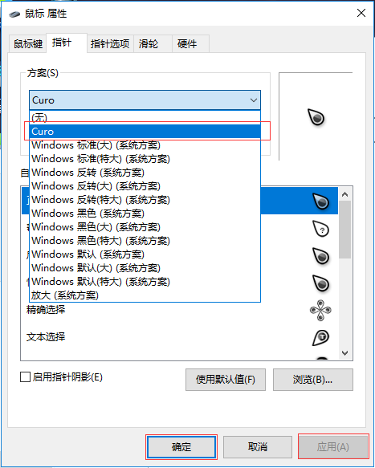

## **环境说明**
#### 准备工作
* Windows 10 1909版本（Windows系统）
* 鼠标指针皮肤安装包

## **步骤说明**
**1.解压下载好的鼠标指针皮肤文件后，打开文件夹后，右键点击右键安装.inf文件，点击安装**

**2.鼠标右击桌面，依次选择个性化-->主题-->鼠标指针设置，在方案中选择刚才安装的鼠标皮肤文件（即下载的鼠标指针皮肤名）,然后点击应用，点击确定即可**

#### 注意事项